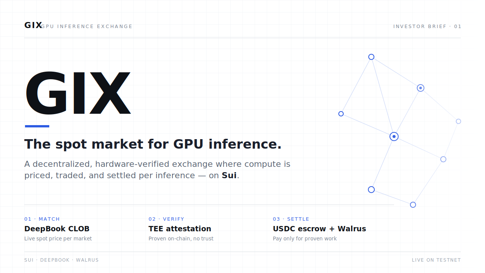
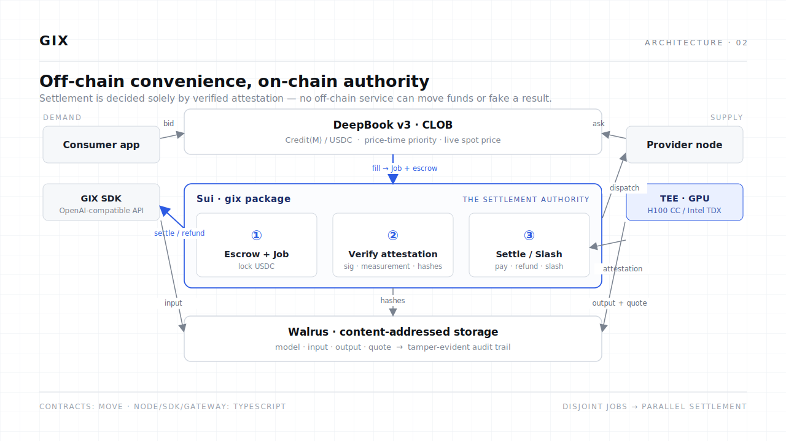
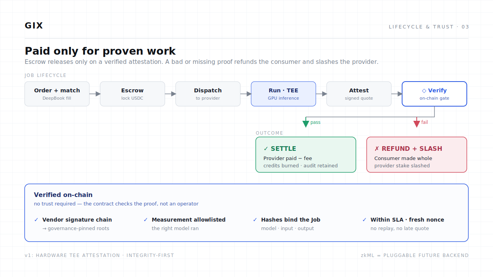
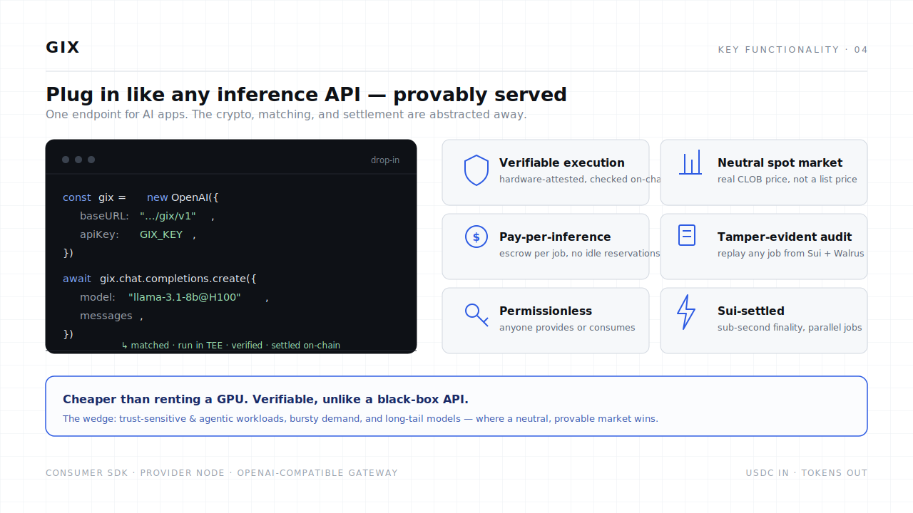
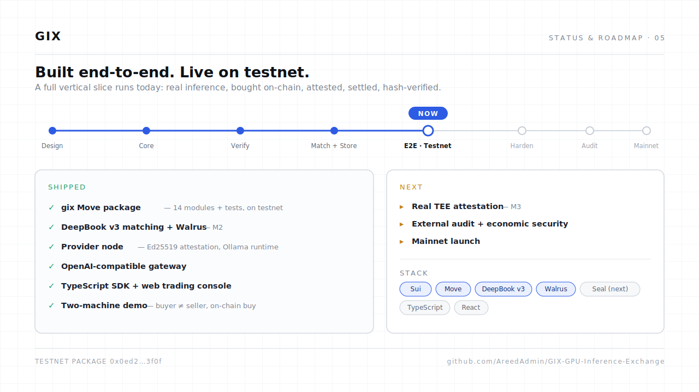
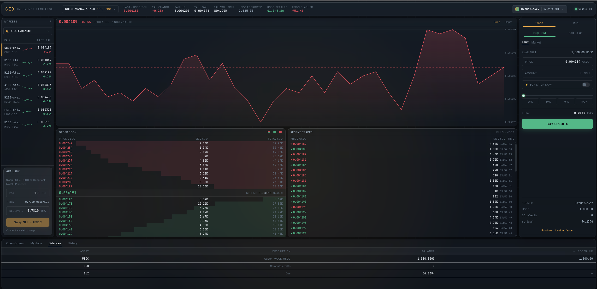

<div align="center">



<br/>

<h2 align="center">A decentralized spot market for <em>verifiable</em> GPU inference — settled on Sui.</h2>

[](docs/roadmap.md)
[](docs/m2-scope.md)
[](contracts/)
[](LICENSE)

### ▶ &nbsp;[Open the interactive pitch deck → `readme.html`](readme.html)
<sub>(open it locally in a browser, or via GitHub Pages — the slides below are the same deck, embedded)</sub>

</div>

---

GIX turns GPU inference into a **liquid, exchange-traded commodity**. Compute is matched on a
central limit order book, every job is **proven by hardware attestation and verified on-chain**,
and payment settles autonomously — no trust in any single provider, and no black-box API.

| Layer | Tech | Role |
| --- | --- | --- |
| **Match** | **DeepBook v3** | A live CLOB where compute supply meets demand — a real-time spot price, no auction latency. |
| **Verify** | **TEE attestation** | A hardware-signed quote, checked **on-chain**, proves the *right model ran on your input*. |
| **Settle** | **Sui + Walrus** | USDC escrow released only on a verified proof; a tamper-evident audit trail on Walrus. |

---

## How it works

<div align="center">

</div>

Demand (consumer / SDK / OpenAI-compatible API) and supply (provider node + TEE) meet on a
**DeepBook** pool. A fill creates an escrowed **Job** on the **`gix`** Move package, which is the
**sole settlement authority** — off-chain services optimize liveness but can never move funds or
fake a result. Artifacts live on **Walrus**, content-addressed; Sui holds only their hashes.
→ [architecture overview](docs/architecture/overview.md)

## Paid only for proven work

<div align="center">

</div>

Escrow releases **only** on a verified attestation. The contract checks the vendor signature
chain, that the measurement is allowlisted (the *right* model), that the model/input/output
hashes bind the Job, and that it was within SLA. A bad or missing proof → **refund the consumer,
slash the provider**. → [verification & attestation](docs/architecture/verification-attestation.md)

## Plug in like any inference API

<div align="center">

</div>

AI apps point an **OpenAI-compatible** client at the gateway; the matching, escrow, and
settlement are abstracted away. The wedge isn't *cheapest tokens* — it's **verifiable, neutral,
pay-per-inference** compute for trust-sensitive, agentic, bursty, and long-tail workloads.

## Built end-to-end · live on testnet

<div align="center">

</div>

A full vertical slice runs today: real `llama3.1:8b` inference, bought **on-chain** with USDC,
attested with a registered-key signature **verified on-chain**, settled to the provider, and
returned **hash-verified** — through both the gateway and the web console.
→ [demo runbook](DEMO.md) · [roadmap](docs/roadmap.md)

<div align="center">

<br/>
<sub>The web trading console — live order book, open positions, and a per-job on-chain audit trail.</sub>
</div>

---

## Locked v1 decisions

- **Verification — hardware TEE attestation only** (no zkML, no re-execution in v1). MVP scope:
  CPU TEE = **Intel TDX (P-256)**, natively verifiable on Sui; AMD SEV-SNP and **on-chain GPU-CC
  verification are a post-MVP fast-follow**. → [verification §4/§9](docs/architecture/verification-attestation.md)
- **Privacy — integrity-only in v1.** Confidential markets (sealed I/O via **Seal**) are a roadmap item.
- **Match — DeepBook v3** over per-market Compute Credits (`Credit⟨M⟩ / USDC`).
- **Settle in USDC.** The native **GIX token is deferred to post-MVP** — v1 bonds are USDC,
  governance is an `AdminCap`/multisig. → [tokenomics](docs/tokenomics.md)
- **Stack —** Move (`gix`), TypeScript (node, SDK, gateway, web, harness).

## What's built

| Component | Path | Notes |
| --- | --- | --- |
| **Contracts** | [`contracts/`](contracts/) | `gix` Move package — 14 modules + tests, deployed to testnet |
| **Provider node** | [`node/`](node/) | TypeScript; Ollama runtime adapter; Ed25519 attestation; DeepBook + Walrus |
| **Gateway** | [`services/gateway/`](services/gateway/) | OpenAI-compatible inference API over the market |
| **SDK** | [`sdk/`](sdk/) | TypeScript consumer/provider client + Walrus tooling |
| **Web** | [`web/`](web/) | React/Vite trading console |
| **Harness** | [`harness/`](harness/) | Multi-actor simulation & load-test harness |
| **Examples** | [`examples/`](examples/) | GPU-less buyer client (two-machine demo) |
| **Ops** | [`ops/`](ops/) | localnet / deploy / fund / demo scripts |

## Quickstart

```bash
# 1. open the pitch deck
open readme.html                      # or: python3 -m http.server, then visit /readme.html

# 2. contracts (Sui Move)
cd contracts && sui move test

# 3. check your testnet wallet (deploy targets are in deployment.testnet.json)
sui client switch --env testnet && sui client balance
```

See [`DEMO.md`](DEMO.md) for the full end-to-end runbook and
[`docs/two-machine-networking.md`](docs/two-machine-networking.md) for the buyer↔seller topology.

## Documentation

Start with the **[overview](docs/architecture/overview.md)** (canonical) and the
**[glossary](docs/glossary.md)**, then read by area via **[docs/README.md](docs/README.md)**.
Decisions that still need a human answer live in
**[docs/open-ended-questions.md](docs/open-ended-questions.md)**.

| Area | Doc |
| --- | --- |
| Architecture (canonical) | [overview](docs/architecture/overview.md) · [contracts](docs/architecture/sui-move-contracts.md) · [DeepBook](docs/architecture/deepbook-integration.md) · [Walrus](docs/architecture/walrus-integration.md) · [verification](docs/architecture/verification-attestation.md) · [node](docs/architecture/node-architecture.md) · [SDK](docs/architecture/sdk.md) |
| Protocol | [task lifecycle](docs/protocol/task-lifecycle.md) |
| Economics & security | [tokenomics](docs/tokenomics.md) · [threat model](docs/security/threat-model.md) |
| Plan & ops | [roadmap](docs/roadmap.md) · [deployment](docs/operations/deployment.md) · [M2 scope](docs/m2-scope.md) |

## License

[Apache-2.0](LICENSE).
