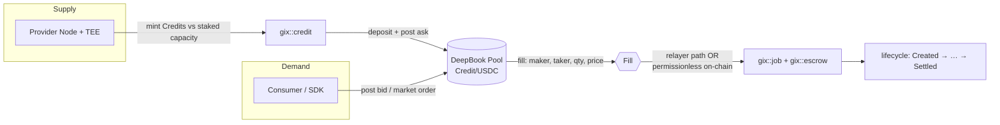
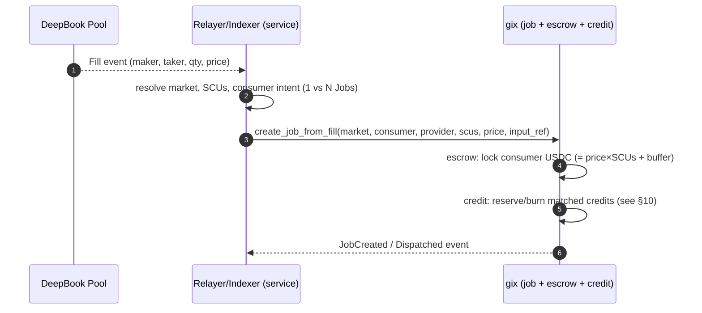

# DeepBook Integration

**Purpose:** How GIX uses DeepBook v3 as its on-chain matching engine — tokenizing
per-market Compute Credits, pooling them against USDC, and turning fills into
escrowed Jobs.

> **Status:** Design document. Conforms to the canonical names, module map, object
> model, and lifecycle in [overview](overview.md) and the [glossary](../glossary.md).
> Where exact DeepBook v3 API surface is uncertain, the assumption is stated
> explicitly rather than asserted as fact.

---

## 1. Role: DeepBook is the matching engine

GIX does not run its own order book. The matching of compute **supply** (providers
selling capacity) against compute **demand** (consumers buying capacity) is delegated
entirely to **DeepBook v3**, Sui's native central limit order book (CLOB). Each
[Market](../glossary.md) — the canonical tuple `(GPU class, model/runtime tier, SLA
class)` — gets exactly one DeepBook pool:

```
Pool(Market) = Credit<Market> / USDC
```

USDC here is the **canonical quote asset**, instantiated per network as the generic quote
coin `Q` — `MOCK_USDC` (localnet), **`DBUSDC`** (testnet), real USDC (mainnet); see
[overview §5.1](overview.md) and §13. Below, "USDC" means whichever `Q` the target network
uses.

Providers post **asks** (sell `Credit<Market>` for USDC); consumers post **bids** or
**market orders** (buy `Credit<Market>` with USDC). The clearing price of that pool is
the market's live **spot price** of compute — the present price of one SCU of the
market model's **verified output** (GIX trades *verified inference*, not raw GPU time;
[overview §1/§3](overview.md)). A fill is the trigger that creates an on-chain `Job`
and locks an `Escrow` (see §6).

This is fixed canon: tokenized credits matched on DeepBook. A bespoke Move CLOB is
**not** the v1 design.

> **Why a real CLOB — the three-role spot market.** GIX is a **spot exchange for a
> perishable commodity** ([overview §3.1](overview.md)) with three roles: **consumers**
> (demand), **providers** (supply), and **market makers / liquidity providers** who post
> two-sided quotes to earn the spread **without owning a GPU or consuming inference**.
> That third role is *the* reason GIX matches on DeepBook rather than a bespoke
> worker-pool: only a real order book lets a third party supply liquidity it neither
> produces nor consumes. Real-time price discovery, MM liquidity, and hedging are in
> scope; hoarding is bounded by perishability + credit expiry.



### Why reuse DeepBook instead of a custom CLOB

| Concern | Custom Move CLOB | DeepBook v3 (chosen) |
| --- | --- | --- |
| Matching engine | We build & audit price-time priority, partial fills, cancels | Hardened, audited, in production on Sui |
| Performance | Unproven; every order is our gas cost to optimize | Tuned for high-frequency on-chain trading |
| Liquidity | Isolated to GIX | Shared tooling, market-maker ecosystem, routing |
| Parallelism | We design object layout to avoid contention | DeepBook already structured for Sui's parallel execution |
| Price-time priority, tick/lot semantics | Reimplemented & re-tested | Provided primitives |
| Flash loans / atomic composition | Build from scratch | Native (used in §6 fallback) |
| Maintenance surface | A whole second protocol to maintain | One integration boundary |

The cost of reuse is a **coupling to DeepBook's data model and an impedance mismatch**
between a *fungible-token trade* and a *unit of work*. The bulk of this document is
about bridging that gap (§6).

See [overview §3](overview.md) for the canonical "why tokenize" rationale and
[tokenomics](../tokenomics.md) for the economic model.

---

## 2. DeepBook v3 primer (design level)

This is the mental model GIX integrates against. Treat specifics flagged
*(assumption)* as design assumptions to confirm against the live DeepBook v3
package on the target network.

### 2.1 Pools

A **Pool** is a shared object trading a `Base/Quote` asset pair. For GIX:
`Base = Credit<Market>`, `Quote = USDC`. Pools maintain the bid and ask sides of the
order book and execute matching with **price-time priority** (best price first;
within a price level, earliest order first).

Each pool is parameterized by:

- **Tick size** — the minimum price increment (in quote units per base unit).
- **Lot size** — the minimum base-quantity increment per order.
- **Min size** — the minimum order quantity that may rest or execute.

DeepBook v3 supports **permissionless pool creation** via `create_permissionless_pool`:
anyone can create a pool for a coin pair by paying a fixed **500 DEEP** creation fee. The
pair need not be pre-whitelisted, but it must be **unique** — the global `PoolRegistry`
rejects a duplicate pair. GIX uses this so `gix::market` can stand up a pool per market
without a DeepBook-side allowlist; because each market's `Credit<Market>` coin type is
unique, the `Credit<Market>/USDC` pair is inherently GIX-controlled (see §12 Q7).
*(Verified: `deepbookv3/contract-information/permissionless-pool.mdx`.)*

### 2.2 BalanceManager and TradeProof

DeepBook v3 separates **custody** from **trading authority**:

- **`BalanceManager`** — a shared object that custodies a trader's funds across pools.
  Deposits/withdrawals go through it; orders settle against its balances. One
  `BalanceManager` can trade across many pools.
- **`TradeProof`** — a short-lived capability minted from a `BalanceManager` (by its
  owner, or by a delegated trade-cap holder) that authorizes order placement/cancel in
  a single transaction. It proves "this PTB is allowed to move this manager's funds"
  without handing over ownership.

GIX implication: both providers and consumers (or the SDK acting for them) hold a
`BalanceManager`. The provider's manager holds minted `Credit<Market>` and receives
USDC proceeds; the consumer's manager holds USDC and receives credits on a buy. See
§9 for who holds what and how custody flows into `Escrow`.

### 2.3 Order types & priority

- **Limit order** (`place_limit_order`) — may match immediately as a taker, then rests
  the remainder as a maker. ("Limit = maker" is loose; a marketable limit takes first.)
- **Market order** (`place_market_order`) — executes immediately against the book →
  **taker**; any unfilled remainder is cancelled (modeled internally as a limit order at
  the max/min price). No resting.
- **Order options** (verified v3 constants, not free-form flags): `NO_RESTRICTION`,
  `IMMEDIATE_OR_CANCEL` (IOC), `FILL_OR_KILL` (FOK), `POST_ONLY`. Order **expiry** is a
  separate `expire_timestamp` parameter, *not* one of the four options.
- **Self-matching options** (verified): `SELF_MATCHING_ALLOWED`, `CANCEL_TAKER`,
  `CANCEL_MAKER` — prevent a `BalanceManager` from trading against its own resting orders.
  *(Verified: `deepbookv3/contract-information/orders.mdx`.)*

Matching is **price-time priority**. A taker order walks the book from best price,
generating one or more fills (one per maker order/level consumed) until filled or
exhausted.

### 2.4 Fees

DeepBook v3 charges **maker** and **taker** fees, taker-heavy to reward liquidity
provision. Fee tiers by pool type: **Volatile** (taker 1–10 bps / maker 0–5),
**Stable** (taker 0.1–1 / maker 0–0.5), **Whitelisted** (0/0). Fees are payable **either
in DEEP** (with a ~20% discount) **or in the input/traded token** — input-token fees are
a **per-order flag** (`pay_with_deep: false`) available on all pools, *not* a special
pool type, so a USDC-paying consumer never needs to hold DEEP. (Operational caveat: to
*collect* fees in DEEP a pool needs a DEEP price point via a `add_deep_price_point` cron;
and a stale contract note claims `pay_with_deep` "must be true" — believed outdated,
verify against the live package. See §12 Q4.) These fees are **separate from** the GIX
protocol fee taken at
[settlement](../protocol/task-lifecycle.md). The total consumer cost is:

```
spot_price × SCUs  +  DeepBook taker fee  +  GIX protocol fee (at settlement)  +  Sui gas
```

This fee stack is a real UX cost; §7 discusses amortizing it.

### 2.5 Flash loans

DeepBook v3 exposes **flash loans**: borrow from a pool and repay within the same PTB
(transaction is atomic; if not repaid, the whole PTB aborts). GIX uses this property
conceptually in the **permissionless on-chain fill→Job fallback** (§6.3) to make
"consume the order book *and* create the Job" atomic.

---

## 3. Compute Credit tokenization

### 3.1 One coin type per Market

Each Market has **exactly one** fungible Compute Credit coin type, e.g.
`gix::credit::CREDIT<MARKET_H100_LLAMA70B_INT8_P50>` (one-time-witness per market, a
distinct `Coin<T>`). One credit = **one SCU** for that market — one unit of the model's
**verified output** (a bounded request/item, or *N* output tokens at the market's tier;
see [glossary](../glossary.md)), **not** a unit of GPU time. The GPU class in the market
tuple only *qualifies* which hardware serves the model.

> Credits are **claims on verified output, not money**. USDC is the money. A
> `Credit<Market>` is only fungible *within* its market; credits from different markets
> are different types and cannot be confused on-chain.

### 3.2 Treasury cap & minting authority

The `TreasuryCap<Credit<Market>>` is **held by the `gix::credit` module** (wrapped in
a market-scoped object, not held by any provider). Providers never hold the raw
treasury cap. Minting is gated by capacity, not by possession:

```move
// illustrative design sketch, not final
public fun mint_credits(
    market: &Market,
    stake: &mut ProviderStake,          // gates capacity; the slashable bond
    cap_registry: &mut CreditTreasury,  // holds TreasuryCap<Credit<MARKET>>
    scu_amount: u64,                    // # of SCUs == # of credits
    ctx: &mut TxContext,
): Coin<Credit<MARKET>> {
    // 1. check provider has uncommitted staked capacity for `scu_amount` SCUs
    capacity::reserve(stake, market, scu_amount);
    // 2. mint exactly scu_amount credits from the market's treasury cap
    let credits = coin::mint(&mut cap_registry.treasury, scu_amount, ctx);
    // 3. emit MintedCredits for the indexer
    events::emit_minted(stake.provider, market.id, scu_amount);
    credits
}
```

The capacity check ties minting to the **staked bond collateral** (USDC in v1; GIX
post-MVP) in [`gix::staking`](sui-move-contracts.md): a provider can only mint credits
up to the SCUs its `ProviderStake` is bonded to back. This is the supply control that prevents
a provider from selling capacity it cannot deliver — overselling is bounded by stake,
and undelivered work is slashable. The exact stake→capacity→credit curve and any
collateralization ratio live in [tokenomics](../tokenomics.md); the module split and
signatures live in [contracts](sui-move-contracts.md).

### 3.3 Lifecycle of a credit (high level)

```
mint (vs staked capacity) → deposit to BalanceManager → post ask on DeepBook
   → [matched] → moves to consumer side on fill
   → reserved/burned when the matched Job is created/settled  (see §10)
```

The reserve-vs-burn timing — whether the credit is burned on Job creation or on
`Settled` — is a deliberate design decision discussed in §10.

---

## 4. Pool structure & sizing

### 4.1 One pool per Market

```
Market(H100-80GB, llama-3.1-70b-int8, p50<2s/p99<5s)
        └── DeepBook Pool: Credit<that market> / USDC
```

`gix::market` records the DeepBook `pool_id` on the shared `Market` object (see the
object model in [overview §5](overview.md)). The pool is created **permissionlessly**
at market-genesis time, then bound:

```move
// illustrative design sketch, not final
public fun create_market(
    cfg: &GovernanceConfig,
    gpu_class: GpuClass,
    model: ID,            // ModelRecord
    sla: SlaClass,
    scu_def: ScuDefinition,
    tick: u64, lot: u64, min_size: u64,
    ctx: &mut TxContext,
): Market {
    let (treasury, meta) = credit::create_currency<...>(ctx); // per-market coin
    let pool_id = deepbook::create_permissionless_pool<Credit<...>, USDC>(
        tick, lot, min_size, /* creation fee */ ctx,
    );
    // store pool_id, scu_def, sla, treasury handle on the Market object
    ...
}
```

### 4.2 Choosing tick / lot / min size

These three numbers determine whether **per-task, high-frequency matching** is even
expressible. Goals: support buying a *single* SCU (one task) while keeping the order
book numerically sane and gas-efficient.

| Param | Drives | GIX guidance |
| --- | --- | --- |
| **Lot size** | Smallest credit quantity tradable | Set to **1 SCU** (or the smallest unit a consumer would buy) so a single task is one lot. If SCU = "one request," lot = 1. |
| **Tick size** | Price granularity in USDC/SCU | Fine enough that maker/taker can express a competitive spread on a cheap SCU, coarse enough to avoid dust price levels. Pick from expected USDC-per-SCU (e.g. a $0.002 SCU wants sub-tenth-cent ticks). |
| **Min size** | Smallest restable/executable order | Ideally = lot (1 SCU) for micro-orders; may be raised to reduce book spam if dust orders become a gas/DoS problem. |

Trade-offs:

- **Too-fine tick** → many sparse price levels, deeper book walks, more gas per fill,
  easier penny-jumping/quote-stuffing.
- **Too-coarse lot/min** → consumers can't buy a single task; forces over-buying and a
  credit-inventory burden on consumers.
- SCUs are **integers**; choosing SCU granularity (1 request vs *N* tokens) up front
  fixes lot semantics. A token-denominated SCU lets finer purchases but inflates
  credit counts and on-chain quantity arithmetic.

> **Cost implication.** Every fill is on-chain work, and §6 turns fills into Jobs.
> A market order that sweeps 50 resting asks produces ~50 fills → potentially many Job
> creations. Sizing and batching (§7) keep this affordable.

---

## 5. Order flow

### 5.1 Provider posts an ask

```ts
// illustrative design sketch, not final — TS SDK over a Sui PTB
const tx = new Transaction();
const proof = balanceManager.generateTradeProof(tx);          // TradeProof
deepbook.placeLimitOrder(tx, {
  poolId: market.poolId,
  balanceManager,
  tradeProof: proof,
  side: "ask",                 // selling Credit<Market>
  price: priceInUsdcPerScu,    // multiple of tick
  quantity: scusToSell,        // multiple of lot
  orderType: "post_only",      // ensure maker; avoid accidental take
  expireTimestamp: now + ttl,  // stale-ask hygiene (see §10)
});
// credits must already be deposited into the provider's BalanceManager
```

### 5.2 Consumer buys

A consumer either rests a **bid** (limit, patient) or sends a **market order**
(immediate). The SDK's "quote → upload input → order → await result" flow (see
[sdk](sdk.md)) typically uses a market order or aggressive IOC limit so a Job is
created promptly:

```ts
// illustrative design sketch, not final
const tx = new Transaction();
const proof = consumerManager.generateTradeProof(tx);
deepbook.placeMarketOrder(tx, {
  poolId: market.poolId,
  balanceManager: consumerManager,
  tradeProof: proof,
  side: "bid",                 // buying Credit<Market>
  quantity: scusNeeded,        // e.g. 1 SCU for one task
  selfMatchingPrevention: true,
});
```

The input blob is uploaded to Walrus **before** ordering, so `input_hash`/`blob_id`
exist when the Job is created (see [overview §6](overview.md) and
[walrus-integration](walrus-integration.md)).

---

## 6. From fill to Job

This is the core integration problem: **DeepBook produces a token trade; GIX needs an
escrowed unit of work.** A `Credit<Market>` changing hands is *not by itself* a Job —
the consumer now holds credits, but no `Job` exists, no USDC is escrowed against
delivery, and no provider is bound to execute.

GIX bridges the gap two ways, with the same authority outcome: a **relayer path**
(fast, default) and a **permissionless on-chain fallback** (trustless liveness). Both
are equivalent for correctness; the relayer holds **no settlement authority** (see
[overview §8](overview.md) and [threat model](../security/threat-model.md)).

### 6.1 The mapping: matched quantity → SCUs → Jobs

A fill yields `(maker, taker, qty_in_lots, price)`. Since lot = SCU granularity:

```
matched_SCUs = qty_in_lots × lot_SCUs
```

That `matched_SCUs` becomes **one or more Jobs**:

- **1 SCU = 1 task → 1 Job.** The common micro case: a single-SCU fill creates one
  `Job`.
- **N SCUs, one logical request → 1 Job consuming N credits.** If the consumer is
  buying capacity for a single large request that the market prices at N SCUs, the
  relayer creates one `Job` that reserves N credits.
- **N SCUs, N independent tasks → N Jobs.** A consumer pre-buying a batch creates N
  Jobs (or buys credits as inventory and creates Jobs lazily; see §10).

The SDK signals intent (batch vs single) via order metadata / an off-chain request
manifest keyed by the consumer's order, so the relayer knows the N-SCU→Job fan-out.
*(Assumption: DeepBook fill events do not carry arbitrary app payload; the
consumer→Job intent is correlated off-chain by the relayer or supplied in the
permissionless path's PTB. This is an open question — see §12.)*

### 6.2 Relayer / indexer path (default)



The relayer is a **liveness optimizer**. It watches fills, resolves the SCU→Job
fan-out, and submits the `create_job_from_fill` transaction. It cannot fake a fill or
divert funds: `gix::job`/`gix::escrow` validate that a referenced fill is real and
that the escrowed USDC corresponds to the consumer's actual quote-side proceeds /
balance (see §9 on custody and §6.4 on validation). If the relayer is offline, jobs
stall but **nothing is lost** — the consumer holds credits and can fall back to §6.3.

### 6.3 Permissionless on-chain fallback (trustless liveness)

Anyone — most naturally the consumer or the provider — can create the Job directly,
without the relayer, in a single PTB. This is what makes the relayer non-load-bearing
for correctness.

Two shapes:

1. **Order-and-create in one PTB.** The consumer's buy and the `create_job_from_fill`
   call live in the same programmable transaction: place the (taker) order against the
   pool, read the resulting fill/credits, then immediately create the Job and lock
   escrow. Because a PTB is atomic, either the consumer gets credits *and* a Job, or
   the whole thing aborts.

2. **Create-from-held-credits.** A consumer already holding `Credit<Market>` (bought
   earlier, or via the relayer-less path) calls `create_job` directly, surrendering
   the credits and locking USDC escrow, no DeepBook interaction needed at all.

```move
// illustrative design sketch, not final
public fun create_job(
    market: &Market,
    credits: Coin<Credit<MARKET>>,   // exactly scu_for_this_job credits
    payment: Coin<USDC>,             // becomes Escrow
    model: &ModelRecord,
    input_hash: vector<u8>,
    input_blob: BlobId,
    clock: &Clock,
    ctx: &mut TxContext,
): ID /* job_id */ {
    let scus = coin::value(&credits);
    let escrow = escrow::lock(payment, /* required = */ market_price_floor(market, scus));
    credit::reserve_or_burn(market, credits);            // see §10
    let job = job::new(market, scus, input_hash, input_blob, escrow, clock, ctx);
    events::emit_created(job.id, market.id);             // Created → Matched → Escrowed
    object::id(&job)
}
```

DeepBook **flash loans** (§2.5) can make shape (1) robust even when the consumer's
USDC and credits are momentarily split across steps: borrow→trade→create→repay inside
the atomic PTB. *(Assumption: flash-loan repayment and order placement compose within
one PTB; confirm against v3.)*

### 6.4 Atomicity & partial fills

- **Partial fills are normal.** A resting ask for 100 SCUs partially filled for 7 SCUs
  is a 7-SCU fill → up to 7 single-SCU Jobs (or one 7-SCU Job). The remaining 93 SCUs
  stay on the book as the provider's live ask (their inventory; §10).
- **Relayer path is not atomic with the fill.** The fill commits on DeepBook; the Job
  is created in a *later* transaction. Between them the consumer holds credits with no
  Job — acceptable because credits are redeemable (§6.3 shape 2) and escrow is only
  locked at Job creation. The risk window is *liveness*, not *safety*.
- **Permissionless path is atomic** (single PTB) — preferred when atomicity matters
  (e.g. a consumer who wants "trade only if a Job results").
- **Idempotency.** Job creation must be idempotent per fill: `gix::job` records the
  consuming fill/credit provenance so a fill cannot be turned into two Jobs (defends
  against a relayer + a self-help consumer both racing to create the Job). The credits
  are the scarce, single-spend resource that enforces this — a credit consumed by one
  Job cannot fund another.

> **One fill → many Jobs is sequential, not atomic-as-a-set.** Each Job is its own
> shared object (the [overview](overview.md) parallelism rule). A 50-SCU sweep creates
> 50 Jobs, possibly across several transactions; there is no requirement that all 50
> commit together. Batching (§7) makes this cheap.

---

## 7. High-frequency / micro-transaction design

Per-task matching means **thousands of small fills**. The naive "one fill = one
transaction = one Job" pattern would be gas-bound. Mitigations:

1. **Batch Job creation.** The relayer aggregates many fills (same or different
   markets) into a single PTB that calls `create_job_from_fill` N times. Sui PTBs run
   many Move calls per transaction, amortizing base gas across Jobs.
2. **Batch DeepBook ops.** Providers refresh quotes with batched cancel+replace
   (`modify`/cancel-many) rather than one tx per order, reducing churn cost.
3. **Credit inventory model.** Consumers can buy credits in bulk (one larger fill) and
   spin up Jobs lazily from held credits (§6.3 shape 2), decoupling trade frequency
   from Job frequency — fewer, larger trades; many cheap local Job creations.
4. **Settlement batching.** `gix::settlement` supports settling/refunding many Jobs in
   one PTB (see [contracts](sui-move-contracts.md)), so thousands of small completions
   don't each pay full base gas.
5. **Gas amortization target.** The dominant per-task cost should be the *Job*
   (escrow + lifecycle), with DeepBook matching and fee overhead amortized by batching.
6. **Sub-second finality.** Sui's object-centric parallel execution gives near-instant
   finality on disjoint Jobs; the design assumes sub-second confirmation for the
   create→dispatch and attest→settle hops, which is what makes per-task spot trading
   feel real-time. DeepBook matching itself is on the consensus path; the assumption is
   it confirms within the same sub-second envelope.

> **The real bottleneck is fills→Jobs, not matching.** DeepBook matching is cheap; the
> expensive part is materializing escrowed Jobs. Batching and the inventory model are
> the two levers that keep micro-transactions economical.

---

## 8. Price discovery, spot price & liquidity

### 8.1 Spot price

The **spot price** of a market is the live `Credit<Market>/USDC` clearing price from
DeepBook matching (canonical definition in the [glossary](../glossary.md)). The SDK's
"quote" step reads top-of-book / recent fills to show consumers the current cost per
SCU before they order.

### 8.2 Market-maker role

Liquidity providers (often the providers themselves, or third-party MMs) keep tight
two-sided or ask-side quotes so consumers get immediate, fairly-priced fills.
Maker-fee rebates/discounts (§2.4) incentivize resting liquidity. Providers are
natural makers: they mint credits against capacity and rest asks; their inventory is
real capacity, so their quotes reflect true marginal cost.

### 8.3 Cold-start / liquidity bootstrapping

A brand-new market has an empty book — the classic two-sided cold-start problem.
Approaches (economics detailed in [tokenomics](../tokenomics.md)):

- **Provider-seeded asks.** Onboard a few staked providers who mint and rest asks at a
  reference price, so consumers always have a fill available.
- **Maker incentives.** Fee rebates / GIX incentives for early makers in thin markets.
- **Reference/oracle pricing.** Seed an initial price band from an off-chain compute
  price reference to avoid wild first-trade prints.
- **Market consolidation.** Don't over-fragment markets; too many narrow markets split
  liquidity. The market-definition granularity is a governance lever — see §12 open
  question on one-pool-per-market scaling.

---

## 9. USDC custody: trade proceeds vs escrow

There is a subtlety: DeepBook settles a buy by moving **USDC to the seller's
`BalanceManager`** and credits to the buyer. But in GIX the consumer's USDC should
become **Escrow against delivery**, and the provider should be paid **only at
settlement** — not at fill.

The design reconciles this by separating *the trade* from *the payment for work*:

- **Credits are the traded good; USDC paid on DeepBook buys credits.** That USDC is the
  *price of capacity claims*. But the value that must be escrowed for the Job is held
  against **delivery**, released at `Settled` or refunded at failure.
- **Preferred model — escrow at Job creation, not at fill.** The consumer's `create_job`
  (or the relayer's `create_job_from_fill`) locks the USDC into `gix::escrow` as part
  of Job creation, surrendering credits. The provider receives revenue **from escrow at
  settlement**, minus the GIX protocol fee — *not* from the DeepBook fill. In this
  model the DeepBook trade is a **price-discovery / matching mechanism**; the actual
  money-for-work moves through `Escrow`. *(Assumption: credits are priced low/nominal on
  the book or the buy-side USDC is recaptured into escrow; the precise flow — whether
  the USDC paid to the maker on DeepBook is the same USDC that becomes escrow, or
  whether escrow is funded separately at Job creation — is an open question, §12, with
  direct settlement implications.)*
- **Interaction with [settlement](../protocol/task-lifecycle.md).** On `Verified`,
  `gix::settlement` releases `Escrow` → provider (− protocol fee), distributes fees, and
  finalizes the consumed credits. On failure (invalid/missing attestation, SLA breach,
  timeout), escrow is **refunded** to the consumer and the provider's stake may be
  **slashed**. The DeepBook fee was already spent — it is a transaction cost, not part
  of escrow, and is not refunded.

This separation is what lets settlement remain the **sole authority** over who gets
paid, independent of how matching happened.

---

## 10. Credit vs order lifecycle

Two lifecycles run in parallel and must stay consistent: the **order** lifecycle (on
DeepBook) and the **credit** lifecycle (on `gix::credit`).

> **Credit fungibility — single-use now, bearer-resale later (sequencing).** A
> `Credit<Market>` is fungible *on the book* (it must be, to pool in one DeepBook pool),
> but in **v1/M2 a filled credit is single-use**: it is consumed by its buyer's `Job`,
> and the **provider whose ask filled is the obligated server** (assigned-from-fill,
> single-provider in the demo). This keeps the credit↔server link intact without a
> dispatch/clearing layer. A **full free-resale secondary market** — *fungible bearer
> credits* redeemable against **any** staked provider, decoupling "who bought" from "who
> serves" — is the deliberate post-MVP **tradeable-credits upgrade**
> ([roadmap](../roadmap.md) Phase 8): it requires a dispatch + clearing layer (job
> assignment from a provider pool, not from the fill) and is what would let role-3 market
> makers re-sell a held credit onward, not merely quote the book. Reselling fungible
> credits *before* that layer exists would break the server↔credit binding, so it is
> intentionally out of scope until then.

### 10.1 Reserve vs burn semantics

A credit represents one undelivered SCU of capacity. When a Job consumes credits:

- **Reserve-then-burn (preferred).** On Job creation the credits are *reserved*
  (escrowed inside the Job / removed from circulation but not yet destroyed). On
  `Settled` they are **burned** (capacity was delivered). On `Refunded`/failure, the
  reservation is **released**: depending on policy either returned to the provider's
  inventory (provider gets capacity back) or burned with stake slashed (provider
  failed). The release policy is governed by fault attribution in
  [task-lifecycle](../protocol/task-lifecycle.md) and [slashing](sui-move-contracts.md).
- **Burn-on-creation (simpler).** Burn immediately at Job creation; on refund, *re-mint*
  to the provider. Simpler accounting, more mint/burn churn.

Either way, **a credit can fund exactly one Job** — this single-spend property is what
makes fill→Job idempotent (§6.4).

### 10.2 Cancellations & stale asks

- **Cancel.** A provider cancels a resting ask via DeepBook; the credits return to its
  `BalanceManager`. No Job, no escrow — purely an order-book action.
- **Stale-ask hygiene.** Asks carry an **expiry timestamp** (§5.1) so a provider that
  goes offline doesn't leave sellable capacity it can no longer honor. Expired orders
  stop matching; the node's [node-architecture](node-architecture.md) liveness loop
  re-posts fresh asks while healthy.
- **Capacity ↔ inventory coupling.** Minted-but-unsold credits resting on the book are
  *committed* capacity. If a provider's available capacity drops (hardware fault,
  reboot), it should **cancel asks** to avoid being matched for work it can't run within
  SLA — otherwise it risks SLA-breach slashing.

### 10.3 Inventory management for providers

The node treats resting asks as a real-time reflection of free capacity:

```
free_capacity (SCUs)  ──mint──►  Credit inventory  ──post ask──►  resting on book
        ▲                                                              │
        └──────────── cancel / expire / job completes ────────────────┘
```

The node continuously reconciles: *(free GPU capacity) ≈ (resting asks) + (in-flight
Jobs)*. Over-posting risks SLA slashing; under-posting wastes capacity (lost revenue).
This control loop lives in [node-architecture](node-architecture.md).

---

## 11. Risks & abuse (summary)

Matching-layer attack surface — full treatment in
[threat model](../security/threat-model.md):

- **Thin-pool price manipulation.** In a shallow market, a small order moves spot price
  a lot; a consumer could be over-charged or a manipulator could print a misleading
  reference. Mitigations: market-maker liquidity, price bands/oracle reference at
  cold-start (§8.3), and consumer-side slippage limits (IOC/limit with a max price).
- **Wash trading.** A provider trading with itself to fake volume/price. Mitigations:
  self-matching prevention (§2.3), and the economic reality that a wash trade that
  *settles* must still produce a verified attestation or get slashed — fake volume that
  never delivers costs DeepBook + gas fees and earns nothing.
- **Front-running / MEV.** A searcher could observe a pending consumer market order and
  reprice. Mitigations: limit orders with explicit max price, fine-but-not-dust tick
  sizing to limit penny-jumping, and Sui's execution model; residual MEV is documented
  in the [threat model](../security/threat-model.md).
- **Order-book spam / dust DoS.** Floods of sub-min orders. Mitigations: `min_size`
  (§4.2), DeepBook order fees, and per-account limits.
- **Fill→Job race / double-creation.** Defended by credit single-spend + idempotent Job
  creation (§6.4).
- **Oversold capacity.** A provider minting more credits than it can serve. Bounded by
  stake-gated minting (§3.2) and slashed on SLA breach.

---

## 12. Open questions

> These are **resolved** against the DeepBook v3 docs (answers inline below). The one
> remaining item needing *your* call — **market granularity / dimension consolidation**
> (Q5) — is tracked centrally as **E2** in
> [open-ended-questions.md](../open-ended-questions.md).

1. **Exact fill→Job hook & atomicity.** DeepBook v3 fill events likely don't carry
   arbitrary app payload, so the consumer→Job intent (1 vs N Jobs, which input blob)
   must be correlated off-chain by the relayer or supplied in the permissionless PTB.
   Is there a clean on-chain hook to bind a fill to a Job atomically without the
   self-help PTB? This is the single most load-bearing uncertainty.

  **Resolved (verified against DeepBook v3 + PTB docs).** Atomicity is achieved with a
  client-side Programmable Transaction Block (PTB); off-chain relayers are a liveness
  optimizer, **not** required for correctness. **One mechanism correction, though:**
  `place_market_order` / `place_limit_order` do **not** return the bought
  `Credit<Market>` coins — they return an `OrderInfo` value and **settle filled funds
  into the taker's `BalanceManager`** (via the pool's internal Vault). So you cannot pipe
  "the compute tokens from Command 0" straight into `create_job` as a coin argument. Two
  PTB shapes that *do* work and stay atomic:
  - **Swap interface (cleanest):** call `swap_exact_quote_for_base<Credit, USDC>` — the
    DeepBook **swap** functions return real `Coin<Base>` / `Coin<Quote>` / `Coin<DEEP>`
    objects, which a later command can pass by `NestedResult` directly into
    `create_job`. No `BalanceManager` needed.
  - **Order + withdraw:** place the order, then `withdraw` the credited
    `Credit<Market>` out of the `BalanceManager` into a `Coin` **within the same PTB**,
    and feed that into `create_job`.

  Either way a PTB is all-or-nothing: if `create_job` aborts, the whole block (including
  the trade) reverts. Note also that DeepBook **fill events carry no arbitrary app
  payload**, so the consumer→Job intent (input blob, 1-vs-N fan-out) must be supplied in
  the PTB itself (permissionless path) or correlated off-chain (relayer path) — it cannot
  ride on the fill event.
  *(Sources: `deepbookv3/contract-information/{orders,swaps}.mdx`, `develop/transactions/ptbs/prog-txn-blocks.mdx`.)*

2. **USDC flow: trade payment vs escrow funding.** Does the USDC the consumer pays on
   the DeepBook buy *become* the escrow, or is escrow funded separately at Job
   creation while credits are priced nominally? This determines whether the maker (a
   third-party MM) ever holds the work-payment USDC, and has direct settlement and
   refund implications (§9).
  **Resolved (verified against DeepBook v3 settlement semantics).** DeepBook pays the
  **maker** (a possibly third-party market-maker) at *fill* time: on a buy, USDC moves
  to the maker's `BalanceManager` and credits move to the taker — there is no native
  escrow-against-delivery. **Therefore GIX must not rely on the DeepBook trade to hold
  the work-payment USDC.** The settled escrow model is the right call: the consumer's
  real compute payment is locked into `gix::escrow` at **Job creation**, and the provider
  is paid **only at settlement**, on a verified **TEE attestation** (per the v1
  verification canon — *not* a zero-knowledge proof, which is an explicit v1 non-goal;
  see [verification](verification-attestation.md)). Refunds return the escrowed USDC to
  the consumer directly; the market-maker never touches the work payment.

  Two ways to reconcile this with the tokenized-credit canon (overview §3 — credits *are*
  traded on DeepBook, this is fixed):
  - **(a) Trade credits, escrow USDC separately in the same PTB.** Credits are priced
    on the book at a nominal/low level (a credit is a *capacity claim*, cheap); the real
    USDC compute price is escrowed at `create_job` within the atomic order+create PTB.
    Preserves the CLOB price signal *and* escrow-against-delivery.
  - **(b) DeepBook as a price oracle only.** Read top-of-book/recent fills for the spot
    price, then deposit USDC straight into `gix::escrow` without resting/taking a
    credit order. Simpler, but it weakens the "tokenized credit" thesis and the
    matching/liquidity benefits — treat (a) as the default.
  *(Sources: `deepbookv3/design.mdx` settlement flow.)*

3. **Reserve vs burn-on-creation.** **Resolved (design decision; Sui-feasible either
   way).** Use the **Reserve model (escrow lock)** from §10.1: credits are reserved into
   the `Job` at creation and **burned at `Settled`**; on `Refunded`/failure the
   reservation is released per fault attribution (returned to provider inventory on
   no-fault, burned-with-slash on provider fault). This keeps refunds cheap (no re-mint)
   and makes fill→Job idempotent via the credit single-spend property. The accounting
   lives entirely in `gix::credit`/`gix::staking`; nothing in DeepBook constrains the
   choice. (Re-mint-on-refund remains a valid simpler alternative — §10.1 — but reserve
   is the default.)

4. **DeepBook fee interaction.** **Resolved (verified against DeepBook v3 docs), with
   one caveat.** v3 supports **input-token fees as a per-order flag** (`pay_with_deep:
   false`), available on *all* pool types — so a USDC-paying consumer never needs to hold
   DEEP (forgoing the ~20% discount that paying in DEEP gives). Pool **fee tiers** are
   Volatile (taker 1–10 bps / maker 0–5), Stable (taker 0.1–1 / maker 0–0.5), and
   Whitelisted (0/0); a `Credit/USDC` pool is a Volatile or Stable pool. **Caveat:** to
   *collect* fees in DEEP the pool needs a DEEP price point, which requires base or quote
   to be USDC/SUI **and** a cron calling `add_deep_price_point` every 1–10 min — GIX's
   `Credit/USDC` pools qualify (quote = USDC) but a GIX-run cron is an operational
   requirement per pool. Also flag: one contract doc note (`orders.mdx`) still says
   `pay_with_deep` "must be true" — this contradicts the v2+ changelog/SDK default and is
   believed stale; **verify against the live package (v6) before relying on DEEP-free
   orders.** The consumer cost stack to display: `spot_price × SCUs + DeepBook fee
   (DEEP-discounted or input-token) + GIX protocol fee (at settlement) + Sui gas`; the
   SDK must compute this before building the PTB. *(Sources:
   `deepbookv3/contract-information/{permissionless-pool,orders}.mdx`, `design.mdx`.)*

5. **One pool per market — does it scale?** **Partly resolved — and the original
   reasoning was factually wrong.** Correction: a DeepBook v3 **`Pool` is a single shared
   object**; `Book`/`State`/`Vault` are internal Move *components of that one object*, not
   three separate shared objects. (The distinct shared objects in DeepBook are `Pool`,
   the global `PoolRegistry`, and per-trader `BalanceManager`s.) The Sui/DeepBook docs
   are **silent** on any "thousands of pools degrades the network" limit — that claim is
   not doc-supported and should not be asserted as a protocol fact. What *is* real and
   doc-backed: (i) each permissionless pool costs **500 DEEP** to create; (ii) each pool
   needs the `add_deep_price_point` cron (Q4) and an `update_pool_allowed_versions` call
   after every DeepBook upgrade — a per-pool ops burden; (iii) pools are
   consensus-sequenced shared objects, but **distinct pools do not contend with each
   other** (Sui parallelizes transactions on disjoint shared objects), so pool *count*
   is not itself a throughput ceiling. The genuine constraint is **economic, not
   technical**: market-maker capital and liquidity fragment across granular pools, giving
   shallow books and wide spreads. **Conclusion:** consolidate market dimensions (e.g.
   collapse fine SLA tiers) to concentrate liquidity and amortize the 500-DEEP +
   cron-per-pool overhead — a governance lever, not a hard Sui limit. *(Sources:
   `deepbookv3/design.mdx`, `permissionless-pool.mdx`; consensus/parallelism in
   `develop/transaction-payment/local-fee-markets.mdx`.)*

6. **Flash-loan composition.** **Resolved (confirmed).** v3 exposes
   `borrow_flashloan_base` / `borrow_flashloan_quote`, which return a `FlashLoan` **hot
   potato** (an ability-less struct) that must be repaid via `return_flashloan_*` in the
   **same PTB** or the transaction aborts — borrow→trade→create→repay composes atomically.
   One documented caveat: borrowing from a pool **and trading in that same pool** in one
   PTB can fail (borrowed funds aren't available to move), so the atomic order-and-create
   fallback should borrow from a *different* liquidity source than the pool being swept,
   or use the swap-interface path (Q1) which doesn't need a flash loan at all.
   *(Source: `deepbookv3/contract-information/flash-loans.mdx`.)*

7. **Permissioned vs permissionless pool creation in practice.** **Recommendation
   (design decision).** `create_permissionless_pool` enforces **one pool per asset pair**
   (the `PoolRegistry` rejects duplicates), and a market's `Credit<Market>` coin type is
   unique to that market — so the `(Credit<Market>, USDC)` pair is inherently
   GIX-controlled and cannot be re-created by a third party. Have `gix::market` create and
   record the pool at market genesis (binding `deepbook_pool_id` on the `Market` object);
   no external party can stand up a competing pool for the same `Credit<Market>/USDC`
   pair. So "GIX owns pool creation" falls out of the per-market coin type for free; no
   extra allowlist is needed. *(Source: `permissionless-pool.mdx` uniqueness rule.)*

8. **Self-matching & MEV residue.** **Resolved (confirmed).** Self-matching is handled
   per order via three options — `SELF_MATCHING_ALLOWED`, `CANCEL_TAKER`, `CANCEL_MAKER`
   — preventing a `BalanceManager` from trading against its own resting orders (use
   `CANCEL_TAKER` for consumer orders). On MEV/front-running, DeepBook ships an **EWMA
   gas-price penalty**: when the current gas price exceeds ~3σ above an exponentially-
   weighted moving average, the taker fee is raised, "to prevent toxic takers from using
   high gas prices to … pick off stale maker orders." It triggers only on extreme gas
   spikes (~0.15% of observations, ~+0.1% taker fee). Residual exposure for consumer
   market orders is therefore bounded but non-zero; mitigate with **limit/IOC orders that
   carry an explicit max price** (slippage cap) rather than naked market orders.
   *(Sources: `deepbookv3/contract-information/{orders,ewma}.mdx`.)*

---

## 13. The SUI→USD on-ramp (consumer funding)

Consumers hold **SUI** (the gas token) but compute is priced in the quote dollar `Q`
(`MOCK_USDC` / `DBUSDC` / `USDC` per network — [overview §5.1](overview.md)). To fund a
purchase without leaving the app, GIX ships a small **SUI→USD on-ramp**: an in-app
**utility swap**, *not* a DEX, that converts a user's SUI into the quote dollar they then
spend on inference.

Crucially, this is the **one DeepBook integration GIX can demonstrate live today with no
DEEP**, because it rides an **existing** pool rather than a GIX-created one:

| Network | On-ramp swap | Pool (existing) |
| --- | --- | --- |
| **testnet** | `SUI → DBUSDC` | `SUI_DBUSDC` (DeepBook's live testnet pool) |
| **mainnet** | `SUI → USDC` | `SUI_USDC` |

Flow:

1. User holds SUI; the widget ("Get USDC") swaps `SUI → DBUSDC` on the existing pool.
2. The swap PTB pays fees with the **input coin** (`pay_with_deep: false`, §2.4) → **no
   DEEP** needed.
3. The user now holds the quote dollar and buys compute via the normal path (§5–§6).

### 13.1 On-ramp vs the compute order book — keep them distinct

The on-ramp and the per-market `Credit<Market>/Q` book are **different things** and must
not be conflated:

| | On-ramp swap | Compute order book |
| --- | --- | --- |
| Purpose | Fund a wallet (SUI → quote dollar) | Match compute supply/demand; price discovery |
| Pool | An **existing** `SUI/USD`-family DeepBook pool | A **GIX-created** `Credit<Market>/Q` pool (§4) |
| DEEP | **None** — uses an existing pool + input-coin fees | Pool **creation is DEEP-gated** (500 DEEP, §2.1, §12 Q5) |
| Role in GIX | Funding convenience | The exchange itself |
| Live now? | **Yes** (real testnet txns on `SUI_DBUSDC`) | Direct/Ask buy path works now; the permissionless `Credit/Q` order book is the DEEP-gated piece |

So the on-ramp proves the DeepBook integration **live now, DEEP-free**, while the
DEEP-requiring work (creating each market's `Credit<Market>/Q` pool) stays on the roadmap.
Full design: [onramp-dbusdc-plan.md](../onramp-dbusdc-plan.md).

---

*Cross-references:* [overview](overview.md) · [contracts](sui-move-contracts.md) ·
[lifecycle](../protocol/task-lifecycle.md) · [tokenomics](../tokenomics.md) ·
[threat model](../security/threat-model.md) · [node](node-architecture.md) ·
[sdk](sdk.md) · [on-ramp plan](../onramp-dbusdc-plan.md)
