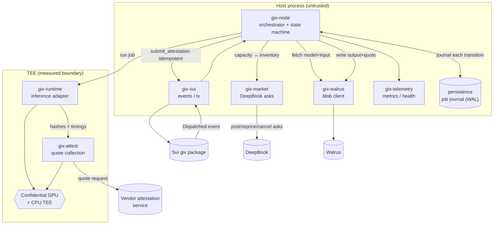

# Node Architecture

Engineering plan for the **Node** — the Rust provider software that runs inference
inside a TEE, produces attestations, and manages stake, credits, and asks.

> **Status:** Conforms to [overview](overview.md) and the [glossary](../glossary.md).
> Canonical names (Node, ProviderStake, Compute Credit, SCU, Job, `Dispatched`
> event, `model_hash`/`input_hash`/`output_hash`, attestation quote, lifecycle
> states) are used exactly as defined there. When this document and the overview
> disagree, the overview wins.

---

## 1. Role & responsibilities

The Node is the provider's autonomous worker. It is the **trust-sensitive boundary
of the protocol**: it is the only component that touches plaintext model, input, and
output, and the only one whose honest behaviour the protocol does *not* assume.
Instead, the Node runs inside a hardware TEE and the protocol trusts **only** the
vendor-signed attestation quote it produces — never the Node's own assertions. Every
design choice below follows from that single fact: *the Node is untrusted code whose
TEE measurement must be reproducible and allowlisted, so that what it claims to have
run can be cryptographically verified on-chain.*

A correctly operating Node performs, end to end:

1. **Market presence.** Mints Compute Credits against its `ProviderStake` capacity and
   posts asks (`Credit<Market>` for USDC) on DeepBook; reprices and cancels as
   inventory and spot price move. → [deepbook](deepbook-integration.md)
2. **Job intake.** Subscribes to the Sui `gix` package and reacts to `Dispatched`
   events addressed to it, acknowledging within the **dispatch-ack** deadline.
3. **Artifact fetch.** Reads the model (by `ModelRecord` Walrus content id) and the
   input blob from Walrus, verifying `model_hash` and `input_hash`.
   → [walrus](walrus-integration.md)
4. **Confidential execution.** Loads the model deterministically by `model_hash` and
   runs inference inside the GPU + CPU TEE, metering output into SCUs and tracking the
   **execution/SLA** deadline.
5. **Attestation.** Obtains a vendor-signed attestation quote binding
   `runtime_measurement ‖ model_hash ‖ input_hash ‖ output_hash ‖ t_start ‖ t_end`.
   → [verification](verification-attestation.md)
6. **Publish & submit.** Writes the output blob + quote to Walrus, then submits
   `submit_attestation` to Sui **idempotently** within the **attestation-submission**
   deadline. → [contracts](sui-move-contracts.md)
7. **Self-governance.** Tracks settlement and slashing events, manages stake
   (stake/unstake), redeems credits on completion, and exposes health/metrics for the
   operator.

What the Node is **not**: it is not trusted for correctness (the quote is), it holds
no settlement authority (the contracts do), and it never decides whether it gets
paid. It can only *produce evidence*; `gix::attestation` and `gix::settlement` judge
it. A Node that lies, stalls, or runs the wrong code cannot fake a valid quote — it
can only earn itself a slash. See [threat model](../security/threat-model.md).

---

## 2. Workspace layout

A Cargo workspace splits the Node along **trust** and **substrate** boundaries. The
split is not cosmetic: code that runs *inside* the TEE measurement must be minimal,
auditable, and reproducibly built, so anything that can live *outside* the measured
boundary does. The crates marked **[measured]** below are part of the enclave image
and contribute to `runtime_measurement`; everything else runs in the untrusted host
process.

```
gix-node/                      workspace root
├── crates/
│   ├── gix-core/              shared types: Job, Market, hashes, SCU, states  [measured-types]
│   ├── gix-node/   (bin)      orchestrator: the supervisor + state machine
│   ├── gix-runtime/           inference adapters (vLLM / TensorRT-LLM / Triton)  [measured]
│   ├── gix-attest/            TEE quote collection + measurement binding         [measured]
│   ├── gix-walrus/            Walrus blob client (read model/input, write output/quote)
│   ├── gix-sui/               Sui chain client: event subscription, idempotent tx
│   ├── gix-market/            DeepBook ask posting, inventory & credit management
│   └── gix-telemetry/         metrics, structured logs, health endpoints (no secrets)
└── Cargo.toml                 [workspace]
```

| Crate | Responsibility | Why separate |
| --- | --- | --- |
| `gix-core` | Canonical types mirroring on-chain objects (`Job`, `Market`, `Scu`, `ModelHash`, `InputHash`, `OutputHash`, lifecycle `State`), error taxonomy, config schema. No I/O. | Single source of truth shared by every crate; pure and trivially auditable. The hash/SCU types are compiled into the measured image, so they must have zero ambient dependencies. |
| `gix-node` (bin) | The orchestrator: owns the per-job state machine, scheduling, backpressure, persistence, graceful shutdown, and wiring of all adapters. The only binary. | Keeps policy (deadlines, retries, concurrency) in one place; adapters stay mechanism-only and dumb. |
| `gix-runtime` | The inference backend behind one trait (`InferenceRuntime`); deterministic model loading by `model_hash`; SCU metering. **Runs inside the TEE.** | Swapping vLLM ↔ TensorRT-LLM must not ripple; and because it executes the model, it is on the measured boundary and is versioned/pinned independently. |
| `gix-attest` | Launches/joins the TEE, collects the vendor quote, binds the four hashes + timestamps, parses/normalizes vendor formats. **Runs inside the TEE.** | The most security-critical surface; isolating it bounds the audit and lets it be reviewed against [verification](verification-attestation.md) independently. |
| `gix-walrus` | Content-addressed blob client: fetch + verify model/input, store output + quote, return blob ids. | Storage is its own substrate with its own retry/availability semantics; mocked in tests. |
| `gix-sui` | Subscribes to `Dispatched`, submits `submit_attestation`, manages `ProviderStake`, mints/redeems Compute Credits, builds/signs/retries transactions idempotently. | Chain access is its own substrate; isolates key custody and the idempotency layer. |
| `gix-market` | DeepBook ask placement, repricing, cancellation; maps credit inventory ↔ live capacity. | Market-making is a distinct policy concern that should evolve without touching the job path. |
| `gix-telemetry` | Prometheus metrics, structured tracing, `/healthz` & `/readyz`, capacity gauges. **Carries no plaintext I/O and no secrets.** | Observability must never become an exfiltration path out of the trust boundary; keeping it a leaf crate makes that auditable. |

**Trust-minimization rationale.** Only `gix-runtime`, `gix-attest`, and the type
core of `gix-core` are inside the TEE measurement. The chain/market/walrus clients,
the orchestrator's scheduling, and telemetry are *host-side*: a host-side bug cannot
forge a quote, and keeping them out of the measurement keeps the reproducible image
small and the allowlisted measurement stable across host-only changes. This boundary
is the whole point — see §5 and [verification](verification-attestation.md).

---

## 3. Component diagram & job dataflow



### Internal dataflow for one Job (`Dispatched → … → submit`)

```mermaid
sequenceDiagram
    autonumber
    participant Sui as gix-sui
    participant Orch as gix-node (orchestrator)
    participant Jrnl as Journal (WAL)
    participant Wal as gix-walrus
    participant RT as gix-runtime (TEE)
    participant Att as gix-attest (TEE)
    participant Vnd as Vendor service

    Sui->>Orch: Dispatched(job_id, model_id, input_blob_id, deadlines)
    Orch->>Jrnl: persist Dispatched (idempotency key = job_id)
    Orch->>Sui: ack dispatch (within dispatch-ack deadline)
    Note over Orch: admission control — reject if cannot meet SLA (§7)
    Orch->>Wal: read ModelRecord blob → verify model_hash
    Orch->>Wal: read input blob → verify input_hash
    Orch->>Jrnl: persist Executing (t_start)
    Orch->>RT: infer(model_hash, input) inside TEE
    RT->>RT: deterministic load by model_hash; meter output → SCUs
    RT-->>Orch: output bytes, scu_used, t_end
    Orch->>Att: bind(model_hash, input_hash, output_hash, t_start, t_end)
    Att->>Vnd: request vendor-signed quote over measurement‖hashes‖timings
    Vnd-->>Att: attestation quote
    Att-->>Orch: quote
    Orch->>Wal: write output blob + quote blob → blob_ids
    Orch->>Jrnl: persist Attested (quote, output_hash, blob_ids)
    Orch->>Sui: submit_attestation(job_id, quote, output_hash, timings) [idempotent]
    Sui-->>Orch: tx digest → persist Settled/observed
```

The orchestrator advances each Job through the canonical states
`Dispatched → Executing → Attested` on its side; `Verified → Settled` (or
`Refunded`/`Slashed`) are observed from chain, never asserted by the Node. Every
transition is journaled **before** the side effect, so a crash resumes deterministically
(§9). Full on-chain semantics: [lifecycle](../protocol/task-lifecycle.md).

---

## 4. Inference runtime adapters

`gix-runtime` hides the backend (vLLM, TensorRT-LLM, Triton) behind one trait so the
orchestrator and the attestation binding are backend-agnostic. The trait is the
contract between untrusted scheduling and measured execution.

```rust
// illustrative design sketch, not final
use gix_core::{ModelHash, InputHash, OutputHash, Scu, Timestamp};

/// A loaded, model_hash-pinned engine ready to serve requests.
#[async_trait::async_trait]
pub trait InferenceRuntime: Send + Sync {
    /// Deterministically load the model identified by `model_hash`.
    /// MUST fail closed if the on-disk artifact's hash != model_hash.
    async fn load(&self, model_hash: ModelHash, cfg: &RuntimeConfig)
        -> Result<LoadedModel, RuntimeError>;
}

#[async_trait::async_trait]
pub trait LoadedModel: Send + Sync {
    fn model_hash(&self) -> ModelHash;

    /// Run one Job's inference. Returns output bytes, SCU metering, and
    /// monotonic trusted timestamps captured around execution.
    async fn infer(&self, req: InferenceRequest) -> Result<InferenceOutput, RuntimeError>;
}

pub struct InferenceRequest {
    pub input: Vec<u8>,
    pub input_hash: InputHash,    // re-verified before execution
    pub sla_deadline: Timestamp,  // execution/SLA bound, see §7
    pub max_scu: Scu,             // hard cap from the Job / market SCU definition
}

pub struct InferenceOutput {
    pub output: Vec<u8>,
    pub output_hash: OutputHash,  // computed inside the measured boundary
    pub scu_used: Scu,            // metered, see "SCU metering" below
    pub t_start: Timestamp,
    pub t_end: Timestamp,
}
```

**Deterministic / reproducible model loading by `model_hash`.** The runtime treats
the model as content-addressed: it never loads "the latest llama" — it loads exactly
the artifact whose hash equals the `ModelRecord`'s `model_hash`, and **fails closed**
on mismatch. Where the backend supports it, sampling is constrained (greedy / fixed
seed / pinned kernels) so the same `(model_hash, input_hash)` yields the same
`output_hash`; where full bit-determinism is not yet guaranteed (kernel/driver
nondeterminism), the attestation still binds the *actual* `output_hash` produced — so
the consumer always receives a proof of *what this Node ran*, even if two honest Nodes
might differ. (Determinism across drivers is an Open question, §13.)

**SCU metering.** One Compute Credit = one **Standardized Compute Unit** for the
market. The runtime is the authority on how much of the SCU envelope a Job consumed:
for token-tier markets it counts generated output tokens against the market's
SCU-per-credit definition; for bounded-request markets it counts one request. `max_scu`
is a hard ceiling derived from the Job and the `Market` SCU parameter — the runtime
**must** stop generation at the cap rather than over-serve, so credit accounting and
the on-chain Job stay consistent. `scu_used` is reported back for credit
redemption (§6) and surfaced via telemetry.

**Concurrency & batching.** The orchestrator owns concurrency; the runtime exposes
its safe parallelism. vLLM/TensorRT-LLM continuous batching lets one engine serve many
Jobs, but each Job still needs **independent, attested** timestamps and an
**independent** `output_hash`. The adapter therefore guarantees per-request isolation
of hashes/timings even when requests share a batch. Admission control (§7) never
admits more concurrent SCUs than capacity can meet within SLA.

---

## 5. TEE integration

The TEE is what makes the Node's output trustworthy without trusting the operator.

**Launching the runtime in the TEE.** `gix-runtime` and `gix-attest` execute inside a
confidential-computing GPU paired with a CPU TEE (Intel TDX / AMD SEV-SNP per the
[glossary](../glossary.md)). At startup the enclave establishes the CPU↔GPU
confidential channel, loads the model into protected memory, and computes its
`runtime_measurement` (analogous to `MRENCLAVE`). The host-side orchestrator hands
work *in* and reads results *out* across the boundary but cannot read or alter
execution.

**Obtaining the attestation quote.** After `infer` returns, `gix-attest` requests a
vendor-signed quote that binds, in one signed report:

```
runtime_measurement ‖ model_hash ‖ input_hash ‖ output_hash ‖ t_start ‖ t_end
```

The hashes are computed *inside* the measured boundary so the binding is meaningful;
`gix-attest` normalizes the vendor format (NVIDIA NRAS for the GPU + Intel/AMD for
the CPU TEE) into the single quote that `gix::attestation` knows how to verify.

```rust
// illustrative design sketch, not final
#[async_trait::async_trait]
pub trait QuoteProvider: Send + Sync {
    /// Collect a vendor-signed quote binding the runtime measurement to the
    /// four job hashes and the execution window. Runs inside the TEE.
    async fn quote(&self, binding: &AttestationBinding)
        -> Result<AttestationQuote, AttestError>;

    /// The reproducibly-built measurement of this enclave image.
    fn measurement(&self) -> Measurement;
}

pub struct AttestationBinding {
    pub model_hash: ModelHash,
    pub input_hash: InputHash,
    pub output_hash: OutputHash,
    pub t_start: Timestamp,
    pub t_end: Timestamp,
}
```

**Reproducible build ⇒ allowlisted measurement.** This is the load-bearing
requirement. `gix::attestation` accepts a quote only if its `runtime_measurement`
appears on the governance **MeasurementAllowlist** for the target `ModelRecord`.
Therefore the measured crates (`gix-runtime`, `gix-attest`, the model loader, pinned
kernels) **must build bit-reproducibly** — pinned toolchain, vendored dependencies,
pinned CUDA/driver/runtime versions, `SOURCE_DATE_EPOCH`, no embedded timestamps — so
that anyone (governance, auditors, the operator) rebuilding the published source
arrives at the **same** measurement that is allowlisted. A non-reproducible build is
unverifiable and so unpayable. The build/release pipeline, the allowlist governance
flow, and the exact measurement contents live in
[verification](verification-attestation.md) and [ops](../operations/deployment.md).

**Key custody, inside vs outside the TEE.**

- *Inside the TEE:* only the vendor-provisioned attestation keys (managed by the
  hardware/firmware) participate in quote signing. The Node never handles those keys.
- *Outside the TEE:* the **operator/stake signing key** that authorizes Sui
  transactions (`submit_attestation`, stake/unstake, mint/redeem, DeepBook orders)
  lives in the host, ideally in an HSM/KMS. It is deliberately *not* in the
  measurement: it is an authorization key, not a correctness key. Compromising it lets
  an attacker spend/withdraw the operator's own funds, but **cannot** forge a valid
  attestation quote — correctness is rooted in vendor signatures over the measured
  binding, not in the operator key. This separation is central to the
  [threat model](../security/threat-model.md).

---

## 6. Sui client (`gix-sui`)

`gix-sui` is the Node's only authority-bearing channel; it is built around
**idempotency** because every action it takes is observable and slashable.

**Subscribing to `Dispatched`.** The client maintains a resilient subscription to the
`gix` package event stream, filtered to `Dispatched` events naming this provider. It
checkpoints the last processed event cursor in the journal so a reconnect replays from
the right point without missing or double-processing Jobs. Each `Dispatched` carries
`job_id`, `model_id`, `input_blob_id`, and the three deadlines.

**Idempotent `submit_attestation`.** Submission is the most consequential tx. Because
a Job is a shared object and the Node may retry across crashes, submission is keyed by
`job_id`: the contract accepts the first valid attestation and treats duplicates as
no-ops, and the client persists the in-flight tx digest before broadcasting so a
restart resumes the *same* logical submission rather than racing a second one.
Re-submission on transient RPC failure is safe by construction.

```rust
// illustrative design sketch, not final
#[async_trait::async_trait]
pub trait SuiClient: Send + Sync {
    /// Resilient Dispatched stream from a persisted cursor.
    fn dispatched_events(&self, from_cursor: Cursor)
        -> BoxStream<'_, Result<Dispatched, SuiError>>;

    /// Idempotent on job_id: safe to retry; duplicates are no-ops on-chain.
    async fn submit_attestation(&self, sub: AttestationSubmission)
        -> Result<TxDigest, SuiError>;

    // ProviderStake management
    async fn stake(&self, amount_gix: u64) -> Result<TxDigest, SuiError>;
    async fn unstake(&self, amount_gix: u64) -> Result<TxDigest, SuiError>;

    // Compute Credit lifecycle (gated by ProviderStake capacity)
    async fn mint_credits(&self, market: MarketId, scu: Scu) -> Result<TxDigest, SuiError>;
    async fn redeem_credits(&self, job_id: JobId) -> Result<TxDigest, SuiError>;
}
```

**Managing `ProviderStake`.** The client stakes/unstakes the bond collateral (**USDC
in v1**; GIX post-MVP); staked capacity gates how many SCUs of Compute Credits can be
minted. Unstaking respects
on-chain locks (outstanding Jobs, cooldowns) and is surfaced to the operator (§11).

**Minting / redeeming Compute Credits.** Minting against staked capacity creates the
inventory `gix-market` sells (§7); redemption/burn occurs on Job completion so credit
supply tracks delivered SCUs. The orchestrator drives mint volume from capacity and
spot price, never beyond what the `ProviderStake` permits.

---

## 7. DeepBook posting (`gix-market`)

`gix-market` turns capacity into live asks. It is pure market-making policy and is
deliberately isolated from the job path so it can evolve independently. Mechanics and
pool semantics: [deepbook](deepbook-integration.md).

- **Ask placement.** Posts asks selling `Credit<Market>` for USDC, sized to *available*
  capacity (minted credits not reserved by in-flight Jobs) and priced from a
  configured floor (operator cost) up the book relative to current spot.
- **Inventory / credit management.** Tracks three quantities: staked capacity, minted
  (but unsold) credits, and credits reserved by active Jobs. It never posts asks it
  cannot honour within SLA — admission capacity (§ below) and ask inventory share one
  ledger so the book can't promise compute the Node can't deliver.
- **Repricing.** On spot moves, capacity changes, or utilization thresholds, it
  cancels-and-replaces or amends asks. Repricing is rate-limited to avoid spamming the
  book and to bound tx cost.
- **Cancellations.** On capacity loss (GPU fault, drain for upgrade), graceful
  shutdown (§9), or stake reduction, it cancels resting asks promptly so the Node is
  not matched into work it cannot complete — an unfilled commitment that would lead to
  a missed deadline and a slash.

```rust
// illustrative design sketch, not final
pub trait MarketMaker: Send + Sync {
    fn target_asks(&self, capacity: Capacity, spot: Price, inv: Inventory) -> Vec<AskOrder>;
    fn on_capacity_change(&self, capacity: Capacity) -> Vec<AskAction>; // place/amend/cancel
    fn drain(&self) -> Vec<AskAction>;                                  // cancel-all for shutdown
}
```

**Admission control (capacity vs SLA).** When a `Dispatched` event arrives, the
orchestrator checks whether the Job can be completed within all three deadlines given
current load. If not, it **rejects** the Job rather than accept-and-miss — a clean
decline is cheaper than a slash. Admission and ask inventory draw on the same capacity
ledger so the Node never oversubscribes.

---

## 8. Walrus client (`gix-walrus`)

Walrus is the content-addressed substrate for all artifacts; the client verifies on
read and returns blob ids on write. Detail: [walrus](walrus-integration.md).

- **Read model.** Fetches the `ModelRecord` blob by content id and verifies the bytes
  hash to `model_hash` before the runtime loads them. A mismatch aborts the Job (fail
  closed) — never run an unverified model.
- **Read input.** Fetches the input blob named by the `Dispatched` event and verifies
  it hashes to `input_hash` before execution.
- **Write output.** Stores the output blob; the returned blob id and `output_hash` go
  into the attestation and the chain submission so the consumer can retrieve and verify
  the result.
- **Write quote.** Stores the attestation quote as a retrievable audit artifact,
  mirroring the on-chain `AttestationRecord`, so the proof is permanently auditable off
  the hot path.

The client is built for availability: retries with backoff, write confirmation before
the Node treats an artifact as durable, and read caching of large model blobs across
Jobs (a model is fetched and verified once, then served from local protected storage).

---

## 9. SLA, latency metering & fault tolerance

### Deadlines & trusted time

Three deadlines from the [overview](overview.md) bound every Job, and the Node tracks
all three locally while the contract enforces them on submission:

| Deadline | Meaning | Node behaviour |
| --- | --- | --- |
| **dispatch-ack** | Acknowledge receipt of the `Dispatched` Job. | Ack immediately after admission; if it cannot, decline so the Job can be re-dispatched. |
| **execution/SLA** | Finish inference within the market's latency class. | Carry `sla_deadline` into the runtime; abort/return early on breach risk rather than over-run. |
| **attestation-submission** | Get the attestation on-chain. | Prioritize quote + Walrus write + `submit_attestation`; idempotent retries until the deadline. |

**Trusted timestamps.** `t_start`/`t_end` are captured inside the measured boundary
and bound into the quote, so latency is judged on attested time, not on the Node's
self-report; the contract checks them against the market SLA. The authoritative
trusted time source (TEE secure clock vs vendor-stamped quote time vs on-chain
reference) is an Open question (§13).

**Backpressure & max-concurrency.** The orchestrator caps in-flight Jobs at the
capacity that can be met within SLA. Beyond that it applies backpressure: it declines
new `Dispatched` Jobs (admission, §7) and `gix-market` trims/cancels asks so fewer
arrive. The Node would rather serve fewer Jobs well than miss deadlines and get
slashed.

### Fault tolerance & liveness

- **Crash recovery / persistence.** A write-ahead **job journal** records every state
  transition (`Dispatched → Executing → Attested`) and the in-flight tx digest *before*
  the corresponding side effect. On restart the orchestrator replays the journal and
  resumes each Job from its last durable state — re-fetching, re-inferring, or
  re-submitting as needed — without losing or double-paying work.
- **Idempotency everywhere.** Event processing keys on `job_id`; `submit_attestation`
  is a no-op on duplicate; Walrus writes are content-addressed (rewriting identical
  bytes is harmless). Retries are therefore always safe.
- **Retries.** Walrus and Sui RPC failures retry with bounded exponential backoff and a
  deadline budget; the Node never retries past a Job's attestation-submission deadline
  (pointless — it would be refunded/slashed already).
- **Partial-failure handling.** If inference succeeds but the quote or Walrus write or
  submission fails, the journal lets the Node resume from the completed step rather than
  recompute. If the quote cannot be obtained, the Job is abandoned (no false claim is
  ever submitted).
- **Graceful shutdown.** On a drain signal the Node: cancels all resting asks
  (`gix-market.drain`), stops admitting new Jobs, finishes in-flight Jobs through
  submission where deadlines allow, flushes the journal, and exits. Stake/credit state
  is left consistent for a later restart or unstake.
- **Missing a deadline ⇒ slash.** If the Node fails to ack, execute, or submit in time,
  the on-chain outcome is `Refunded` for the consumer and `Slashing` of the
  `ProviderStake` where the fault is the provider's. The Node treats this as the worst
  case and biases all policy (admission, backpressure, retry budgets) toward never
  reaching it. Authoritative semantics: [lifecycle](../protocol/task-lifecycle.md).

---

## 10. Security

The Node sits on the protocol's trust boundary, so its threats are first-class.
Cross-reference: [threat model](../security/threat-model.md).

- **Operator / stake key custody.** The Sui signing key (authorizes
  `submit_attestation`, stake/unstake, mint/redeem, DeepBook orders) lives outside the
  TEE in an HSM/KMS, scoped to least privilege. Its compromise risks the operator's own
  funds but **cannot forge a valid attestation** (§5) — correctness is rooted in
  vendor signatures, not this key.
- **Runtime supply-chain.** The measured image is **reproducibly built** and
  **signed**; releases are published with their measurement so governance can allowlist
  it and anyone can rebuild-and-compare. Dependencies are vendored and pinned; the
  toolchain, CUDA/driver, and kernels are pinned. A tampered or non-reproducible build
  produces a measurement that is not on the allowlist and so cannot be paid.
- **Isolation.** Plaintext model/input/output exist only inside the TEE. The host
  orchestrator marshals bytes across the boundary but cannot inspect execution;
  telemetry carries no plaintext and no secrets (§2) so observability is not an
  exfiltration path. (v1 is *integrity-only*: the TEE attests *what ran*, not that the
  operator cannot in principle see inputs — see the non-goals in the
  [overview](overview.md).)
- **Secrets.** Operator keys, RPC credentials, and KMS handles are injected at runtime
  (env/secret store), never baked into the image (which would change the measurement
  and leak across the boundary).
- **DoS resistance.** Admission control and backpressure (§7, §9) cap work to capacity;
  per-peer rate limits and validated event/blob inputs (hash-checked before use) prevent
  malformed `Dispatched` events or oversized blobs from exhausting the Node. The Node
  never accepts work it cannot prove it completed.

---

## 11. Configuration & operator lifecycle

The operator lifecycle is: **register → stake → mint → post asks → run → monitor →
unstake.**

1. **Register.** Record operator identity, endpoints, and hardware class in the `gix`
   `registry`; the hardware class must match the markets the Node will serve.
2. **Stake.** Lock GIX into `ProviderStake` to establish slashable capacity (§6).
3. **Mint.** Mint Compute Credits against that capacity, per target market (§6).
4. **Post asks.** `gix-market` places asks on the market's DeepBook pool (§7).
5. **Run.** The orchestrator subscribes to `Dispatched`, serves Jobs through the
   dataflow of §3, and maintains the book.
6. **Monitor.** Operators watch health, capacity, fill rate, SLA margins, and any
   slashing events via the telemetry surface.
7. **Unstake.** Drain asks, finish in-flight Jobs, then unstake the bond (USDC in v1;
   GIX post-MVP) respecting on-chain locks/cooldowns (§6, §9).

**Config schema (sketch).**

```toml
# illustrative design sketch, not final
[node]
operator_address = "0x..."          # Sui address; signs via KMS below
hardware_class   = "H100-80GB"

[tee]
quote_provider   = "nvidia-nras+tdx"
measurement_id   = "sha256:..."     # expected reproducible measurement (must be allowlisted)

[runtime]
backend          = "vllm"           # vllm | tensorrt-llm | triton
model_cache_dir  = "/var/lib/gix/models"
deterministic    = true             # greedy/fixed-seed where supported

[markets.h100-llama-70b-int8]
market_id        = "0x..."
scu_definition   = "tokens:1000"    # SCU = 1000 output tokens at tier
max_concurrency  = 8                # admission cap; never exceeds SLA-safe capacity
ask_floor_usdc   = "0.42"
reprice_interval = "5s"

[sui]
rpc_url          = "https://..."
kms_key_ref      = "projects/.../cryptoKeys/gix-operator"   # operator key OUTSIDE the TEE

[walrus]
endpoints        = ["https://...", "https://..."]

[telemetry]
metrics_addr     = "0.0.0.0:9090"   # Prometheus; carries no secrets/plaintext
health_addr      = "0.0.0.0:8080"   # /healthz, /readyz
```

**Health / metrics endpoints.** `gix-telemetry` exposes `/healthz` (liveness),
`/readyz` (subscription up, TEE attestable, capacity available), and Prometheus
metrics: in-flight Jobs, SCU utilization, SLA margin per deadline, fill rate, quote
latency, retry counts, and slash/refund counters. None of it carries plaintext or
secrets. Deployment, scaling, and runbooks: [ops](../operations/deployment.md). The
provider-side SDK flow that mirrors steps 1–4 is in [sdk](sdk.md).

---

## 12. Cross-references

- [overview](overview.md) — system decomposition, object model, canonical lifecycle.
- [verification](verification-attestation.md) — quote format, measurement contents,
  reproducible-build & allowlist governance.
- [walrus](walrus-integration.md) — blob model and availability semantics.
- [deepbook](deepbook-integration.md) — pool mechanics, ask/bid semantics.
- [contracts](sui-move-contracts.md) — `gix` module/object details and tx signatures.
- [lifecycle](../protocol/task-lifecycle.md) — full state machine, deadlines, edge cases.
- [sdk](sdk.md) — provider/consumer client flows.
- [ops](../operations/deployment.md) — build pipeline, deployment, runbooks.
- [threat model](../security/threat-model.md) — adversary model and mitigations.

---

## 13. Open questions

> **Migrated to the central ledger** —
> **[open-ended-questions.md](../open-ended-questions.md)**. From this doc:
> - **C4** trusted time source / skew tolerance · **I1** runtime determinism across
>   drivers · **I2** multi-GPU / multi-tenant scheduling · **I3** reproducible-build depth
>   at the kernel boundary · **I4** model-cache trust across restarts
> - **B6** credit minting aggressiveness vs realized capacity
>
> Answer them there; node design notes here are updated once decided.
