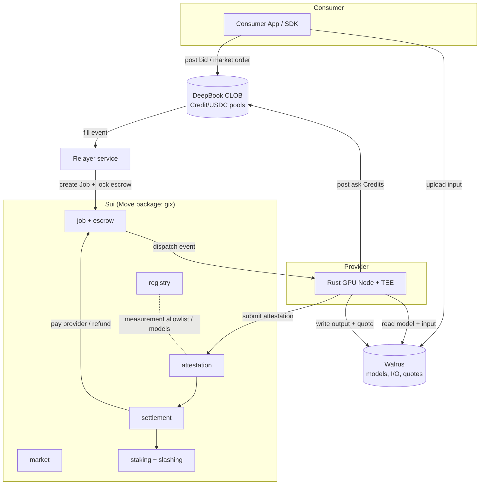

# Architecture Overview

**Status:** Canonical. This document is the single source of truth for system
decomposition, naming, the Move module map, the Sui object model, and the
end-to-end job lifecycle. Every other document conforms to the names and flows
defined here. When in doubt, this file wins.

---

## 1. Problem & design goals

GIX turns GPU inference into a liquid, exchange-traded commodity. To do that in a
**production-grade, trustless** way, the protocol must satisfy:

1. **Real-time price discovery** — continuous matching of compute supply and demand
   without auction latency. → DeepBook CLOB.
2. **Verifiable execution** — a consumer must be paid-for-what-was-run, provably,
   without trusting the operator. → Hardware TEE remote attestation, verified on Sui.
3. **Autonomous settlement** — escrow, payout, refund, and slashing happen by
   contract, not by an intermediary. → Sui Move.
4. **Tamper-evident audit** — every model, input, output, and proof artifact is
   retrievable and content-addressed. → Walrus.
5. **Horizontal scale** — thousands of concurrent, independent jobs with sub-second
   finality. → Sui's object-centric parallel execution.

### Non-goals for v1 (tracked as future work)

- **Zero-knowledge ML proofs (zkML).** zk-SNARK proofs of full-size model inference
  are not production-viable today (proving is orders of magnitude too slow/costly).
  The verification interface is designed so a zk proof *type* can be added later as
  an alternative attestation backend, but v1 ships TEE attestation only. See
  [verification-attestation.md](verification-attestation.md).
- **Data confidentiality.** v1 is *integrity-only*: the TEE attests that the correct
  model ran, not that the operator cannot see inputs. Confidential markets are a
  roadmap item; the identified Sui substrate is **Seal** (threshold encryption) with a
  decryption policy gated on the attested enclave — see
  [verification-attestation.md](verification-attestation.md) §9.3 and
  [walrus-integration.md](walrus-integration.md) §11.
- **Cross-chain settlement / non-USDC quote assets.** USDC is the only quote asset in v1.
- **Native GIX token (deferred).** v1 ships **without** the GIX token. Provider bonds
  are denominated in **USDC** — the same asset as escrow/settlement — so `ProviderStake`
  holds a `Balance<USDC>`; governance is exercised through an **`AdminCap`/multisig**; and
  protocol fees are taken in USDC. The GIX token (staking in GIX, token-weighted
  governance, and emissions-funded bootstrap incentives) is a **post-MVP additive
  upgrade**, at which point the bond is re-denominated in GIX. Bonding in USDC removes the
  bond-vs-obligation valuation mismatch entirely (no price oracle, no `k`-vs-volatility
  problem), which is why it is the MVP choice — see [tokenomics.md](../tokenomics.md) §1
  and open question **B1**.

---

## 2. The three substrates



- **DeepBook — the order matching engine.** A central limit order book where
  tokenized Compute Credits trade against USDC. Continuous matching yields a live
  spot price per market. Detail: [deepbook-integration.md](deepbook-integration.md).
- **Walrus — the storage & audit layer.** Content-addressed blobs for model
  artifacts (the canonical "exact model" hash), job inputs, job outputs, and
  attestation quotes. Detail: [walrus-integration.md](walrus-integration.md).
- **Sui — orchestration & settlement.** The `gix` Move package owns escrow, the job
  lifecycle, attestation verification, settlement, staking, and slashing. Detail:
  [sui-move-contracts.md](sui-move-contracts.md).

Off-chain, two pieces of software complete the system:

- **Node** (Rust) — the provider software that runs inference inside a TEE and
  produces attestations. Detail: [node-architecture.md](node-architecture.md).
- **Services** (Rust) — stateless helpers: a **relayer/indexer** that turns DeepBook
  fills into on-chain Jobs, a **settlement watcher**, and indexing for the SDK.
- **SDK** (TypeScript) — consumer and provider client library.
  Detail: [sdk.md](sdk.md).

---

## 3. Markets & tokenized compute

A **market** is the unit of standardization. It is a tuple:

```
Market = (GPU class, model/runtime tier, SLA class)
e.g.    (H100-80GB,  llama-3.1-70b-int8,  p50<2s / p99<5s)
```

Each market has:

- A fungible **Compute Credit** coin type (`gix::credit`). One credit represents a
  **Standardized Compute Unit (SCU)** for that market — a normalized unit of
  inference capacity (e.g. *N* output tokens at the market's tier, or one bounded
  request). The SCU definition is a market parameter.
- A **DeepBook pool**: `Credit<Market> / USDC`. Providers post asks (sell credits),
  consumers post bids (buy credits). The fill price is the spot price of compute for
  that market.

Providers **mint** credits against staked capacity and **burn**/redeem them when a
job is performed. Credits are claims on capacity, not money; USDC is the money. See
[tokenomics.md](../tokenomics.md) for the full economic model.

> **Why tokenize instead of building a bespoke CLOB?** DeepBook is a hardened,
> high-frequency on-chain CLOB. Representing capacity as a fungible coin lets GIX
> reuse DeepBook's matching, price-time priority, and liquidity primitives rather
> than reimplementing an order book in Move.

---

## 4. The `gix` Move package — module map

| Module | Responsibility |
| --- | --- |
| `market` | Market registry; binds a market to its DeepBook pool, SCU definition, SLA params, and Compute Credit type. |
| `credit` | Compute Credit coin type(s); minting against staked capacity; redemption/burn on job completion. |
| `registry` | **Provider/Node registry** (operator identity, endpoints, hardware class) and **Model registry** (Walrus content IDs + approved TEE measurements per model). |
| `job` | The `Job` shared object: lifecycle state, market ref, hashes (model/input/output), SLA deadlines, parties. |
| `escrow` | Locks consumer USDC against a `Job`; holds funds until settlement or refund. |
| `attestation` | Verifies a submitted TEE quote: vendor signature chain, measurement allowlist (from `registry`), and model/input/output hash binding; checks SLA timing. |
| `staking` | Provider collateral staking; capacity accounting that gates credit minting. **v1: bond is `Balance<USDC>`** (GIX collateral is a post-MVP upgrade). |
| `slashing` | Slashing conditions and execution (invalid/missing attestation, SLA breach, liveness faults). |
| `settlement` | Releases escrow to provider on success (minus protocol fee), refunds on failure, distributes fees, and drives slashing payouts. |
| `governance` | Protocol parameters, measurement/cert allowlists, fee schedule, upgrade authority. **v1: exercised via `AdminCap`/multisig** (token-weighted governance is post-MVP). |

Cross-cutting: a `gix::events` surface emits structured events for the indexer/SDK,
and `gix::math`/`gix::config` hold shared constants. Detailed signatures, abilities,
and object diagrams live in [sui-move-contracts.md](sui-move-contracts.md).

---

## 5. Sui object model (summary)

Each entity is an independent object so that unrelated jobs execute in parallel.

| Object | Ownership | Purpose |
| --- | --- | --- |
| `Market` | Shared | Market params, DeepBook pool id, SCU, SLA, Credit type, fee tier. |
| `ProviderStake` | Owned (provider) | Collateral + capacity accounting; gates minting and is the slashable bond. **v1: USDC** collateral (GIX post-MVP). |
| `ModelRecord` | Shared | Walrus content id of a model + its set of approved TEE measurements. |
| `Job` | Shared | The escrowed unit of work: state, market, consumer, provider, input/model/output hashes, deadlines. |
| `Escrow` | Held by `Job` | Locked USDC `Balance` for the job; released or refunded by `settlement`. |
| `AttestationRecord` | Child of `Job` | The verified quote summary (measurement, hashes, timing) retained for audit. |
| `MeasurementAllowlist` / `CertRoots` | Shared (governance) | Pinned vendor root certs and approved enclave/runtime measurements. |

> **Parallelism note.** A `Job` is a *shared* object because consumer, provider, and
> settlement all touch it — but because Jobs are disjoint, Sui executes
> transactions on different Jobs concurrently. Hot shared objects (`Market`,
> allowlists) are read-mostly; writes to them are rare governance/admin actions, so
> they do not serialize the job path. Design rules are in
> [sui-move-contracts.md](sui-move-contracts.md).

---

## 6. End-to-end job lifecycle (canonical)

The authoritative state machine, with every timeout and edge case, is in
[../protocol/task-lifecycle.md](../protocol/task-lifecycle.md). The happy path:

```mermaid
sequenceDiagram
    autonumber
    participant Cons as Consumer (SDK)
    participant DB as DeepBook
    participant Rel as Relayer (service)
    participant Sui as gix (Sui)
    participant Wal as Walrus
    participant Node as Provider Node (TEE)

    Node->>DB: post ask — sell Credits<Market> for USDC
    Cons->>Wal: upload input blob → input_hash, blob_id
    Cons->>DB: post bid / market order (buy Credits)
    DB-->>Rel: fill event (maker, taker, qty, price)
    Rel->>Sui: create Job + lock USDC escrow; reserve/burn Credits
    Sui-->>Node: Dispatched event (job_id, model_id, input blob_id)
    Node->>Wal: read model (by ModelRecord hash) + input blob
    Node->>Node: run inference inside TEE; measure latency
    Node->>Wal: write output blob + attestation quote
    Node->>Sui: submit attestation (quote, output_hash, timings)
    Sui->>Sui: attestation: verify sig chain + measurement + hash binding + SLA
    alt valid & within SLA
        Sui->>Sui: settlement: pay provider (− fee), finalize credits
        Sui-->>Cons: Settled event (output blob_id, audit refs)
    else invalid / missing / SLA breach
        Sui->>Sui: slashing: slash provider stake
        Sui-->>Cons: refund USDC + (optional) compensation
    end
```

### State summary

```
Created → Matched → Escrowed → Dispatched → Executing → Attested → Verified → Settled
                                   │             │           │
                                   └─ timeout ───┴──── timeout┴── invalid ──→ Refunded (+ Slashed)
```

Three deadlines bound the path: **dispatch-ack**, **execution/SLA**, and
**attestation-submission**. Missing any deadline drives the job to `Refunded` and,
where the fault is the provider's, triggers `Slashing`. Full semantics:
[task-lifecycle.md](../protocol/task-lifecycle.md).

---

## 7. Verification model (summary)

v1 trust is rooted in **hardware vendor attestation**, not in re-execution or zk.

1. The node runs the inference runtime inside a TEE (confidential-computing GPU +
   CPU TEE). The runtime measurement (analogous to `MRENCLAVE`) is reproducible and
   appears on the governance **measurement allowlist** for the target `ModelRecord`.
2. After execution, the node obtains a **vendor-signed attestation quote** binding:
   `runtime_measurement ‖ model_hash ‖ input_hash ‖ output_hash ‖ t_start ‖ t_end`.
3. `gix::attestation` verifies the vendor certificate chain (roots pinned by
   governance), confirms the measurement is allowlisted for that model, checks every
   hash matches the `Job`, and confirms latency is within the market SLA.
4. Only then does `settlement` release escrow. A bad or absent quote → refund + slash.

What this does and does not guarantee, the supported hardware, quote formats, and
the future zk backend are in [verification-attestation.md](verification-attestation.md).

> **Sui-substrate notes & v1 scope (from doc research, 2026-06).** On-chain verification
> follows the **Nautilus** pattern — Sui's official framework for TEE attestation in Move:
> verify the vendor chain **once at enclave registration**, then check a native signature
> per job. **v1 MVP scope decisions** (driven by Sui having **no native ECDSA P-384**):
> CPU TEE = **Intel TDX (P-256) only**, natively verifiable on-chain; **AMD SEV-SNP
> deferred**; and **on-chain NVIDIA GPU-CC/NRAS verification phased to a post-MVP
> fast-follow** (no Sui/Nautilus prior art — the MVP attests the TDX runtime + binds I/O
> hashes, GPU-CC verification follows a spike). These are intentional, tracked revisit
> points. Details: [verification-attestation.md](verification-attestation.md) §4, §9.

---

## 8. Off-chain components (summary)

- **Node (Rust).** Subscribes to `Dispatched` events, fetches model+input from
  Walrus, runs inference via a pluggable runtime adapter (vLLM / TensorRT-LLM /
  Triton) inside the TEE, collects the attestation quote, writes artifacts to
  Walrus, and submits the attestation to Sui within the SLA. Also manages its
  `ProviderStake`, credit minting, and posts asks to DeepBook. Detail:
  [node-architecture.md](node-architecture.md).
- **Services (Rust).**
  - *Relayer/Indexer* — watches DeepBook fills and turns them into on-chain Jobs +
    escrow; indexes events for the SDK.
  - *Settlement watcher* — observes deadlines, nudges expiries, and surfaces audit
    state. (All authority lives in the contracts; services are convenience/liveness
    helpers and are **not** trusted for correctness — see the threat model.)
- **SDK (TypeScript).** Consumer flow (quote → upload input → order → await result →
  verify) and provider flow (stake → mint credits → post asks → run node).
  Detail: [sdk.md](sdk.md).

> **Trust boundary:** off-chain services optimize liveness and UX but hold **no
> authority**. Settlement is decided solely by on-chain attestation verification.
> If the relayer is offline, jobs can be created via a permissionless on-chain path
> (see lifecycle doc); it cannot steal funds or fake results. See
> [../security/threat-model.md](../security/threat-model.md).

---

## 9. Document map

| Area | Document |
| --- | --- |
| Contracts | [sui-move-contracts.md](sui-move-contracts.md) |
| Matching | [deepbook-integration.md](deepbook-integration.md) |
| Storage | [walrus-integration.md](walrus-integration.md) |
| Verification | [verification-attestation.md](verification-attestation.md) |
| Node | [node-architecture.md](node-architecture.md) |
| SDK | [sdk.md](sdk.md) |
| Lifecycle | [../protocol/task-lifecycle.md](../protocol/task-lifecycle.md) |
| Economics | [../tokenomics.md](../tokenomics.md) |
| Security | [../security/threat-model.md](../security/threat-model.md) |
| Ops | [../operations/deployment.md](../operations/deployment.md) |
| Plan | [../roadmap.md](../roadmap.md) |
| Terms | [../glossary.md](../glossary.md) |
