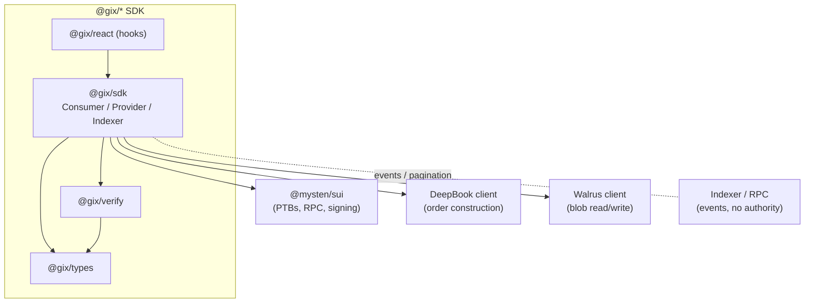
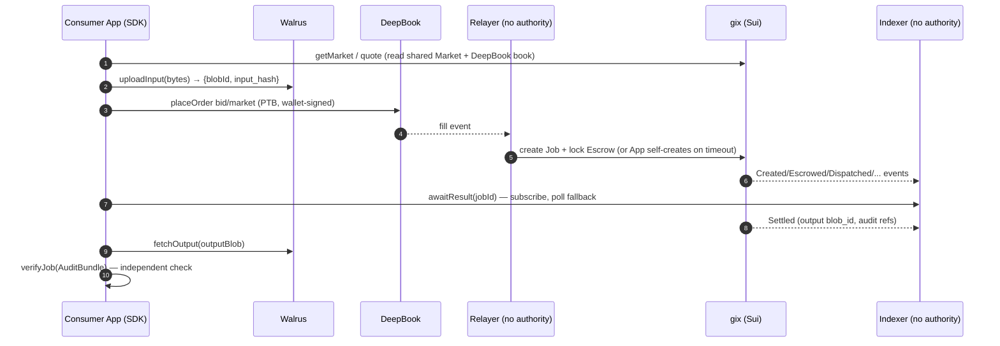

# SDK (TypeScript Client Library)

The TypeScript client library that lets consumer apps, provider operators, and
dashboards interact with GIX — quote and trade on a **Market**, escrow a **Job**,
store and retrieve artifacts on **Walrus**, and independently verify execution from
the on-chain **AttestationRecord** — without trusting any off-chain service.

This document is an engineering plan for the SDK. It conforms to the names, objects,
and lifecycle defined in [overview](overview.md) and [glossary](../glossary.md). It
cross-references [contracts](sui-move-contracts.md),
[deepbook](deepbook-integration.md), [walrus](walrus-integration.md),
[verification](verification-attestation.md), [lifecycle](../protocol/task-lifecycle.md),
and [node](node-architecture.md).

> **Building blocks & assumptions.** The SDK is a thin, opinionated layer over three
> upstream clients: **`@mysten/sui`** (Programmable Transaction Blocks, RPC reads,
> wallet signing), a **DeepBook client** (order construction against `Credit/USDC`
> pools), and a **Walrus client** (blob read/write). Where the exact upstream API
> surface is uncertain, this document states the assumption inline and wraps it
> behind a GIX-owned interface so the implementation can adapt without changing the
> public SDK contract. All TypeScript below is an *illustrative design sketch, not
> final*.

---

## 1. Purpose & audiences

The SDK exists so that no consumer or provider has to hand-build Programmable
Transaction Blocks (PTBs), parse DeepBook order state, juggle Walrus blob ids, or
re-implement attestation verification. It encodes the canonical job lifecycle once
and exposes it as typed, composable calls.

Three audiences, three usage profiles:

| Audience | What they do with the SDK | Primary surface |
| --- | --- | --- |
| **Consumer apps** | Discover/quote a **Market**, upload input to Walrus, place a bid/market order on DeepBook, await a **Job** result, fetch output, and **verify** it client-side. | `ConsumerClient` |
| **Provider operators / tooling** | Register in the `registry`, post the bond (`ProviderStake` — USDC in v1, GIX post-MVP), mint **Compute Credits**, post asks on DeepBook, and monitor jobs. Heavy lifting (inference, TEE quoting) is the Rust [node](node-architecture.md); the SDK does setup + monitoring. | `ProviderClient` |
| **Indexer-backed dashboards** | Subscribe to lifecycle events, page through historical jobs/fills, render market depth and spot price, surface audit state. | `IndexerClient` + read-only views |

Design goals, in priority order:

1. **Trust-minimization parity with the protocol.** Anything the SDK reports as
   "verified" must be verifiable from on-chain state + Walrus blobs alone — never
   from a relayer or indexer's say-so. The relayer and indexer hold **no settlement
   authority** ([overview](overview.md) §8); the SDK treats them strictly as liveness
   and convenience helpers.
2. **Lifecycle fidelity.** SDK states map 1:1 to the canonical state machine in
   [lifecycle](../protocol/task-lifecycle.md). No invented states.
3. **Runtime portability.** Works in Node (provider tooling, server-side consumers)
   and the browser (wallet-connected consumer apps), behind capability flags.
4. **Typed everything.** Hashes, object ids, coin amounts, and states are branded
   types, not bare strings/numbers.

---

## 2. Package layout

The SDK ships as a small monorepo of focused packages so a browser dapp can pull in
only what it needs and tree-shake the rest. (Illustrative; names not final.)

```
@gix/types     ── shared branded types, enums, event shapes, ABI constants.
                  Zero runtime deps. Imported by everything.
@gix/sdk       ── the clients: ConsumerClient, ProviderClient, IndexerClient.
                  Wraps @mysten/sui + DeepBook client + Walrus client.
@gix/verify    ── pure, dependency-light client-side verification (hashing,
                  cert-chain + measurement checks). No network of its own beyond
                  reading pinned roots. Usable standalone in audits/CI.
@gix/react     ── optional React hooks (useMarket, useJob, useQuote, useVerify)
                  + wallet-adapter glue. Browser only.
```



**Why split `@gix/verify` out.** Verification must be auditable and runnable in
isolation (e.g. a third party re-checking a settled job in CI). Keeping it free of
the heavy clients means an auditor can `import { verifyJob } from '@gix/verify'`,
hand it on-chain state + blobs, and get an answer with no trust in `@gix/sdk`'s
network code.

**Versioning coupling.** `@gix/types` pins the on-chain `gix` package version and ABI
constants it was generated against (see §11). The other packages depend on a
`@gix/types` version, giving one place to gate compatibility.

---

## 3. Core types

Branded primitives keep us from mixing a `blob_id` with an `object_id`, or USDC base
units with credit amounts. (Illustrative design sketch, not final.)

```typescript
// @gix/types — branded primitives
type Brand<T, B> = T & { readonly __brand: B };

type SuiObjectId   = Brand<string, 'SuiObjectId'>;   // 0x… shared/owned object
type SuiAddress    = Brand<string, 'SuiAddress'>;
type WalrusBlobId  = Brand<string, 'WalrusBlobId'>;   // content id of a blob
type Hash32        = Brand<string, 'Hash32'>;         // 32-byte hex digest

// Canonical hashes that bind a Job (see overview §7, verification doc)
type ModelHash  = Hash32; // model_hash
type InputHash  = Hash32; // input_hash
type OutputHash = Hash32; // output_hash

// Amounts are bigint base units; quote = USDC, base = Compute Credit (SCU count)
type Usdc        = Brand<bigint, 'Usdc'>;    // USDC base units
type CreditAmt   = Brand<bigint, 'CreditAmt'>; // # of Compute Credits == # of SCU

// Canonical lifecycle states — mirror task-lifecycle.md exactly.
type JobState =
  | 'Created' | 'Matched' | 'Escrowed' | 'Dispatched' | 'Executing'
  | 'Attested' | 'Verified' | 'Settled'           // happy path
  | 'Refunded' | 'Slashed' | 'Expired';           // terminal failure
```

```typescript
// A Market = (GPU class, model/runtime tier, SLA class). Mirrors the on-chain
// shared Market object plus its DeepBook pool binding.
interface Market {
  id: SuiObjectId;             // the shared Market object
  gpuClass: string;            // e.g. "H100-80GB"
  modelTier: string;          // e.g. "llama-3.1-70b-int8"
  modelRecord: SuiObjectId;   // ModelRecord shared object
  sla: { p50Ms: number; p99Ms: number };
  scu: {                       // what one Compute Credit (one SCU) buys
    kind: 'request' | 'output_tokens';
    units: number;             // e.g. N output tokens
  };
  deepbookPoolId: SuiObjectId; // Credit<Market> / USDC pool
  creditType: string;          // fully-qualified Move coin type for this market
  feeTierBps: number;          // protocol fee at settlement
}

// Live quote derived from DeepBook order book for a market.
interface Quote {
  market: SuiObjectId;
  spotPriceUsdcPerScu: Usdc;   // best executable price for size = 1 SCU
  bestBid: Usdc; bestAsk: Usdc;
  // Size-aware estimate: filling `size` SCU walks the book.
  estimateFill(size: CreditAmt): { avgPrice: Usdc; worstPrice: Usdc; usdcTotal: Usdc };
  asOfCheckpoint: bigint;      // Sui checkpoint the book snapshot is anchored to
}

interface OrderParams {
  market: SuiObjectId;
  side: 'bid' | 'ask';
  type: 'limit' | 'market';
  size: CreditAmt;             // SCU to buy/sell
  limitPriceUsdcPerScu?: Usdc; // required for 'limit'
  slippageBps?: number;        // for 'market'; SDK derives a protective limit
  clientOrderId: string;       // idempotency key (see §10)
}

// What the consumer ultimately receives + can verify.
interface JobResult {
  jobId: SuiObjectId;
  state: JobState;
  market: SuiObjectId;
  consumer: SuiAddress; provider: SuiAddress;
  modelHash: ModelHash;
  inputHash: InputHash; inputBlob: WalrusBlobId;
  outputHash?: OutputHash; outputBlob?: WalrusBlobId; // present once Attested+
  attestation?: AttestationSummary;
  escrowUsdc: Usdc;
  deadlines: { dispatchAck: number; execution: number; attestation: number }; // epoch ms
}

// Read-back of the on-chain AttestationRecord (child of the Job).
interface AttestationSummary {
  measurement: Hash32;         // runtime/enclave measurement (MRENCLAVE-like)
  modelHash: ModelHash; inputHash: InputHash; outputHash: OutputHash;
  tStartMs: number; tEndMs: number;
  quoteBlob: WalrusBlobId;     // full vendor quote archived on Walrus
  vendor: 'nvidia-nras' | 'intel-tdx' | 'amd-sev-snp' | string;
}

// Everything needed to re-verify a job offline. The unit @gix/verify consumes.
interface AuditBundle {
  job: JobResult;
  attestation: AttestationSummary;
  rawQuote: Uint8Array;        // fetched from quoteBlob
  output: Uint8Array;          // fetched from outputBlob
  input: Uint8Array;           // fetched from inputBlob (integrity-only v1)
  pinnedRoots: { certRoots: SuiObjectId; allowlist: SuiObjectId }; // governance objs
}
```

> **Integrity-only v1.** Per [overview](overview.md) §1, v1 is *integrity-only*: the
> input and output blobs are readable, and verification proves the *correct model
> ran on the committed input and produced the committed output* — not
> confidentiality. The types above expose `input`/`output` as plaintext bytes
> deliberately; confidential markets are a roadmap item and would change these
> shapes.

---

## 4. Consumer API & end-to-end flow

The consumer flow is exactly the canonical happy path from [overview](overview.md)
§6, expressed as SDK calls. The relayer turns the DeepBook fill into a **Job** +
**Escrow**; the SDK never depends on it for correctness, only for promptness, and
falls back to the permissionless on-chain Job-creation path if the relayer is silent
(see §10 and [lifecycle](../protocol/task-lifecycle.md)).



### 4.1 End-to-end TypeScript example

```typescript
// Illustrative design sketch, not final.
import { ConsumerClient } from '@gix/sdk';
import { verifyJob } from '@gix/verify';

const gix = await ConsumerClient.create({
  sui:    { rpcUrl, wallet },          // @mysten/sui signer/wallet adapter
  walrus: { aggregatorUrl, publisherUrl },
  deepbook: { /* pool registry / client cfg */ },
  indexer:  { url: indexerUrl },       // optional; pure RPC fallback if omitted
  gixPackageId,                         // pins the on-chain package version (§11)
});

// 1. Discover + quote a Market (spot price for the size we want).
const market = await gix.getMarket({
  gpuClass: 'H100-80GB',
  modelTier: 'llama-3.1-70b-int8',
});
const quote = await gix.quote(market.id);
const fill = quote.estimateFill(1n as CreditAmt); // buy 1 SCU
console.log('spot', quote.spotPriceUsdcPerScu, 'est total', fill.usdcTotal);

// 2. Upload input to Walrus → blob id + input_hash (hash computed locally).
const input = new TextEncoder().encode(JSON.stringify({ prompt: 'Hello GIX' }));
const { blobId: inputBlob, inputHash } = await gix.uploadInput(input);

// 3. Place a (protected) market bid on DeepBook. One signed PTB.
const order = await gix.placeOrder({
  market: market.id,
  side: 'bid',
  type: 'market',
  size: 1n as CreditAmt,
  slippageBps: 50,
  clientOrderId: crypto.randomUUID(), // idempotency key
});

// 4. Await the Job result via indexer/events (with polling fallback + timeouts
//    mapped to lifecycle states).
const result = await gix.awaitResult({
  fromOrder: order,
  inputHash,                 // lets the SDK match the right Job
  timeoutMs: 120_000,
});

if (result.state === 'Settled') {
  // 5. Fetch output bytes from Walrus.
  const output = await gix.fetchOutput(result.outputBlob!);

  // 6. Verify client-side: re-check AttestationRecord + hashes against the output.
  const bundle = await gix.buildAuditBundle(result.jobId);
  const verdict = await verifyJob(bundle);
  if (!verdict.ok) throw new Error(`verification failed: ${verdict.reasons.join(', ')}`);

  console.log('verified output', new TextDecoder().decode(output));
} else {
  // Refunded / Slashed / Expired — escrow returned per settlement rules.
  console.warn('job did not settle', result.state);
}
```

### 4.2 What each call actually does

- **`getMarket` / `quote`** read the shared `Market` object and the DeepBook pool's
  book via RPC. No transaction, no signing. `quote` snapshots the book at a Sui
  checkpoint (`asOfCheckpoint`) so a UI can show staleness honestly. Detail:
  [deepbook](deepbook-integration.md).
- **`uploadInput`** hashes the bytes locally to `input_hash` (the canonical
  `input_hash` the `Job` will be bound to), writes the blob to Walrus, and returns
  both. The hash is computed by the SDK, never taken from Walrus, so the consumer
  commits to exactly what it uploaded. Detail: [walrus](walrus-integration.md).
- **`placeOrder`** builds a DeepBook order PTB and asks the wallet to sign it (§6).
  For `market` orders the SDK derives a protective limit from `slippageBps` so a thin
  book can't fill the bid at a runaway price.
- **`awaitResult`** subscribes to lifecycle events for the resulting `Job`, mapping
  each on-chain state to `JobState`, and resolves on a terminal state or timeout
  (§8, §10).
- **`buildAuditBundle`** gathers the `Job`, its child `AttestationRecord`, the
  governance `CertRoots`/`MeasurementAllowlist` ids, and the referenced Walrus blobs
  into the `AuditBundle` that `@gix/verify` consumes.

---

## 5. Provider API

The provider's *inference* path lives entirely in the Rust [node](node-architecture.md)
(TEE execution, quote generation, attestation submission). The SDK covers everything
*around* it: one-time setup and ongoing monitoring/automation that an operator or a
dashboard runs.

```typescript
// Illustrative design sketch, not final.
import { ProviderClient } from '@gix/sdk';

const prov = await ProviderClient.create({ sui: { rpcUrl, wallet }, /* … */ });

// 1. Register operator identity, endpoints, hardware class in `registry`.
await prov.register({
  operator: wallet.address,
  endpoints: ['https://node.example:443'],
  gpuClass: 'H100-80GB',
});

// 2. Post the bond → creates/funds the ProviderStake (the slashable bond).
//    v1: bond is USDC (GIX token is post-MVP — see tokenomics scope banner).
const stake = await prov.stake({ amountUsdc: 50_000n });

// 3. Mint Compute Credits against staked capacity (gated by ProviderStake).
const credits = await prov.mintCredits({
  market: market.id,
  amount: 1_000n as CreditAmt,     // 1000 SCU of capacity
});

// 4. Post an ask on DeepBook (sell Credits for USDC).
const ask = await prov.postAsk({
  market: market.id,
  size: 1_000n as CreditAmt,
  limitPriceUsdcPerScu: priceUsdc,
  clientOrderId: crypto.randomUUID(),
});

// 5. Monitoring helpers (the node does the work; SDK observes).
for await (const ev of prov.watchJobs({ provider: wallet.address })) {
  // ev: Dispatched | Executing | Attested | Verified | Settled | Slashed …
  metrics.record(ev);
}
const health = await prov.providerStatus(); // stake, capacity used, slash events
```

What the SDK does **not** do for providers: run inference, talk to the TEE, generate
or submit attestation quotes, or read the model into the enclave. Those are the
node's job and are covered in [node](node-architecture.md) and
[verification](verification-attestation.md). The SDK's `watchJobs`/`providerStatus`
exist so operators can build dashboards and alerting without re-deriving event
plumbing.

> **Capacity accounting.** `mintCredits` is gated by `ProviderStake` capacity
> ([overview](overview.md) §4–5). The SDK surfaces the current cap and rejects an
> over-mint locally (typed error) before building the PTB, but the contract is the
> authority — a stale local view never lets you mint past the on-chain limit.

---

## 6. Sui interaction details

The SDK builds **Programmable Transaction Blocks** with `@mysten/sui` and signs them
through a pluggable wallet abstraction.

### 6.1 PTB construction

Every state-changing call (`placeOrder`, `register`, `stake`, `mintCredits`,
`postAsk`, self-create-Job fallback) compiles to one PTB. A multi-step action (e.g.
*split USDC coin → place DeepBook bid → emit client tag*) is composed as one atomic
PTB so it either fully lands or fully fails.

```typescript
// Illustrative: placing a bid as a single PTB. Not final.
function buildBidPtb(tx: Transaction, p: {
  poolId: SuiObjectId; usdcCoin: TransactionObjectArgument;
  size: bigint; limitPrice: bigint; clientOrderId: string;
}) {
  // split the exact USDC needed; remainder stays in the wallet coin
  const [pay] = tx.splitCoins(p.usdcCoin, [p.size * p.limitPrice]);
  tx.moveCall({
    target: `${DEEPBOOK_PKG}::pool::place_limit_order`,
    typeArguments: [CREDIT_TYPE, USDC_TYPE],
    arguments: [tx.object(p.poolId), pay, tx.pure.u64(p.limitPrice),
                tx.pure.u64(p.size), tx.pure.string(p.clientOrderId)],
  });
  return tx;
}
```

> **Assumption.** Exact DeepBook entry signatures (argument order, balance-manager vs.
> raw-coin model, order-id return) are taken from the DeepBook client and wrapped
> behind `gix.placeOrder`. If DeepBook uses a `BalanceManager`, the SDK manages it
> transparently; the public `OrderParams` contract is unchanged. Detail:
> [deepbook](deepbook-integration.md).

### 6.2 Wallet & signing abstraction

```typescript
interface GixSigner {
  address: SuiAddress;
  signAndExecute(tx: Transaction): Promise<TxResult>; // browser wallet or keypair
}
```

- **Browser:** a wallet-adapter (`@mysten/sui` wallet standard) implements
  `GixSigner`; the SDK hands it a built `Transaction` and shows the user one signing
  prompt per PTB.
- **Node:** an `Ed25519Keypair`-backed signer for provider tooling/CI.

This keeps the clients runtime-agnostic; only the `GixSigner` implementation differs
between browser and Node.

### 6.3 Gas & coin management

- **Gas:** the SDK lets `@mysten/sui` pick gas coins by default but exposes an
  override for sponsored-transaction / gas-station setups. Provider tooling can pin a
  dedicated gas coin to avoid contending with USDC/credit coins.
- **Coin selection:** USDC and Compute Credit are distinct coin types. The SDK
  selects/merges/splits the right coins inside the PTB (e.g. split exact USDC for a
  bid, merge dust before a large order) so callers pass amounts, not coin objects.
- **Credit type resolution:** the per-market `Credit<Market>` type comes from the
  `Market` object's `creditType`; the SDK resolves it once and caches it.

### 6.4 Reading shared objects

`Market`, `ModelRecord`, `Job`, `ProviderStake`, `MeasurementAllowlist`/`CertRoots`
are shared/owned objects read via RPC `getObject` / `multiGetObjects`, plus
`getDynamicFields` to reach a `Job`'s child `AttestationRecord` and its `Escrow`.
The SDK decodes Move structs into the §3 types and **never** trusts an indexer's copy
of a value that settlement depends on — for verification it always reads the
authoritative object (or a checkpoint-anchored read) directly.

---

## 7. Walrus & DeepBook interaction

### 7.1 Walrus (blob read/write)

```typescript
interface WalrusIO {
  write(bytes: Uint8Array): Promise<{ blobId: WalrusBlobId; size: number }>;
  read(blobId: WalrusBlobId): Promise<Uint8Array>;
}
```

- **Write** (consumer input, and — node-side — output/quote) goes through a Walrus
  *publisher*; **read** goes through an *aggregator*. The SDK hashes-on-write so the
  returned `input_hash` is computed locally, then optionally re-reads and re-hashes
  to confirm the blob is retrievable and content-addressed before placing the order.
- **Read** for verification (`output`, `rawQuote`, `input`) is plain content
  retrieval; integrity is then checked against on-chain hashes in `@gix/verify`
  (§8), so a malicious aggregator cannot substitute bytes without detection. Detail:
  [walrus](walrus-integration.md).

> **Assumption.** Walrus blob-id ⇔ content-hash semantics and the publisher/aggregator
> URL model are taken from the Walrus client. If the blob id is not itself the
> content hash, the SDK stores `input_hash` independently and binds it to the `Job`
> so verification never relies on the blob id alone.

### 7.2 DeepBook order construction

Order construction is funneled through `OrderParams` (§3) →
`buildBidPtb`/`buildAskPtb`. The SDK:

- maps SCU `size` and `USDC-per-SCU` price into DeepBook's lot/tick units for the
  pool (reading pool config once),
- for `market` orders, derives a protective limit from `slippageBps`,
- attaches the `clientOrderId` as the idempotency key (§10),
- returns a typed handle the consumer's `awaitResult` / provider's `watchJobs` can
  correlate to the resulting fill and `Job`.

Depth, spot price, and historical fills for dashboards are read through the same
DeepBook client and surfaced on `Quote` and `IndexerClient` views. Detail:
[deepbook](deepbook-integration.md).

---

## 8. Client-side verification

This is the SDK's trust core. `@gix/verify` reconstructs the protocol's trust
**from on-chain state + Walrus blobs alone**, mirroring `gix::attestation`
([overview](overview.md) §7, [verification](verification-attestation.md)) so a
consumer can confirm settlement was justified without trusting the relayer, indexer,
provider, or even the SDK's own network layer.

```typescript
// Illustrative design sketch, not final.
function verifyJob(b: AuditBundle): Promise<{ ok: boolean; reasons: string[] }> {
  const fail: string[] = [];

  // (a) Hash binding: recompute digests of the actual blobs and match the Job/record.
  if (sha(b.output) !== b.attestation.outputHash) fail.push('output_hash mismatch');
  if (sha(b.input)  !== b.attestation.inputHash)  fail.push('input_hash mismatch');
  if (b.attestation.modelHash !== b.job.modelHash) fail.push('model_hash mismatch');

  // (b) Quote integrity: the on-chain AttestationRecord summarizes this exact quote.
  if (sha(b.rawQuote) !== summaryDigest(b.attestation)) fail.push('quote/record mismatch');

  // (c) Vendor cert chain: verify the quote's signature chains to a governance-pinned
  //     root (CertRoots). TEE is the trust root — see note below.
  if (!verifyCertChain(b.rawQuote, b.pinnedRoots.certRoots)) fail.push('bad cert chain');

  // (d) Measurement allowlist: the runtime measurement is approved for this model.
  if (!isAllowlisted(b.attestation.measurement, b.job.modelHash, b.pinnedRoots.allowlist))
    fail.push('measurement not allowlisted');

  // (e) SLA timing: t_end − t_start within the market SLA the Job was bound to.
  if (!withinSla(b.attestation, b.job)) fail.push('SLA breach');

  return Promise.resolve({ ok: fail.length === 0, reasons: fail });
}
```

### 8.1 What it can verify (no off-chain trust required)

- **Hash binding.** The bytes the consumer holds (`output`, `input`) hash to exactly
  the `output_hash`/`input_hash` recorded on-chain, and the `model_hash` matches the
  `Job`'s market `ModelRecord`. → *You got the output produced for your input under
  the agreed model.*
- **Attestation authenticity.** The vendor-signed quote chains to a governance-pinned
  root (`CertRoots`), and its embedded measurement is on the
  `MeasurementAllowlist` for that `ModelRecord`. → *The right runtime ran in a genuine
  TEE.*
- **On-chain consistency.** The `AttestationRecord` summary read from chain matches
  the raw quote on Walrus, and the same digests bind the `Job`. → *Settlement was
  decided on this evidence, and the evidence is intact.*
- **SLA timing.** Latency from the attested timestamps is within the market SLA.

All inputs to `verifyJob` are either authoritative on-chain objects or
content-addressed blobs checked against on-chain hashes — so a lying indexer or
aggregator is caught, not trusted.

### 8.2 What it cannot verify (and the trust root)

- **The TEE itself.** Verification establishes that a genuine, allowlisted TEE
  attested the result — it does **not** prove the hardware vendor's root of trust is
  itself unbroken. The trust root is **hardware vendor attestation** (NVIDIA NRAS /
  Intel TDX / AMD SEV-SNP roots pinned by governance), exactly as in
  [overview](overview.md) §7. A vendor root compromise is out of scope for client
  verification; it is a governance/threat-model concern
  ([../security/threat-model.md](../security/threat-model.md)).
- **Confidentiality.** v1 is integrity-only — verification says nothing about whether
  the operator *saw* the input. The SDK never claims privacy in v1.
- **Semantic quality.** It proves the committed model produced the committed output;
  it does not judge whether the output is "good."
- **No zkML.** There is no zero-knowledge proof of execution in v1; the verification
  interface is shaped so a zk backend could slot in later as an alternative to the
  cert-chain/measurement checks ([overview](overview.md) §1).

---

## 9. Event & indexer usage

Lifecycle progress is driven by `gix::events` ([overview](overview.md) §4). The
`IndexerClient` provides subscription, pagination, and a polling fallback, and
`awaitResult`/`watchJobs` are built on it.

```typescript
// Illustrative design sketch, not final.
interface JobEvent {
  jobId: SuiObjectId;
  state: JobState;            // mapped from the emitted Move event
  checkpoint: bigint;        // ordering anchor
  payload: Record<string, unknown>; // blob ids, hashes, party addrs, deadlines
}

interface IndexerClient {
  subscribeJob(jobId: SuiObjectId): AsyncIterable<JobEvent>;
  listJobs(q: { consumer?: SuiAddress; provider?: SuiAddress; state?: JobState },
           page?: { cursor?: string; limit?: number }): Promise<{
             items: JobResult[]; nextCursor: string | null }>;
  // Market data for dashboards.
  fills(market: SuiObjectId, page?: { cursor?: string; limit?: number }):
    Promise<{ items: Fill[]; nextCursor: string | null }>;
}
```

- **Subscription.** Where an indexer offers WebSocket/stream, the SDK consumes it;
  events are ordered by Sui `checkpoint` and de-duplicated by `(jobId, state)` so a
  reconnect that replays events is harmless.
- **Pagination.** Opaque, checkpoint-stable cursors. The SDK never assumes total
  counts and pages forward only.
- **Reconnection.** On drop, the SDK resubscribes from the last acknowledged
  checkpoint cursor, then reconciles by a direct RPC read of the `Job` object so no
  terminal transition is missed across the gap.
- **Polling fallback.** With no indexer (or on subscription failure), `awaitResult`
  polls the `Job` object and `queryEvents` by package/module on a backoff. Because
  the authoritative state is always the on-chain `Job`, the indexer is purely a
  latency optimization — **it holds no authority** ([overview](overview.md) §8). The
  SDK can run fully against raw RPC.

---

## 10. Error handling & resilience

### 10.1 Typed errors

```typescript
type GixError =
  | { kind: 'WalletRejected' }
  | { kind: 'InsufficientUsdc'; needed: Usdc; have: Usdc }
  | { kind: 'InsufficientCapacity'; cap: CreditAmt; requested: CreditAmt }
  | { kind: 'OrderUnfilled'; clientOrderId: string }       // bid never matched
  | { kind: 'JobTimeout'; jobId: SuiObjectId; at: JobState } // see mapping below
  | { kind: 'VerificationFailed'; reasons: string[] }
  | { kind: 'Refunded'; jobId: SuiObjectId }
  | { kind: 'Slashed'; jobId: SuiObjectId }
  | { kind: 'IndexerUnavailable' }                          // non-fatal; falls back
  | { kind: 'RpcUnavailable'; retryable: true };
```

### 10.2 Retries & idempotency

- **Idempotency keys.** Every order/job-initiating call carries a `clientOrderId`.
  Retries reuse it so a network hiccup never double-spends: the SDK first checks
  whether a Job/fill already exists for that key before re-submitting.
- **Read retries.** RPC/Walrus reads retry with jittered backoff; they are pure and
  safe to repeat.
- **Write retries.** Signed PTB submissions retry only when the failure is provably
  pre-execution (e.g. transient RPC), never blindly after a possible inclusion — the
  SDK re-reads chain state to confirm before any resubmit.

### 10.3 Timeouts mapped to lifecycle states

The three canonical deadlines ([overview](overview.md) §6,
[lifecycle](../protocol/task-lifecycle.md)) map directly to terminal outcomes the SDK
surfaces:

| Deadline missed | On-chain effect | SDK surfaces |
| --- | --- | --- |
| **dispatch-ack** | Job → `Refunded` | `JobTimeout{at:'Dispatched'}` then `Refunded` |
| **execution / SLA** | Job → `Refunded` (+ `Slashed` if provider at fault) | `JobTimeout{at:'Executing'}`, then `Refunded`/`Slashed` |
| **attestation-submission** | Job → `Refunded` + `Slashed` | `JobTimeout{at:'Attested'}`, then `Slashed` |

### 10.4 Refunds & slashes

These are **settlement outcomes, not SDK errors to swallow**. `awaitResult` resolves
to a `JobResult` whose `state` is `Refunded`/`Slashed`/`Expired`; the consumer's USDC
is returned by `settlement` on chain. The SDK reports the terminal state and the
audit references; it does not retry a settled-failed job (a new order is a new job).
If the relayer never created the Job after a fill, the SDK invokes the
permissionless on-chain create path so a consumer can never be stuck with a fill and
no Job ([overview](overview.md) §8, [lifecycle](../protocol/task-lifecycle.md)).

---

## 11. Versioning & compatibility

- **On-chain coupling.** Every client is constructed with a `gixPackageId` and an
  expected on-chain package version. `@gix/types` is generated against a specific
  `gix` package release and carries its ABI constants (module names, event types,
  struct layouts).
- **Feature detection.** On `create`, the SDK reads the package's published version
  /config object and compares it to what `@gix/types` expects. On mismatch it either
  (a) enables only the features the on-chain version supports, or (b) refuses with a
  typed `IncompatibleVersion` error — configurable, defaulting to safe-refuse for
  state-changing calls and best-effort for read-only views.
- **SemVer policy.** SDK major = on-chain breaking ABI change; minor = additive
  on-chain features; patch = SDK-only fixes. The DeepBook and Walrus client versions
  are pinned ranges, surfaced in `gix.capabilities()` so a dashboard can show exactly
  what substrate versions it is talking to.
- **Graceful degradation.** Missing optional substrate (no indexer, aggregator-only
  Walrus, read-only RPC) downgrades features (no live subscription, no writes) rather
  than failing construction, so a pure read/verify deployment always works.

---

## Open questions

> **Resolved against the Sui TS SDK / DeepBook / Walrus docs since first draft:**
> - **Wallet UX for multi-step PTBs** → **Walrus upload cannot share the trading PTB.**
>   A Walrus write is its own on-chain flow (encode → **register** blob on Sui → send
>   slivers → **certify** with the returned certificate), distinct from the order/Job
>   transaction. But the **DeepBook order + `create_job` `moveCall` *can* be one PTB**
>   (the DeepBook SDK order fns return a `(tx) => {}` you compose with `tx.add(...)`), so
>   the realistic minimum is: **Walrus upload (1–2 sigs) → one combined order+Job PTB**.
>   **Sponsored transactions** (`tx.build({ onlyTransactionKind: true })` + a sponsor gas
>   owner; productized by **Enoki**) and **zkLogin** reduce gas/friction but not the count
>   of *distinct* transactions. *(Sources: `deepbookv3-sdk/orders.mdx`,
>   `walrus storing-blobs.mdx`/`upload-relay.mdx`, `ts-sdk transaction-building/sponsored-transactions.mdx`.)*
> - **Browser vs Node runtime** → large-blob **upload works in the browser via the
>   Upload Relay** (`/v1/blob-upload-relay`, implemented in the TS SDK; Mysten runs public
>   relays); Node can talk to storage nodes directly. **WebSocket event subscriptions are
>   DEPRECATED** (JSON-RPC subscriptions slated for deactivation ~July 2026) — use **gRPC
>   `SubscriptionService`** streaming (`SuiGrpcClient.subscriptionService`) for real-time
>   or **poll** via `client.waitForTransaction({digest})` / GraphQL `events`. Surface this
>   split in `gix.capabilities()`. *(Sources: `walrus upload-relay.mdx`,
>   `develop/accessing-data/grpc/what-is-grpc.mdx`, `ts-sdk clients/json-rpc.mdx`.)*
> - **Walrus blob-id ⇔ hash** → **confirmed: the blob id is NOT the content hash** (it is
>   a sliver-Merkle commitment over `encoding_tag ‖ length ‖ root`), so the SDK **must**
>   bind `input_hash`/`output_hash` independently. See [walrus](walrus-integration.md) §2/§10.
> - **DeepBook order/fill correlation & `clientOrderId`** → orders accept a developer
>   **`clientOrderId`**; placement yields a protocol `order_id` (via `OrderInfo`/events).
>   Correlate **clientOrderId → protocol `order_id` (from `OrderPlaced`/`OrderFilled`
>   effects) → on-chain `Job`**. One fill can span multiple makers/levels (multiple
>   `Fill`s). Caveat: the public **indexer `/trades` schema does not expose
>   `client_order_id`** — correlate via the protocol `order_id`, or read the order's own
>   transaction effects. See [deepbook](deepbook-integration.md) §12 Q1/Q E.
> - **In-browser attestation crypto** → the Sui TS SDK provides P-256 (`Secp256r1Keypair`,
>   `WebCryptoSigner`) keys and `@mysten/sui/verify` for *Sui* signatures, but **does not
>   parse X.509 or verify vendor cert chains**. Client-side chain verification needs
>   WebCrypto (`crypto.subtle.verify` supports P-256/**P-384**/P-521 raw sigs) **plus an
>   ASN.1/X.509 library** (e.g. PKI.js) to extract keys and walk the chain — shippable to
>   a browser, but not from the SDK alone. (And recall on-chain it's the **enclave's
>   Ed25519 re-sign**, not the raw vendor chain, that's verified — [verification](verification-attestation.md)
>   §9.3 — so the in-browser check mainly serves independent client-side auditing.)

Still open — **migrated to the central ledger**
([open-ended-questions.md](../open-ended-questions.md)). From this doc:
- **K7** indexer hosting & trust / canonical endpoint (DeepBook's public indexer can cover
  order/fill correlation) · **K9** client-construction migration (pin SDK 2.0
  `SuiGrpcClient` + `.$extend(...)` shape).
