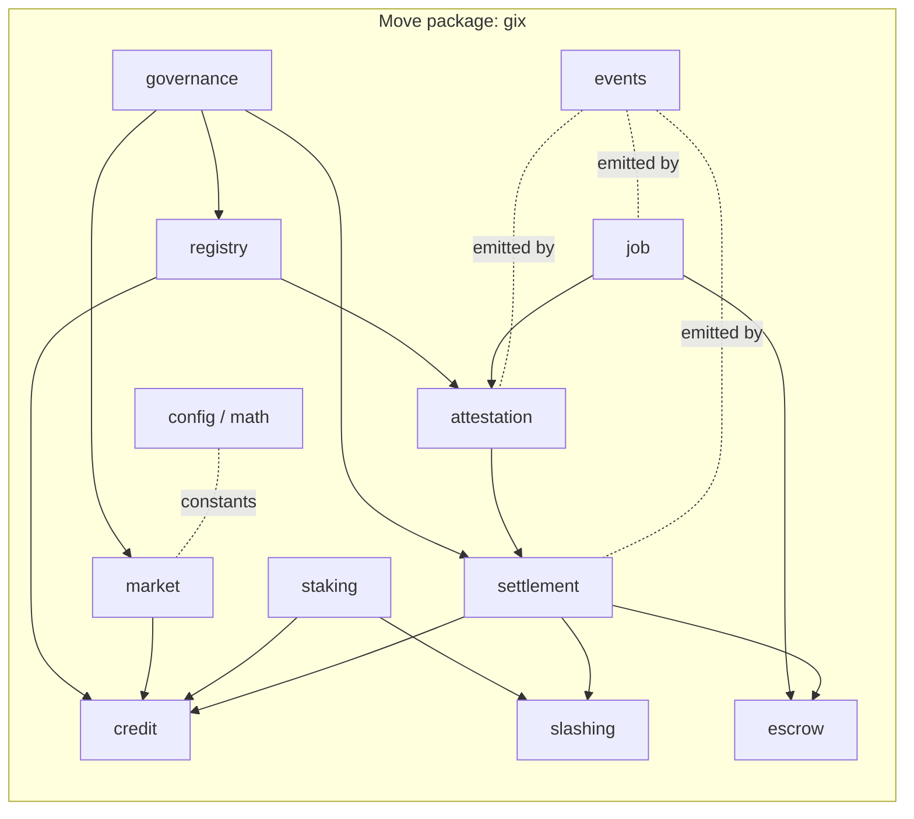
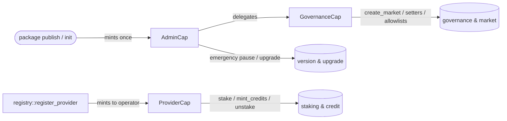
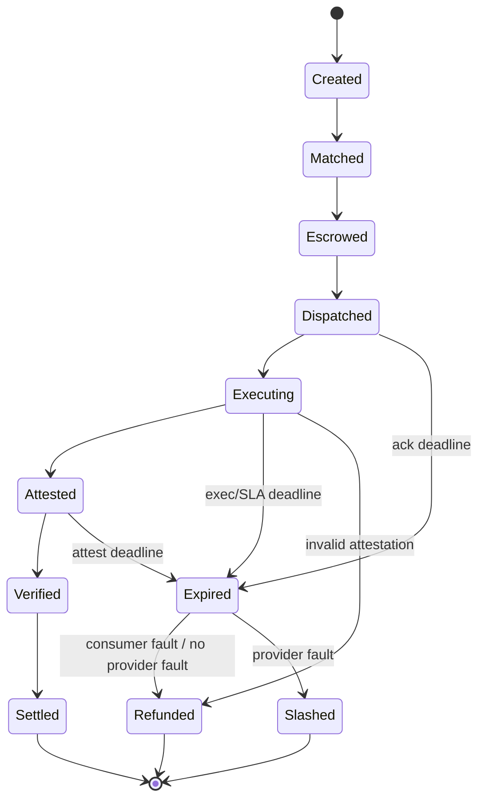

# Sui Move Contracts (`gix` package)

> The on-chain design of GIX: the Move package layout, the object model, the
> capability and money primitives, the entry surface, and the rules that keep the
> job path parallel, safe, and upgradeable.

**Status:** Conforms to [overview](overview.md) and [glossary](../glossary.md). Where
this document and the canon disagree, the canon wins. All Move below is an
**illustrative design sketch, not final** — field layouts, error codes, and
signatures will move as the package is implemented and audited.

Related: [verification](verification-attestation.md) ·
[deepbook](deepbook-integration.md) · [walrus](walrus-integration.md) ·
[lifecycle](../protocol/task-lifecycle.md) · [tokenomics](../tokenomics.md) ·
[threat model](../security/threat-model.md).

---

## 1. Design philosophy

The `gix` package is built around five Sui-native principles. They are not stylistic
preferences; each one is load-bearing for the goals in the [overview](overview.md)
(real-time matching, verifiable execution, autonomous settlement, horizontal scale).

1. **Object-centric, not account-centric.** State lives in typed Move objects with
   globally addressable IDs, not in a monolithic contract account. A `Job` is a
   first-class object. This is what lets two unrelated jobs settle in the same
   checkpoint without contending on shared state.

2. **Parallel execution by construction.** Sui executes transactions that touch
   disjoint object sets concurrently. We therefore make the *hot* path — create job,
   dispatch, attest, settle — touch one `Job` (and its children) plus only
   *read-mostly* shared objects (`Market`, allowlists). Two transactions on two
   different Jobs never serialize against each other. See §8.

3. **Capability-based access control.** Authority is a transferable, unforgeable
   object (`AdminCap`, `GovernanceCap`, `ProviderCap`), never an address allowlist
   checked with `assert!(sender == admin)`. Holding the capability *is* the
   permission; least privilege is enforced by which capability a function demands.
   See §4.

4. **Money is a resource, never a number.** USDC and GIX are `Coin<T>` / `Balance<T>`.
   Escrow custody is a `Balance<USDC>` owned by the `Job`'s `Escrow` child — value
   can be split, joined, and moved but never copied or dropped. The type system
   makes "create money from nothing" unrepresentable. See §9.

   > **The quote coin is a generic phantom `Q`, not a hardcoded `USDC`.** USDC remains
   > *the* canonical quote/settlement/bond asset, but `gix::escrow`, `gix::staking`,
   > `gix::settlement`, and refunds are written over `Coin<Q>` / `Balance<Q>` and `Q` is
   > instantiated **per network**: `MOCK_USDC` (localnet), **`DBUSDC`** (testnet), real
   > USDC (mainnet) — see [overview §5.1](overview.md). The `Balance<USDC>` in every sketch
   > below is shorthand for `Balance<Q>`; one codebase serves all three networks.

5. **Upgradeability-first.** Every shared object carries an on-chain `version` field;
   every entry function asserts it; governance gates the Sui package upgrade. We
   assume the package *will* be upgraded and design migrations from day one. See §11.

---

## 2. Package & module structure

The single published package is `gix`. Module names match the canon module map in
[overview](overview.md) §4 exactly.



**Dependency rule:** dependencies point "downhill" toward leaves (`config`, `events`,
`math`) and never form a cycle. `settlement` is the only module that mutates `Escrow`
balances, `slashing` is the only module that debits `ProviderStake` bonds, and
`attestation` is the only module that flips a `Job` to `Verified`. This keeps the
authority to move money or change verdicts in exactly one place each.

| Module | Responsibility | Key structs (abilities) | Capability guarded |
| --- | --- | --- | --- |
| `governance` | Protocol params, fee schedule, upgrade authority, allowlist edits. | `GovernanceCap (key, store)`, `AdminCap (key, store)`, `Config (key)` (shared) | Holds & checks `GovernanceCap` / `AdminCap`. |
| `registry` | Provider/Node identity & hardware class; Model registry (Walrus id + approved measurements). | `ProviderRecord (key, store)`, `ProviderCap (key, store)`, `ModelRecord (key)` (shared) | Mints `ProviderCap`; gates `add_measurement` with `GovernanceCap`. |
| `market` | Binds a market to its DeepBook pool, SCU def, SLA, Credit type, fee tier. | `Market (key)` (shared), `MarketCap (key, store)` (optional, per-market admin) | `create_market` requires `GovernanceCap`. |
| `credit` | Per-market Compute Credit coin; mint against staked capacity; burn/redeem. | `Credit<phantom M>` coin type, `TreasuryCap<Credit<M>>` (held by package logic) | Mint gated by `ProviderStake` capacity + `ProviderCap`. |
| `staking` | Provider collateral (**USDC bond in v1**; GIX post-MVP); capacity accounting that gates minting; the slashable bond. | `ProviderStake (key, store)` (owned) | Holder of the `ProviderStake` (= provider). |
| `slashing` | Slashing conditions & execution; bond debit + payout routing. | (no new object; acts on `ProviderStake`) | Internal; only callable by `settlement` / `attestation` verdict. |
| `job` | The `Job` shared object: lifecycle, market ref, hashes, deadlines, parties. | `Job (key)` (shared), `Escrow`/`AttestationRecord` as children | State transitions guarded by `friend` modules. |
| `escrow` | Locks consumer USDC against a `Job`; holds until settle/refund. | `Escrow (key, store)` (child of `Job`) | Only `settlement` may withdraw. |
| `attestation` | Verifies TEE quote: cert chain, measurement allowlist, hash binding, SLA timing. | `AttestationRecord (key, store)` (child of `Job`) | Reads `CertRoots`/`MeasurementAllowlist`; writes verdict to `Job`. |
| `settlement` | Releases escrow on success (− fee), refunds on failure, distributes fees, drives slashing. | (no new object; orchestrates `escrow`/`credit`/`slashing`) | `friend` of `escrow`, `slashing`, `credit`. |
| `events` | Structured event surface for indexer/SDK. | event structs (`copy, drop`) | none. |
| `config` / `math` | Shared constants, fixed-point math, fee/SCU helpers. | constants, pure fns | none. |

We use Move `friend` visibility to express the "only X may call Y" rules above:
`escrow::withdraw_all` is `public(friend)` with `settlement` as the sole friend;
`job::set_state_verified` is `public(friend)` with `attestation` as the sole friend.
Capabilities guard *external* callers; `friend` guards *internal* module boundaries.

---

## 3. Detailed object model

This expands [overview](overview.md) §5 into field-level sketches. Ownership choices
(shared / owned / child-via-dynamic-field) are justified per object because they
directly determine the parallelism story in §8.

### 3.1 `Config` and governance allowlists (shared, read-mostly)

```move
// illustrative design sketch, not final
module gix::governance {
    /// Singleton protocol config. Shared, but written only by rare governance txns.
    struct Config has key {
        id: UID,
        version: u64,              // asserted by every entry fn (see §11)
        protocol_fee_bps: u16,     // e.g. 30 = 0.30%
        treasury: address,         // protocol fee sink
        slash_bps_invalid: u16,    // slash fraction on invalid/absent attestation
        slash_bps_sla: u16,        // slash fraction on SLA breach
        min_stake: u64,            // minimum bond to register (USDC in v1; GIX post-MVP)
        paused: bool,              // global circuit breaker
    }

    /// Pinned vendor root certs (NVIDIA NRAS, Intel, AMD…). Shared, read-mostly.
    struct CertRoots has key {
        id: UID,
        version: u64,
        // dynamic fields: vendor_id (vector<u8>) -> RootCert { der, not_after, ... }
    }

    /// Approved enclave/runtime measurements, keyed per model. Shared, read-mostly.
    struct MeasurementAllowlist has key {
        id: UID,
        version: u64,
        // dynamic fields: model_id (ID) -> VecSet<Measurement>  (Measurement = vector<u8>)
    }
}
```

`CertRoots` and `MeasurementAllowlist` store their bulk data in **dynamic fields**
keyed by vendor / model rather than in a single growing `Table` field, so that adding
a measurement for model A touches a different field slot than reading the
measurements for model B — minimizing write-contention surface and keeping the parent
object size bounded. They are **shared** because every `submit_attestation` must read
them, and **read-mostly** because they change only on governance txns.

### 3.2 `Market` (shared, read-mostly)

```move
// illustrative design sketch, not final
module gix::market {
    struct Market has key {
        id: UID,
        version: u64,
        gpu_class: vector<u8>,        // e.g. b"H100-80GB"
        model_id: ID,                 // -> ModelRecord
        scu: ScuDef,                  // what 1 Compute Credit buys (e.g. N tokens)
        sla: SlaParams,               // p50/p99 latency, ack/exec/attest deadlines
        deepbook_pool_id: ID,         // the Credit<M>/USDC pool
        credit_type: TypeName,        // Credit<M> witness type for this market
        fee_tier_bps: u16,            // market-level fee override of Config default
        active: bool,
    }

    struct ScuDef has store, copy, drop { kind: u8, n_tokens: u64, max_req_bytes: u64 }
    struct SlaParams has store, copy, drop {
        p50_ms: u32, p99_ms: u32,
        ack_deadline_ms: u32, exec_deadline_ms: u32, attest_deadline_ms: u32,
    }
}
```

**Shared** so consumers, the relayer, and providers can all reference it when creating
Jobs and minting credits. It is the canonical home of the three deadlines named in
[overview](overview.md) §6 (`ack` / `exec` / `attest`). Because it is read on the hot
path but written only by governance, it does not serialize jobs (see §8).

### 3.3 `ProviderStake` (owned by provider)

```move
// illustrative design sketch, not final
module gix::staking {
    struct ProviderStake has key, store {
        id: UID,
        version: u64,
        provider: address,
        bond: Balance<USDC>,         // the slashable collateral — USDC in v1 (GIX post-MVP)
        capacity_scu: u64,           // total SCU this stake authorizes
        minted_scu: u64,             // currently-outstanding minted credits (across markets)
        locked_until: u64,           // unbonding timelock (ms epoch)
        slashed_total: u64,          // lifetime slashed, for reputation/audit
    }
}
```

> **Bond denomination (v1 vs post-MVP).** v1 bonds in **USDC** (`Balance<USDC>`), the
> same asset as escrow — see the [tokenomics](../tokenomics.md) scope banner and
> [overview](overview.md) §1. The GIX token is a post-MVP additive upgrade; introducing
> it re-types `bond` to `Balance<GIX>` and adds the value-haircut/oracle logic (B1).
> Capacity gating, unbonding, and slashing are identical either way — only the coin
> type and (post-MVP) valuation differ.

**Owned** by the provider so that staking, unbonding, and minting against *their own*
capacity never contend with other providers — each provider's stake is a private
object. Slashing debits `bond` and is invoked only through the `settlement` /
`slashing` verdict path (the provider does not sign the slash; the contract does it as
part of settling a faulted `Job`). `capacity_scu − minted_scu` is the free capacity
that gates `mint_credits`.

### 3.4 `ModelRecord` (shared)

```move
// illustrative design sketch, not final
module gix::registry {
    struct ModelRecord has key {
        id: UID,
        version: u64,
        model_uri: vector<u8>,       // human label e.g. b"llama-3.1-70b-int8/vllm"
        walrus_blob_id: vector<u8>,  // content id of the canonical model artifact
        model_hash: vector<u8>,      // the "exact model" hash bound in attestation
        // approved measurements live in governance::MeasurementAllowlist keyed by this id,
        // OR mirrored here as a dynamic field for cheap co-location reads — see Open questions.
        active: bool,
    }

    struct ProviderRecord has key, store {
        id: UID,
        version: u64,
        operator: address,
        endpoint: vector<u8>,        // dispatch URL / libp2p id
        gpu_class: vector<u8>,
    }
}
```

`ModelRecord` is **shared** because every `Job` and every attestation references it,
and it must be discoverable by the SDK. It is read-mostly. The binding from a model to
its allowlisted measurements is governance-controlled (see [verification](verification-attestation.md)).

### 3.5 `Job` (shared) — the atom of parallel settlement

```move
// illustrative design sketch, not final
module gix::job {
    struct Job has key {
        id: UID,
        version: u64,
        market_id: ID,
        consumer: address,
        provider: address,           // resolved from the DeepBook maker (provider's ask)
        state: u8,                   // see STATE_* constants in §10
        // content bindings
        model_id: ID,
        input_hash: vector<u8>,      // committed by consumer pre-dispatch
        input_blob_id: vector<u8>,   // Walrus blob id of the input
        output_hash: vector<u8>,     // filled at attestation time (0x0 until then)
        output_blob_id: vector<u8>,
        // economics
        scu_qty: u64,                // units of compute this job buys
        price_usdc: u64,             // fill price * qty, the escrowed amount
        // timing (epoch ms), copied from Market.sla at creation
        created_at: u64,
        dispatch_deadline: u64,
        exec_deadline: u64,
        attest_deadline: u64,
        // children attached via dynamic_object_field:
        //   b"escrow"      -> Escrow
        //   b"attestation" -> AttestationRecord (after verification)
    }
}
```

**Shared** — the canon's central decision. Consumer, provider node, relayer, and the
settlement watcher all touch the same `Job`, so it cannot be `owned` by one party. The
critical property is that **Jobs are disjoint**: a transaction that settles Job #A
locks only Job #A and its children, so Sui runs it concurrently with the settlement of
Job #B. `Escrow` and `AttestationRecord` are attached as **child objects via dynamic
object fields**, so they travel with the `Job` and are loaded only by transactions
that already touch that `Job` — they never become independent contention points.

### 3.6 `Escrow` (child of `Job`)

```move
// illustrative design sketch, not final
module gix::escrow {
    struct Escrow has key, store {
        id: UID,
        version: u64,
        funds: Balance<USDC>,        // locked consumer USDC
        funded_amount: u64,          // invariant: == value(funds) until settlement
        refundable_to: address,      // consumer
    }

    /// Only settlement (friend) may pull funds.
    public(friend) fun withdraw_all(e: &mut Escrow): Balance<USDC> { /* ... */ }
}
```

Held as a **child of the `Job`** (dynamic object field key `b"escrow"`). Custody is a
`Balance<USDC>`, not a `Coin`, because a balance is a pure resource with no `UID` and
is the right primitive for vaulted funds. It can only leave through
`escrow::withdraw_all`, which is `public(friend)` to `settlement`.

### 3.7 `AttestationRecord` (child of `Job`)

```move
// illustrative design sketch, not final
module gix::attestation {
    struct AttestationRecord has key, store {
        id: UID,
        version: u64,
        measurement: vector<u8>,     // the verified runtime measurement
        model_hash: vector<u8>,
        input_hash: vector<u8>,
        output_hash: vector<u8>,
        t_start: u64,
        t_end: u64,
        quote_blob_id: vector<u8>,   // full quote retained in Walrus for audit
        verified_at: u64,
        verdict: u8,                 // VALID / SLA_BREACH / INVALID
    }
}
```

Attached as a **child of the `Job`** (key `b"attestation"`) after verification — it is
permanent on-chain audit evidence, summarizing the quote whose full bytes live in
Walrus ([walrus](walrus-integration.md)). It is a *summary*, not the raw quote, to keep
on-chain footprint small.

### 3.8 Ownership summary

| Object | Ownership | Why |
| --- | --- | --- |
| `Config`, `CertRoots`, `MeasurementAllowlist` | Shared, read-mostly | Read by attestation; written only by rare governance txns. |
| `Market` | Shared, read-mostly | Referenced by job creation & minting; governance-written. |
| `ModelRecord`, `ProviderRecord` | Shared | Globally discoverable; referenced by jobs/attestation. |
| `ProviderStake` | Owned (provider) | Private capacity/bond; avoids cross-provider contention. |
| `Job` | Shared | Multiple parties touch it; disjoint ⇒ parallel. |
| `Escrow` | Child of `Job` | Travels with the job; funds isolated to that job. |
| `AttestationRecord` | Child of `Job` | Per-job audit evidence; loaded only with its job. |
| Capabilities (`AdminCap`, `GovernanceCap`, `ProviderCap`) | Owned | Bearer authority, least-privilege. |

---

## 4. Capability pattern (access control)

GIX uses **object capabilities**. There is no `assert!(sender == 0xADMIN)`; authority
is a typed object you must own and pass in.



| Capability | Minted | Held by | Grants | Explicitly does NOT grant |
| --- | --- | --- | --- | --- |
| `AdminCap` | once, at `init` | protocol multisig / launch team → governance | emergency pause, set upgrade authority, bootstrap `GovernanceCap` | moving any user's escrow, faking attestations |
| `GovernanceCap` | by `AdminCap` | the governance process (DAO / multisig) | `create_market`, fee/param setters, `add_measurement`, edit `CertRoots`, `register_model` | touching a `Job`'s funds; slashing a specific provider arbitrarily |
| `ProviderCap` | by `register_provider` | each provider | `stake`, `mint_credits` (within capacity), `unstake`, update endpoint | minting beyond staked capacity; settling its own jobs |

**Least privilege is the point.** Even the holder of `GovernanceCap` cannot reach into
an `Escrow` — that path is `public(friend) settlement` only, and settlement's decision
is dictated by the on-chain attestation verdict, not by any capability. This matches
the [overview](overview.md) §8 trust boundary: governance sets rules; it cannot steal
funds or fake results. The [threat model](../security/threat-model.md) treats
capability key compromise (especially `AdminCap`) as a top risk; mitigations
(multisig, timelocked upgrade, pause) live there.

---

## 5. Entry functions per module

Illustrative signatures (**design sketch, not final**). `entry`/`public` annotations
indicate the external surface; `friend` functions are internal.

### 5.1 `governance` / `market` / `registry`

```move
// illustrative design sketch, not final

// governance: bootstrap & params
public fun set_protocol_fee(_: &GovernanceCap, cfg: &mut Config, bps: u16) { assert_version(cfg); /* ... */ }
public fun set_pause(_: &AdminCap, cfg: &mut Config, paused: bool) { /* ... */ }

// market
public fun create_market(
    _: &GovernanceCap,
    cfg: &Config,
    gpu_class: vector<u8>,
    model_id: ID,
    scu: ScuDef,
    sla: SlaParams,
    deepbook_pool_id: ID,
    fee_tier_bps: u16,
    ctx: &mut TxContext,
): /* shares */ Market { /* ... emits MarketCreated */ }

// registry: models & measurements
public fun register_model(
    _: &GovernanceCap,
    model_uri: vector<u8>,
    walrus_blob_id: vector<u8>,
    model_hash: vector<u8>,
    ctx: &mut TxContext,
): ModelRecord { /* shares; emits ModelRegistered */ }

public fun add_measurement(
    _: &GovernanceCap,
    allow: &mut MeasurementAllowlist,
    model_id: ID,
    measurement: vector<u8>,
) { assert_version(allow); /* writes dynamic field; emits MeasurementAdded */ }

public fun register_provider(
    operator: address,
    endpoint: vector<u8>,
    gpu_class: vector<u8>,
    ctx: &mut TxContext,
): (ProviderRecord, ProviderCap) { /* mints ProviderCap to operator */ }
```

### 5.2 `staking` / `credit`

```move
// illustrative design sketch, not final
public fun stake(
    _: &ProviderCap, cfg: &Config, bond: Coin<USDC>, capacity_scu: u64, ctx: &mut TxContext,
): ProviderStake { /* asserts >= cfg.min_stake; emits Staked */ }   // Coin<USDC> in v1 (GIX post-MVP)

public fun unstake(
    cap: &ProviderCap, stake: &mut ProviderStake, amount: u64, clk: &Clock, ctx: &mut TxContext,
): Coin<USDC> {
    // assert!(stake.minted_scu == 0 || sufficient free bond, E_STAKE_LOCKED);
    // assert!(clk.timestamp_ms() >= stake.locked_until, E_UNBONDING);
    /* ... emits Unstaked */
}

// mint credits against free capacity for a specific market
public fun mint_credits<M>(
    _: &ProviderCap, stake: &mut ProviderStake, market: &Market, qty: u64, ctx: &mut TxContext,
): Coin<Credit<M>> {
    // assert!(stake.minted_scu + qty <= stake.capacity_scu, E_INSUFFICIENT_CAPACITY);
    /* ... mints via internal TreasuryCap; emits CreditsMinted */
}

// redeem/burn credits when a job is finalized (called by settlement, friend)
public(friend) fun redeem<M>(stake: &mut ProviderStake, credits: Balance<Credit<M>>) {
    /* burns; stake.minted_scu -= qty; emits CreditsRedeemed */
}
```

### 5.3 `job` — creation from a DeepBook fill

A `Job` is created from a DeepBook fill. There are **two paths**, matching the canon's
trust boundary (off-chain helpers hold no authority):

- **Relayer path (default, fast).** The relayer/indexer observes a fill event and
  submits `create_job_from_fill`, passing the fill receipt/coordinates plus the
  consumer's pre-committed `input_hash`/`input_blob_id`. This is a *convenience*: the
  relayer cannot alter price or parties because those come from the verifiable fill.
- **Permissionless path (liveness fallback).** If the relayer is offline, the consumer
  (or anyone) can call `create_job_permissionless`, which itself re-reads/settles the
  DeepBook fill atomically so the on-chain price and parties are authoritative. See
  [deepbook](deepbook-integration.md) and [lifecycle](../protocol/task-lifecycle.md).

```move
// illustrative design sketch, not final
public fun create_job_from_fill<M>(
    market: &Market,
    cfg: &Config,
    fill: DeepBookFillReceipt,      // maker=provider, taker=consumer, qty, price
    escrow_in: Coin<USDC>,          // == fill.qty * fill.price
    input_hash: vector<u8>,
    input_blob_id: vector<u8>,
    clk: &Clock,
    ctx: &mut TxContext,
): /* shares */ Job {
    // assert!(coin::value(&escrow_in) == fill.qty * fill.price, E_ESCROW_MISMATCH);
    // create Job in state CREATED -> ESCROWED, attach Escrow child, copy SLA deadlines
    // emit JobCreated, JobEscrowed, JobDispatched
}

// permissionless variant performs the fill settlement inline (see deepbook doc)
public fun create_job_permissionless<M>(/* pool, order coords, escrow_in, ... */): Job { /* ... */ }
```

Creating the job advances it through `Created → Matched → Escrowed → Dispatched` in a
single transaction (escrow is locked atomically with creation), then emits the
`Dispatched` event the node listens for.

### 5.4 `attestation` — submit & verify

```move
// illustrative design sketch, not final
public fun submit_attestation(
    job: &mut Job,
    model: &ModelRecord,
    roots: &CertRoots,
    allow: &MeasurementAllowlist,
    quote: vector<u8>,              // raw vendor-signed TEE quote
    output_hash: vector<u8>,
    output_blob_id: vector<u8>,
    quote_blob_id: vector<u8>,
    clk: &Clock,
    ctx: &mut TxContext,
) {
    // assert!(job.state == STATE_EXECUTING || STATE_DISPATCHED, E_BAD_STATE);
    // assert!(clk.timestamp_ms() <= job.attest_deadline, E_ATTEST_DEADLINE);
    // 1. verify vendor cert chain against roots            -> E_CERT_CHAIN
    // 2. measurement allowlisted for job.model_id          -> E_MEASUREMENT
    // 3. quote binds model_hash == model.model_hash,
    //    input_hash == job.input_hash, output_hash given   -> E_HASH_BINDING
    // 4. (t_end - t_start) within Market.sla               -> verdict SLA_BREACH vs VALID
    // attach AttestationRecord child; set job.state = ATTESTED then VERIFIED
    // emit AttestationSubmitted, AttestationVerified
}
```

The cost and exact algorithm of on-chain certificate-chain / signature verification is
the central feasibility question — see [verification](verification-attestation.md) and
the Open questions.

### 5.5 `settlement` — settle / refund / slash

```move
// illustrative design sketch, not final
public fun settle<M>(
    job: &mut Job,
    market: &Market,
    cfg: &Config,
    stake: &mut ProviderStake,      // provider's, to redeem credits / receive nothing extra
    ctx: &mut TxContext,
) {
    // assert!(job.state == STATE_VERIFIED, E_NOT_VERIFIED);
    let funds = escrow::withdraw_all(escrow_of_mut(job));       // Balance<USDC>
    let fee = funds.split(fee_amount(cfg, market, job.price_usdc));
    transfer_balance(fee, cfg.treasury);                        // protocol fee
    transfer_balance(funds, job.provider);                      // provider payout
    credit::redeem<M>(stake, take_reserved_credits(job));       // burn the SCU
    job.state = STATE_SETTLED;
    // emit Settled
}

public fun refund(job: &mut Job, ctx: &mut TxContext) {
    // valid when a deadline lapsed or attestation INVALID; no provider fault required
    let funds = escrow::withdraw_all(escrow_of_mut(job));
    transfer_balance(funds, job.consumer);
    job.state = STATE_REFUNDED;
    // emit Refunded
}

public fun slash_and_refund(
    job: &mut Job, market: &Market, cfg: &Config, stake: &mut ProviderStake, ctx: &mut TxContext,
) {
    // provider-fault path: invalid/absent attestation, SLA breach, liveness fault
    let funds = escrow::withdraw_all(escrow_of_mut(job));
    transfer_balance(funds, job.consumer);                     // consumer made whole
    let penalty = slashing::slash(stake, slash_amount(cfg, job));   // debit bond (USDC in v1)
    distribute_slash(penalty, cfg, job);                       // see §9.3
    job.state = STATE_SLASHED;
    // emit Slashed, Refunded
}
```

A `Job` that crosses a deadline with no valid attestation is driven to `Expired` (a
terminal state, per the canon) by an `expire(job, clk)` entry callable by anyone once
the deadline passes; `expire` routes to `refund` or `slash_and_refund` depending on
whose fault the missed deadline was. See [lifecycle](../protocol/task-lifecycle.md).

### 5.6 Governance setters

`set_protocol_fee`, `set_market_fee_tier`, `set_sla`, `set_min_stake`,
`set_slash_bps`, `add_measurement` / `remove_measurement`, `add_cert_root` /
`revoke_cert_root`, `deactivate_market`, `set_pause` — each takes `&GovernanceCap` (or
`&AdminCap` for pause/upgrade), asserts the object `version`, mutates a read-mostly
shared object, and emits a `ParamUpdated`/`AllowlistUpdated` event.

---

## 6. Events (`gix::events`)

Events are the indexer/SDK contract. Each is `copy, drop` and carries the IDs needed to
join off-chain. The relayer, settlement watcher, and SDK ([overview](overview.md) §8)
subscribe to these.

```move
// illustrative design sketch, not final
module gix::events {
    struct MarketCreated has copy, drop { market_id: ID, gpu_class: vector<u8>, model_id: ID, pool_id: ID }
    struct ModelRegistered has copy, drop { model_id: ID, model_hash: vector<u8>, walrus_blob_id: vector<u8> }
    struct MeasurementAdded has copy, drop { model_id: ID, measurement: vector<u8> }

    struct Staked has copy, drop { stake_id: ID, provider: address, amount: u64, capacity_scu: u64 }
    struct CreditsMinted has copy, drop { stake_id: ID, market_id: ID, qty: u64 }

    struct JobCreated   has copy, drop { job_id: ID, market_id: ID, consumer: address, provider: address, scu_qty: u64, price_usdc: u64 }
    struct JobDispatched has copy, drop { job_id: ID, provider: address, model_id: ID, input_blob_id: vector<u8>, exec_deadline: u64 }
    struct AttestationSubmitted has copy, drop { job_id: ID, measurement: vector<u8>, output_hash: vector<u8> }
    struct AttestationVerified  has copy, drop { job_id: ID, verdict: u8, t_start: u64, t_end: u64 }

    struct Settled  has copy, drop { job_id: ID, provider: address, payout: u64, fee: u64, output_blob_id: vector<u8> }
    struct Refunded has copy, drop { job_id: ID, consumer: address, amount: u64 }
    struct Slashed  has copy, drop { job_id: ID, provider: address, penalty: u64, to_consumer: u64, to_treasury: u64 }
    struct Expired  has copy, drop { job_id: ID, at_state: u8 }
    struct ParamUpdated has copy, drop { key: vector<u8>, value: u64 }
}
```

The `JobDispatched` event is the node's wake-up signal; `Settled`/`Refunded`/`Slashed`
close the consumer's `await result` loop in the SDK.

---

## 7. Lifecycle ↔ state field

The canonical lifecycle ([overview](overview.md) §6, [lifecycle](../protocol/task-lifecycle.md))
maps to `Job.state` (`u8` constants, §10). Allowed transitions are enforced by
asserting the current state in each transition function.



`Created → Matched → Escrowed → Dispatched` all happen inside the single
`create_job_from_fill` transaction (§5.3). `Executing` is set when the node first acks
or when `submit_attestation` lands; `Attested → Verified` is the attestation verdict;
`Verified → Settled` is `settle`. `Refunded`, `Slashed`, `Expired` are terminal.

---

## 8. Parallel execution design

This is the load-bearing scalability property from [overview](overview.md) §5. The
goal: **the steady-state job path must not serialize.**

**Why Jobs are independent shared objects.** Each `Job` is its own shared object with
its own `UID`. Sui's consensus assigns versions per object and executes transactions
that touch disjoint object sets in parallel. Two settlements on two different Jobs lock
two different objects ⇒ they run concurrently. If Jobs were entries in one global
`Table`, every settlement would contend on that table and throughput would collapse to
serial.

**Avoiding hot-shared-object contention.** The hot path
(`create_job → dispatch → attest → settle`) touches:

- exactly **one `Job`** (mutated) and its **children** (`Escrow`, `AttestationRecord`);
- **`Market`, `Config`, `CertRoots`, `MeasurementAllowlist`** — all **read-only** on
  this path.

Shared objects that are only *read* by a transaction do not serialize concurrent
readers in Sui's execution model the way a mutable shared object would; the danger is a
**mutable** hot shared object. So the rule is: **nothing on the job path takes
`&mut Market` / `&mut Config` / `&mut allowlist`.** Governance writes to those happen on
their own rare transactions.

> **Precision note (verified against Sui docs).** "Read-only shared usage" buys
> parallelism and avoids contention, but it does **not** skip consensus. *Every*
> transaction that takes a shared object as input — even read-only — is still sequenced
> through **Mysticeti consensus**; only address-owned and immutable objects use the
> no-consensus fast path. What read-only shared access *does* avoid is the **per-object
> congestion budget**, which is consumed **only by writes** — "immutable [read-only]
> shared uses execute in parallel and consume no budget," whereas concurrent writers to
> one shared object serialize and can hit
> `ExecutionCancelledDueToSharedObjectCongestion`. So keeping `Market`/`Config`/allowlist
> read-only is the right call (real parallelism, no congestion), but the design should not
> claim it removes the consensus-ordering latency floor. *(Sources:
> `develop/transaction-payment/local-fee-markets.mdx`, `develop/sui-architecture/consensus.mdx`,
> `develop/objects/object-ownership/{shared,address-owned}.mdx`.)*

**`ProviderStake` contention.** A provider's stake *is* mutated by `mint_credits`,
`redeem`, and `slash`. This is acceptable because (a) it is an **owned** object, so it
only serializes that one provider's own transactions, never the whole system, and (b)
credit redemption at settlement is the only job-path write to it. If a single very busy
provider's stake becomes a bottleneck, the mitigation is to shard capacity across
multiple `ProviderStake` objects (one per market or per fleet shard) — see Open
questions.

> **Equivocation hazard (verified).** The real risk for a hot **owned** object is not
> throughput but **equivocation**: if the provider's automation submits two transactions
> that both use the same `ProviderStake` version concurrently, the object can be locked
> until the **end of the epoch** (Sui rejects the conflict and freezes the owned object).
> Mitigations from the Sui docs: **batch related ops into one PTB**, serialize the
> provider's stake-touching txns client-side (the SDK execution helpers manage this), or
> — if true in-flight pipelining on the stake is needed — model it as a **consensus
> (party / shared) object**, accepting consensus sequencing in exchange for concurrent
> use. This reframes the §13 "ProviderStake sharding" question: shard for *concurrency
> safety*, not just throughput. *(Sources:
> `develop/sui-architecture/epochs.mdx`, `develop/objects/object-ownership/party.mdx`.)*

**Dynamic fields / child objects.** `Escrow` and `AttestationRecord` are children of
the `Job` via dynamic object fields; `CertRoots`/`MeasurementAllowlist` store entries
in dynamic fields keyed by vendor/model. Dynamic-field reads/writes are scoped to the
specific child accessed, so adding a measurement for model A does not contend with
reading model B's measurements, and loading Job #A's escrow does not touch Job #B.

**Guidance to keep the job path contention-free.**

- Never put a counter, total, or registry `Table` that *every* job must increment on
  the hot path. Aggregate stats are derived off-chain from events instead.
- Keep `Market`/`Config`/allowlists read-only on the job path; route all mutation
  through governance txns.
- Prefer per-`Job` children over a shared collection.
- Batch governance changes so allowlist writes are infrequent.

---

## 9. Money handling

### 9.1 Escrow custody

Consumer funds are held as `Balance<USDC>` inside the `Job`'s `Escrow` child (§3.6).
`Coin<USDC>` is the transport type at the boundary; the moment it is locked it becomes
a `Balance<USDC>` with no `UID`, vaulted in `Escrow.funds`. Invariant:
`Escrow.funded_amount == value(Escrow.funds)` until settlement empties it. Only
`settlement` (a `friend` of `escrow`) can call `escrow::withdraw_all`.

### 9.2 Fee split at settlement

On a successful `settle` (§5.5):

```
payout_to_provider = price_usdc − fee
fee                = price_usdc * effective_fee_bps / 10_000
effective_fee_bps  = market.fee_tier_bps if set, else cfg.protocol_fee_bps
```

`fee` is split off the `Balance<USDC>` and sent to `cfg.treasury`; the remainder goes
to `job.provider`; the reserved Compute Credits are burned via `credit::redeem`,
decrementing `ProviderStake.minted_scu`. No value is created or destroyed except the
deliberate credit burn — the USDC `Balance` is conserved across the split. Fee
economics: [tokenomics](../tokenomics.md).

### 9.3 Slashing payout distribution

On a provider-fault settlement (`slash_and_refund`, §5.5):

1. The full escrowed USDC is refunded to the consumer (made whole) — slashing does not
   come out of the consumer's funds.
2. A penalty is debited from `ProviderStake.bond` (a `Balance<USDC>` in v1; `Balance<GIX>`
   post-MVP), sized by `cfg.slash_bps_invalid` or `cfg.slash_bps_sla`.
3. The penalty is distributed per the policy in [tokenomics](../tokenomics.md): a
   portion to the consumer as compensation, a portion to the protocol treasury, and
   (optionally) a portion burned. The split is recorded in the `Slashed` event
   (`to_consumer` / `to_treasury`).

The consumer's `Escrow` (their funds) and the provider's `bond` (the slashable
collateral) are always **distinct `Balance` objects** and never commingle — a slash
debits the bond, never the escrow. **v1:** both are `Balance<USDC>`, so compensation is
paid to the consumer directly in USDC with no conversion (no burn-vs-redistribute asset
mismatch). **Post-MVP:** the bond becomes `Balance<GIX>`, restoring the cross-asset
"credits/USDC are the trade, GIX is the bond" separation and the GIX→USDC compensation
question (D1).

---

## 10. Errors, invariants, and assertions

Illustrative error-code constants (**not final**). Move aborts carry a `u64`; we
namespace by module decade.

```move
// illustrative design sketch, not final
// governance / config  (1xx)
const E_NOT_AUTHORIZED: u64       = 100;
const E_PAUSED: u64               = 101;
const E_BAD_VERSION: u64          = 102;
// market / registry    (2xx)
const E_MARKET_INACTIVE: u64      = 200;
const E_MODEL_INACTIVE: u64       = 201;
// staking / credit     (3xx)
const E_INSUFFICIENT_STAKE: u64   = 300;
const E_INSUFFICIENT_CAPACITY: u64= 301;
const E_STAKE_LOCKED: u64         = 302;
const E_UNBONDING: u64            = 303;
// job / escrow         (4xx)
const E_BAD_STATE: u64            = 400;
const E_ESCROW_MISMATCH: u64      = 401;
const E_NOT_VERIFIED: u64         = 402;
const E_DEADLINE_NOT_PASSED: u64  = 403;
// attestation          (5xx)
const E_ATTEST_DEADLINE: u64      = 500;
const E_CERT_CHAIN: u64           = 501;
const E_MEASUREMENT: u64          = 502;
const E_HASH_BINDING: u64         = 503;
const E_SLA_BREACH: u64           = 504;
```

**Core invariants** (must hold across every entry function; enforced by assertions and
checked in tests, §12):

- **I1 — Escrow conservation.** `Escrow.funded_amount == value(funds)` until a single
  settlement empties it; an `Escrow` is consumed exactly once.
- **I2 — Escrow ≥ price.** At creation, locked USDC `== scu_qty * fill_price`.
- **I3 — Capacity bound.** `ProviderStake.minted_scu ≤ capacity_scu` at all times.
- **I4 — Monotonic, legal state.** `Job.state` only advances along the legal edges in
  §7; terminal states (`Settled`/`Refunded`/`Slashed`/`Expired`) never transition out.
- **I5 — Settle ⇒ Verified.** A `Job` reaches `Settled` only from `Verified` (a real
  attestation verdict), never directly from a deadline.
- **I6 — Hash binding.** A `VALID` `AttestationRecord` has
  `model_hash == ModelRecord.model_hash`, `input_hash == Job.input_hash`, and a
  non-zero `output_hash`.
- **I7 — Version match.** Every entry asserts `obj.version == PACKAGE_VERSION`.
- **I8 — Single payout.** USDC leaves an `Escrow` exactly once, to exactly one of
  {provider+treasury} (settle) or {consumer} (refund) — never both.

---

## 11. Upgradeability

GIX assumes the package evolves. The strategy follows Sui's package-upgrade model.

**Package upgrade policy.** The package is published with an `UpgradeCap`. Per the
[overview](overview.md) §4 governance responsibility, the `UpgradeCap` is held under
governance (multisig / DAO timelock), not by an individual. Upgrades are
**governance-gated**: an upgrade transaction must be authorized by the governance
process.

> **Terminology correction (verified against `publish-upgrade-packages/custom-policies.mdx`).**
> Sui has **four** upgrade policies, most→least permissive: **Compatible ⊃ Additive ⊃
> Dependency-only ⊃ Immutable.** "Compatible" and "Additive" are **not** synonyms:
> *Compatible* (the publish default) lets you change the **bodies** of existing `public`
> functions and add new functions/types; *Additive* forbids changing existing function
> bodies and is **add-only**. Critically, **a policy can only ever become *more*
> restrictive** (`only_additive_upgrades` → `only_dep_upgrades` → `make_immutable`); it
> can never be loosened. So the earlier phrasing was backwards: there is no "move toward a
> more permissive policy." Decide deliberately: **Compatible** keeps flexibility to patch
> logic; **Additive** is stricter but forbids hotfixing an existing function body. Under
> *any* policy these are frozen: existing `public` function **signatures**, and existing
> struct **fields/abilities** (you cannot add/remove/reorder fields, which is exactly why
> the version-gate + `migrate` pattern below exists), and `init` does not re-run.
> Recommended: publish **Compatible**, gate the `UpgradeCap` behind governance, and
> isolate the upgrade-policy authority in its own minimal package. The
> [threat model](../security/threat-model.md) covers `UpgradeCap` compromise.

**On-chain version field.** Every shared object (`Config`, `Market`, `ModelRecord`,
`Job`, allowlists) carries a `version: u64`. Every entry function calls
`assert_version(obj)` (invariant **I7**). On upgrade, the new package bumps
`PACKAGE_VERSION`; old-version objects must be migrated before they accept the new
logic. This prevents a half-upgraded state where new code reads a stale layout.

```move
// illustrative design sketch, not final
const PACKAGE_VERSION: u64 = 2;

public fun assert_version(cfg: &Config) {
    assert!(cfg.version == PACKAGE_VERSION, E_BAD_VERSION);
}

/// One-shot, governance-gated migration after an upgrade.
public fun migrate_config(_: &AdminCap, cfg: &mut Config) {
    assert!(cfg.version < PACKAGE_VERSION, E_BAD_VERSION);
    // ... layout migration via dynamic fields ...
    cfg.version = PACKAGE_VERSION;
}
```

**Migration approach.** Prefer **additive** evolution: new fields go into dynamic
fields (which don't change the struct's serialized layout) rather than into the struct,
so existing objects remain readable. Migrate shared singletons (`Config`, allowlists)
explicitly via an `AdminCap`-gated `migrate_*`. For the unbounded population of `Job`
objects, in-flight jobs settle under the version they were created with (the version
gate allows the function set for that version); only long-lived shared objects need
active migration. New `Market`s are created at the current version.

---

## 12. Testing strategy

| Layer | What | Tools |
| --- | --- | --- |
| **Unit** | Pure functions: fee math, SCU conversion, fixed-point in `gix::math`; per-module state guards. | Move `#[test]`, `#[expected_failure(abort_code = ...)]`. |
| **Scenario** | Multi-party end-to-end flows on a simulated ledger: consumer + provider + relayer + governance. | `sui::test_scenario` (multi-sender, shared-object takes, child object attach). |
| **Invariant / property** | Assert I1–I8 hold after arbitrary legal call sequences. | Property harness generating randomized op sequences; assert invariants between steps. |
| **Fuzz** | Malformed/adversarial inputs that must abort cleanly, never settle. | Targeted fuzzing of the inputs below. |

**`test_scenario` flows to cover** (each maps to a lifecycle path in
[lifecycle](../protocol/task-lifecycle.md)):

- Happy path: `create_job_from_fill → submit_attestation(VALID) → settle`; assert
  provider paid `price − fee`, treasury got `fee`, credits burned, state `Settled`.
- SLA breach: valid quote but `t_end − t_start` over SLA ⇒ `slash_and_refund`; consumer
  refunded, bond debited, state `Slashed`.
- Invalid attestation: bad cert chain / non-allowlisted measurement / hash mismatch ⇒
  abort or `INVALID` verdict ⇒ refund (+ slash on provider fault).
- Deadline expiry at each of the three deadlines ⇒ `expire` routes to `Refunded` or
  `Slashed`.
- Permissionless `create_job_permissionless` with the relayer absent.
- Governance: `add_measurement`, `set_protocol_fee`, pause blocks the job path.
- Capability negatives: calling a guarded fn without the cap aborts `E_NOT_AUTHORIZED`.
- Upgrade: `migrate_config` bumps version; stale-version calls abort `E_BAD_VERSION`.

**What to fuzz:**

- Raw attestation **quote bytes** (length, truncation, bit-flips, re-encoded cert
  chains) — must never produce a `VALID` verdict unless genuinely valid.
- **Hash fields** (`model_hash`/`input_hash`/`output_hash`) — mismatches must abort.
- **Numeric edges** — `scu_qty`/`price` overflow, fee rounding to zero, `0`-amount
  escrow, `u64` boundary in capacity accounting.
- **State-machine sequences** — illegal transition attempts (e.g. `settle` before
  `Verified`, double-settle, settle after refund) must all abort.
- **Deadline boundaries** — exactly-at vs one-past the ack/exec/attest deadline.

---

## 13. Open questions

> **Resolved against the Sui/DeepBook/Nautilus docs since first draft** (details in the
> linked docs):
> - **On-chain signature & cert-chain cost** → Sui has **no native P-384** and no native
>   X.509 parsing; adopt the **Nautilus register-once pattern** — verify the vendor chain
>   once at enclave registration, then check a native **Ed25519** signature over the BCS
>   bound tuple per job. Target P-256 hardware legs (Intel TDX / NVIDIA P-256) for v1.
>   See [verification](verification-attestation.md) §9.0, §9.3.
> - **Atomicity of fill → job** → a single **PTB is all-or-nothing**; get composable
>   `Coin<Credit>` either via DeepBook's **swap interface** (`swap_exact_quote_for_base`
>   returns real coins) or by **`withdraw`-ing from the `BalanceManager` inside the same
>   PTB**, then feed it into `create_job`. Relayer is a liveness helper, **not** required
>   for correctness. See [deepbook](deepbook-integration.md) §12 Q1.
> - **Upgrade policy** → "compatible" and "additive" are **distinct** policies and a
>   policy can only **tighten**; publish **Compatible**, never loosens. In-flight `Job`s
>   settle under their created version via the version-gate; only long-lived shared
>   singletons need active migration (§11).
> - **Partial-fill jobs** → confirmed: one taker order can fill across **multiple
>   makers/levels** producing multiple `Fill`s. Per the one-provider-per-`Job` canon,
>   **each fill becomes its own `Job`** (a fill binds exactly one provider/maker). See
>   [deepbook](deepbook-integration.md) §6.4.

Still open (now better-scoped) — design choices **migrated to the central ledger**
([open-ended-questions.md](../open-ended-questions.md)):
- **L2** measurement co-location (single authority vs co-located read mirror) ·
  **L3** `ProviderStake` sharding (driver is equivocation safety, see §8, not just
  throughput) · **L1** credit reservation vs immediate burn (*leaning* reserve-then-burn).

Engineering item that stays here (a spike, not a decision for you):
- **GPU-CC verification is novel work — phased to post-MVP (v1 decision, 2026-06).**
  Neither Sui nor Nautilus verifies **NVIDIA GPU Confidential Computing / NRAS**
  attestations on-chain (Nautilus = AWS Nitro only). The GPU-CC leg of `submit_attestation`
  has **no prior art** and is the largest implementation unknown — gas, format, and
  feasibility all need a spike. **v1 MVP ships the Intel TDX (P-256) runtime-attestation
  leg only**; the on-chain GPU-CC endorsement check is the first fast-follow after MVP.
  See [verification](verification-attestation.md) §4 (scope) and §9.3.
