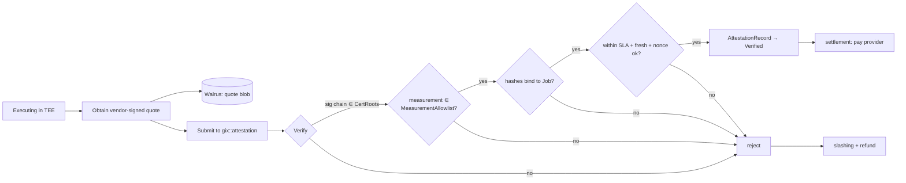

# Verification & Attestation

How GIX proves a job was *actually run by the correct model* without trusting the
operator — using **hardware TEE remote attestation only** in v1. This document is the
authoritative specification of the verification mechanism: the trust model, the quote
format, the on-chain checks in `gix::attestation`, and the slashing triggers derived
from them.

> **Conformance.** Names, modules, objects, and lifecycle states follow
> [overview](overview.md) and the [glossary](../glossary.md) exactly. Where this doc and
> the overview disagree, the overview wins.

---

## 1. The one-sentence trust model

> In v1, GIX trusts **hardware vendor attestation roots** (NVIDIA, Intel, AMD) to
> truthfully report *what code ran on what hardware*; everything downstream of that —
> the measurement allowlist, the hash binding, and the SLA timing — is verified
> **on-chain** in `gix::attestation` against governance-pinned anchors.

This is an **integrity** guarantee, not a **confidentiality** guarantee, and not a
defense against the hardware vendor itself. Be precise about the three buckets:

### 1.1 What is *trusted* (the v1 trust base)

- **Hardware vendor attestation roots.** The silicon root-of-trust and the vendor's
  attestation service (NVIDIA NRAS for GPU Confidential Computing; the Intel TDX /
  AMD SEV-SNP certificate hierarchy for the CPU TEE). We trust that a valid, chained
  vendor signature means the reported measurement genuinely ran inside genuine,
  non-debug, up-to-date TEE hardware.
- **The TEE isolation boundary.** We trust that, given a correct measurement and
  hardware in a good security state, the runtime executed unmodified and its memory
  was not observable or mutable by the host operator.
- **The reproducible build pipeline** that maps inference-runtime source → a single
  canonical `measurement`, so governance can audit *what* a measurement means.

### 1.2 What is *verified on-chain* (no trust required)

- The vendor certificate **chain** validates to a root pinned in `CertRoots`.
- The reported `measurement` is in the `MeasurementAllowlist` **for the specific
  `ModelRecord`** named by the `Job`.
- `model_hash`, `input_hash`, `output_hash` bind to *this* `Job` (no swapping inputs
  or replaying another job's output).
- `t_end − t_start` is within the market's **SLA class**, and the quote is fresh
  (not a stale/rolled-back artifact).
- The quote was produced for *this* `job_id` / nonce (anti-replay).

### 1.3 What is explicitly **NOT** guaranteed in v1

- **Data confidentiality from the operator is not a v1 product guarantee.** The
  attestation proves the *correct model ran on the claimed bytes*; it is integrity-only
  per [overview](overview.md) §1. (TEE memory encryption does raise the bar against a
  *casual* host, but v1 markets do not advertise privacy; see §13 confidential markets.)
- **No defense against vendor signing-key compromise.** If a vendor's attestation key
  leaks, forged quotes become possible until governance rotates `CertRoots`. The root
  of trust is the vendor, full stop.
- **No defense against hardware side channels** (power/EM, microarchitectural timing,
  speculative leaks) or against a vendor-level backdoor. TEEs reduce, not eliminate,
  the host's observational power.
- **No proof of model *quality* or *correctness of the model itself*** — only that the
  bytes hashing to `model_hash` were the loaded weights and that the runtime
  measurement is allowlisted. Garbage-in/garbage-out is out of scope.
- **No re-execution / no zero-knowledge proof.** v1 does not independently recompute
  or zk-verify the inference. zkML is a deliberate non-goal (§3).

---

## 2. Why TEE attestation, and where it sits in the flow

`gix::attestation` is step 7 of the canonical lifecycle ([overview](overview.md) §6):
the node submits a quote, the module verifies it, and only a pass lets
`gix::settlement` release escrow. A fail (or a missing/late quote) drives the `Job` to
`Refunded` and triggers `gix::slashing`.



---

## 3. Why TEE attestation over zkML / optimistic re-execution (v1)

The defining decision: **v1 verifies with hardware TEE remote attestation only.** No
zk proofs, no re-execution challenge games. The reasoning is production viability.

| Property | **TEE attestation (v1)** | zkML (zk-SNARK of inference) | Optimistic re-execution |
| --- | --- | --- | --- |
| Prover overhead vs raw inference | **~1.0–1.3×** (TEE tax) | **10³–10⁶×** for full-size LLMs; impractical today | 1× normal, but disputed jobs re-run in full |
| On-chain verify cost | One sig-chain + allowlist check (cheap, §9) | One SNARK verify (cheap on-chain) but proving is the blocker | Cheap unless challenged |
| Latency to settlement | Seconds (quote is a byproduct of execution) | Minutes–hours of proving | Bounded by **challenge window** (long, hurts spot UX) |
| Confidentiality | Integrity-only (memory-encrypted, but not a v1 guarantee) | Can hide inputs *and* be public-verifiable | None; verifier re-sees data |
| Trust root | **Hardware vendor** (NVIDIA/Intel/AMD) | Math + trusted setup / transparent setup | Honest-majority of re-executors + data availability |
| Determinism requirement | Tolerant (timing-tolerant; output hash must be reproducible) | Strict; non-determinism breaks proofs | Strict; floating-point nondeterminism causes false disputes |
| Production-viable for 70B-class today | **Yes** | No | Partially (but slow finality, redundant cost) |

**Conclusion.** A spot market needs **sub-second-to-seconds finality** and a verify
cost that is a small constant over execution. TEE attestation is the only option that
meets both today. zkML's prover cost is 3–6 orders of magnitude too high for
full-size models, and optimistic re-execution's challenge window is incompatible with
spot-market settlement latency (and doubles compute on disputes).

**zkML is a deliberate non-goal for v1, with the interface left extensible.** The
on-chain `AttestationRecord` and the verification entrypoint are designed around a
*pluggable verifier* so a `zk` proof type can be added later as an **alternative
attestation backend** — same `Job` binding, different proof-of-execution. See §12, and
[overview](overview.md) §1 non-goals.

```move
// illustrative design sketch, not final — the pluggable verifier seam
public enum ProofKind has copy, drop, store {
    TeeQuote,   // v1: hardware remote attestation
    // ZkProof,  // future: zkML backend (same Job binding, different evidence)
}

/// Every backend must populate the same bound tuple and produce the same
/// AttestationRecord shape; only `verify_evidence` differs per backend.
public fun verify(
    job: &Job,
    kind: ProofKind,
    evidence: vector<u8>,          // TEE quote bytes, or (future) a zk proof
    cert_roots: &CertRoots,
    allowlist: &MeasurementAllowlist,
    clock: &Clock,
): AttestationRecord { /* dispatch on kind */ abort 0 }
```

---

## 4. Supported hardware & the composite quote

> **⚠️ v1 MVP scope decision (2026-06) — REVISIT after MVP.** Two scope cuts were taken
> deliberately, driven by Sui's native-crypto surface (§9.0):
> 1. **CPU TEE = Intel TDX only in v1** (ECDSA **P-256**, natively verifiable on-chain via
>    `sui::ecdsa_r1`). **AMD SEV-SNP is deferred** because its reports are **P-384**, which
>    Sui cannot verify natively yet (§9.0). Add SEV-SNP once a P-384 path exists.
> 2. **On-chain verification of the NVIDIA GPU-CC report is phased to a post-MVP
>    fast-follow.** The v1 MVP attests the **TDX-measured runtime** (which loads the model
>    and feeds I/O, binding `model_hash`/`input_hash`/`output_hash`); the **composite
>    GPU-CC + NRAS** on-chain verification — which has *no Sui/Nautilus prior art* and is
>    the largest feasibility unknown (§9.3) — lands after an MVP-stage spike. **This is a
>    known, intentional weakening of the v1 integrity guarantee** (v1 proves the right
>    runtime ran on the bound I/O, but does not yet *cryptographically* prove the GPU
>    executed in CC mode); it is tracked here and in §13 / the [roadmap](../roadmap.md) as
>    the first thing to close after MVP. The full composite design below is the **target**;
>    §4.x marks what ships in the MVP.

The **target** architecture (full build): **NVIDIA H100 / H200 in Confidential Computing
mode (GPU CC)** plus a **CPU TEE** that hosts the orchestration logic and brokers the
GPU's confidential session. The `GPU class` of a [market](../glossary.md) (e.g.
`H100-80GB`, `H200-141GB`) determines which hardware attestation root applies. **In the
v1 MVP the CPU TEE is Intel TDX**, and the GPU-CC report is collected and stored for audit
but its *on-chain* endorsement check is the deferred fast-follow above.

### 4.1 Why two TEEs

GPU CC protects the *weights, activations, and KV-cache on the device*; the CPU TEE
protects the *runtime process that loads the model, feeds inputs, and assembles the
quote*. Neither alone is sufficient:

- GPU CC alone: the host could feed the GPU the wrong input or lie about which model
  was loaded into the protected session.
- CPU TEE alone: the model actually executes on the GPU, outside the CPU enclave's
  measured boundary.

So the two attestations **compose into one composite quote**. The CPU TEE measures the
inference runtime, establishes an encrypted, attested channel to the GPU's
confidential session, retrieves the **GPU CC attestation report**, and *includes the
GPU report (and its verification result) inside the data the CPU TEE signs over*. The
on-chain `measurement` is therefore a binding over **both** the CPU-enclave runtime
measurement **and** the GPU CC device/firmware measurement.

```mermaid
sequenceDiagram
    autonumber
    participant Host as Host (untrusted)
    participant CPU as CPU TEE (TDX/SEV-SNP)
    participant GPU as GPU CC (H100/H200)
    participant NRAS as NVIDIA NRAS
    participant VC as Vendor CA (Intel/AMD)

    Host->>CPU: launch inference runtime (measured at boot)
    CPU->>GPU: open confidential session; request GPU CC report
    GPU-->>CPU: GPU attestation report (device + VBIOS/firmware measurement)
    CPU->>NRAS: forward GPU report for endorsement
    NRAS-->>CPU: signed GPU verification result (NVIDIA root)
    CPU->>CPU: bind { runtime meas ‖ GPU meas ‖ NRAS result ‖ job tuple }
    CPU->>VC: produce CPU TEE quote over the bound report
    VC-->>CPU: (chain rooted at Intel/AMD)
    Note over CPU: composite quote = CPU quote ⊕ endorsed GPU report
```

### 4.2 Vendor attestation services as roots

- **NVIDIA NRAS** (NVIDIA Remote Attestation Service) endorses the GPU CC report —
  device identity, VBIOS/firmware versions, and CC security state.
- **Intel** (TDX quote verification / PCS-style certificate hierarchy) and **AMD**
  (SEV-SNP VCEK/ASK/ARK chain) root the CPU TEE quote.

Governance pins the corresponding roots in `CertRoots`. A market's `GPU class` fixes
which GPU root is acceptable; the host platform fixes which CPU root is acceptable.

---

## 5. What is measured

The **`measurement`** ([glossary](../glossary.md)) is *the* link between "some code ran
in a TEE" and "the **right** code ran." It is a reproducible cryptographic hash
(analogous to `MRENCLAVE`) of the loaded runtime/enclave.

1. **Reproducible build.** The inference runtime (the vLLM / TensorRT-LLM / Triton
   adapter plus its measured boot stack, per [node](node-architecture.md)) is built
   deterministically. The same source + toolchain ⇒ byte-identical image ⇒ identical
   `measurement`. Reproducibility is what lets governance and third parties **audit**
   what a measurement *means* before allowlisting it.
2. **Composite measurement.** As in §4.1, the effective `measurement` covers the CPU
   enclave runtime measurement **and** the GPU CC device/firmware measurement, so a
   downgraded GPU firmware or a swapped runtime both change it.
3. **Binding measurement → `ModelRecord`.** A `measurement` is meaningful only
   relative to a model. Governance adds a measurement to the `MeasurementAllowlist`
   **for a specific `ModelRecord`** — i.e. "this audited runtime, configured to serve
   the model whose weights hash to this `ModelRecord`'s `model_hash`, is approved."
   The model weights themselves are *not* baked into the measurement (they are loaded
   from Walrus at runtime); instead the quote **also** carries `model_hash`, and the
   on-chain check requires *both* `measurement ∈ allowlist[ModelRecord]` *and*
   `model_hash == ModelRecord.model_hash`. That double bind stops a node from running
   an allowlisted runtime against the *wrong* weights.

See [walrus](walrus-integration.md) for how `model_hash` is the content address of the
canonical model blob, and [registry](sui-move-contracts.md) (`gix::registry`) for how
`ModelRecord` stores it alongside the approved measurement set.

---

## 6. Attestation quote: contents & format

The quote binds a single **bound tuple** so that one signature certifies both *who ran*
and *what they ran it on*:

```
bound_tuple =
    measurement
  ‖ model_hash
  ‖ input_hash
  ‖ output_hash
  ‖ t_start
  ‖ t_end
  ‖ job_id
  ‖ nonce
```

This tuple (or its hash) is placed in the TEE's **report data** / user-data field, so
the hardware signs *over the job binding itself* — not just over the enclave identity.
That is the crux: a generic "this enclave is genuine" quote is worthless to GIX; we
need "this enclave, running this measurement, produced this output for this job."

### 6.1 Field-level sketch

```rust
// illustrative design sketch, not final — wire layout the node assembles
struct AttestationQuoteV1 {
    version:         u16,            // quote format version (governance-gated)
    hw_profile:      u8,            // 0 = TDX+H100CC, 1 = SEV-SNP+H100CC, 2 = …+H200CC

    // --- bound tuple (report_data preimage; see §6) ---
    measurement:     [u8; 48],      // composite CPU-enclave ‖ GPU-CC measurement digest
    model_hash:      [u8; 32],      // == ModelRecord.model_hash (Walrus content id digest)
    input_hash:      [u8; 32],      // == Job.input_hash
    output_hash:     [u8; 32],      // == Job.output_hash (also the output blob's Walrus id)
    t_start:         u64,           // ms since epoch, TEE-attested clock (§11.6)
    t_end:           u64,           // ms since epoch
    job_id:          [u8; 32],      // Sui object id of the Job (anti-replay, §8.6)
    nonce:           [u8; 32],      // per-dispatch challenge nonce from the Dispatched event

    // --- vendor evidence ---
    cpu_report_data: [u8; 64],      // = H(bound_tuple); what the CPU TEE signed over
    cpu_quote:       Vec<u8>,       // TDX quote / SEV-SNP attestation report (signed)
    gpu_cc_report:   Vec<u8>,       // NVIDIA GPU CC report (device+firmware measurement)
    nras_result:     Vec<u8>,       // NRAS endorsement of gpu_cc_report (NVIDIA-signed)

    // --- certificate chains (leaf → … → root pinned in CertRoots) ---
    cpu_cert_chain:  Vec<Vec<u8>>,  // Intel PCS / AMD VCEK→ASK→ARK
    gpu_cert_chain:  Vec<Vec<u8>>,  // NVIDIA device cert → NVIDIA root
}
```

The full quote bytes are written to **Walrus** for audit; only a compact, verified
**`AttestationRecord`** (measurement, the three hashes, timings) is retained on-chain
as a child of the `Job` ([overview](overview.md) §5). See
[walrus](walrus-integration.md) for blob layout and retention.

---

## 7. End-to-end attestation flow

This is steps 6–9 of the canonical lifecycle ([overview](overview.md) §6), zoomed in.

```mermaid
sequenceDiagram
    autonumber
    participant Sui as gix (Sui)
    participant Node as Provider Node
    participant TEE as TEE (CPU+GPU CC)
    participant Vend as Vendor svc (NRAS / Intel / AMD)
    participant Wal as Walrus

    Sui-->>Node: Dispatched(job_id, model_id, input blob_id, nonce)
    Node->>TEE: launch measured runtime; load model+input from Walrus
    TEE->>TEE: run inference; record t_start, t_end; compute output_hash
    TEE->>Vend: request quote over H(bound_tuple) (incl. GPU CC report)
    Vend-->>TEE: vendor-signed quote + cert chains
    TEE-->>Node: composite AttestationQuoteV1
    Node->>Wal: write output blob + quote blob (content-addressed)
    Node->>Sui: gix::attestation::submit(job, quote, output_blob_id)
    Sui->>Sui: verify (§8); on pass → AttestationRecord, state → Verified
    Sui->>Sui: gix::settlement releases escrow (− fee)
```

Timing is gated by the **attestation-submission** deadline from
[task-lifecycle](../protocol/task-lifecycle.md); a quote that arrives after it is
treated as missing (§10).

---

## 8. On-chain verification in `gix::attestation`, step by step

`gix::attestation::submit` is the sole authority for accepting a quote. It runs the
following checks **in order**, aborting (and signaling slashing) on the first failure.

```mermaid
flowchart TD
    A[submit(job, quote, output_blob_id)] --> B[8.1 Parse + bounds-check quote]
    B --> C[8.2 Verify cert chains → CertRoots]
    C --> D[8.3 Verify vendor signatures over report_data]
    D --> E[8.4 report_data == H(bound_tuple)?]
    E --> F[8.5 measurement ∈ MeasurementAllowlist for ModelRecord?]
    F --> G[8.6 model/input/output hashes bind to Job?]
    G --> H[8.7 SLA timing + freshness]
    H --> I[8.8 job_id + nonce anti-replay]
    I --> J[Write AttestationRecord; state → Verified]
    C -->|fail| X[abort → slashing]
    D -->|fail| X
    E -->|fail| X
    F -->|fail| X
    G -->|fail| X
    H -->|fail| X
    I -->|fail| X
```

**8.1 — Parse & bounds-check.** Decode `AttestationQuoteV1`; reject unknown `version`
or `hw_profile` not enabled by governance; enforce length bounds on all variable-length
fields (defense against parser DoS / overlong chains).

**8.2 — Verify the vendor certificate chain(s) against `CertRoots`.** Validate both
the CPU chain (Intel PCS / AMD VCEK→ASK→ARK) and the GPU chain (NVIDIA device→root) up
to a root **pinned in the governance `CertRoots` object** ([overview](overview.md) §5).
Check validity windows and, where applicable, revocation. A chain that does not
terminate at a pinned root is rejected. *Pinned roots, not the public web PKI, are the
trust anchor* — see §9 on doing this affordably.

**8.3 — Verify the vendor signatures.** Verify the CPU TEE quote signature and the
NRAS endorsement signature over their respective payloads using the chain-validated
leaf keys.

**8.4 — Confirm the report-data binding.** Recompute `H(bound_tuple)` from the quote's
own `measurement ‖ model_hash ‖ … ‖ nonce` and require it to equal the signed
`cpu_report_data`. This is what proves the signature covers *the job binding*, not just
a generic genuine-enclave assertion.

**8.5 — Confirm the measurement is allowlisted *for this model*.** Look up the `Job`'s
`ModelRecord` in `gix::registry` and require `quote.measurement ∈
MeasurementAllowlist[ModelRecord]`. Not-allowlisted ⇒ reject. (This is the on-chain
analogue of "is this the audited runtime for this model?")

**8.6 — Confirm the hashes bind to the `Job`.** Require:
- `quote.model_hash == ModelRecord.model_hash` (right weights, §5),
- `quote.input_hash == Job.input_hash` (the consumer's actual input, [walrus](walrus-integration.md)),
- `quote.output_hash == output_blob_id` (the submitted output blob is the attested one).

Any mismatch ⇒ reject. This closes input-swap and output-substitution attacks.

**8.7 — Verify SLA timing & freshness.** Using the on-chain `Clock` and the `Job`'s
market **SLA class** ([glossary](../glossary.md)):
- `t_end ≥ t_start` and `t_end − t_start ≤ SLA.max_latency` for the market;
- the quote is **fresh**: `t_end` is within the attestation-submission window relative
  to dispatch, and not older than the last accepted attestation for replay defense.

A breach here is an **SLA breach**, distinct from a forged quote (§10).

**8.8 — Replay / rollback protection.** Require `quote.job_id == Job.id` and
`quote.nonce == Job.dispatch_nonce` (the nonce issued in the `Dispatched` event).
Because each `Job` is a distinct shared object and accepts exactly one
`AttestationRecord`, a quote minted for another job — or a previously consumed quote —
cannot be replayed. The single-`AttestationRecord` invariant gives idempotency.

On success: construct the verified **`AttestationRecord`** (child of `Job`), advance the
state to **`Verified`** ([overview](overview.md) §6), and hand off to
`gix::settlement`.

```move
// illustrative design sketch, not final
public fun submit(
    job: &mut Job,
    model: &ModelRecord,
    cert_roots: &CertRoots,
    allowlist: &MeasurementAllowlist,
    clock: &Clock,
    quote_bytes: vector<u8>,
    output_blob_id: vector<u8>,
    ctx: &mut TxContext,
): AttestationRecord {
    let q = parse_quote_v1(quote_bytes);                       // 8.1
    verify_cert_chains(&q, cert_roots);                        // 8.2
    verify_vendor_sigs(&q);                                    // 8.3
    assert!(q.cpu_report_data == hash_bound_tuple(&q), E_BIND);// 8.4
    assert!(allowlist.contains(model.id(), q.measurement), E_MEAS);     // 8.5
    assert!(q.model_hash  == model.model_hash(), E_MODEL);     // 8.6
    assert!(q.input_hash  == job.input_hash(),   E_INPUT);
    assert!(q.output_hash == output_blob_id,     E_OUTPUT);
    assert!(within_sla(job, q.t_start, q.t_end, clock), E_SLA);// 8.7
    assert!(q.job_id == object::id_bytes(job) &&
            q.nonce  == job.dispatch_nonce(), E_REPLAY);       // 8.8
    new_attestation_record(job, q, ctx)                        // → Verified
}
```

---

## 9. Cryptographic primitives & Sui constraints

The signatures in play:

- **CPU TEE quotes.** Intel TDX quotes verify through an **ECDSA P-256** attestation
  key endorsed by the PCS hierarchy; AMD SEV-SNP reports verify through **ECDSA
  P-384** (VCEK→ASK→ARK). X.509 chains, ASN.1/DER encoded.
- **NVIDIA GPU CC / NRAS.** ECDSA over a NIST curve (**P-256/P-384**), X.509 chain to
  NVIDIA's root.
- **Sui transaction layer.** Submitter signatures are **Ed25519** (or Sui-native
  ECDSA), independent of the attestation crypto.

### 9.0 ⚠️ Curve-support correction: Sui has **no native ECDSA P-384** (secp384r1)

This is the single most important feasibility fact for this design, and an earlier draft
got it wrong. Sui exposes native on-chain verification for exactly these signature
schemes (verified against `develop/cryptography/signing.mdx`):

| Scheme | Move function | Relevant to GIX? |
| --- | --- | --- |
| Ed25519 | `sui::ed25519::ed25519_verify` | yes (enclave re-signing, §9.3) |
| ECDSA **secp256k1** | `sui::ecdsa_k1::secp256k1_verify` / `_ecrecover` | no |
| ECDSA **secp256r1 (P-256)** | `sui::ecdsa_r1::secp256r1_verify` / `_ecrecover` | **yes — Intel TDX & NVIDIA P-256 legs** |
| BLS12-381 | `sui::bls12381::bls12381_min_{sig,pk}_verify` | maybe (Seal/threshold work) |
| Groth16 (BN254 / BLS12-381) | `sui::groth16::verify_groth16_proof` | future `ZkProof` backend (§13) |
| ECVRF | `sui::ecvrf::ecvrf_verify` | no |

**There is no `secp384r1_verify`.** But **AMD SEV-SNP attestation reports are signed with
ECDSA P-384** (VCEK→ASK→ARK), and parts of the NVIDIA/NRAS chain are P-384 as well. So
the §9.2 claim that "signature checks are cheap and native" is **false for any P-384
leg.** Three ways to live within Sui's native curve set, best first:

1. **✓ CHOSEN for v1 — restrict v1 hardware to P-256-only legs.** v1 uses **Intel TDX**
   (P-256) for the CPU TEE, so every on-chain signature check maps to native
   `sui::ecdsa_r1`. **AMD SEV-SNP is deferred** until a P-384 path exists (§4 decision).
   Lowest risk; narrows hardware supply.
2. **Off-chain P-384 verify + on-chain re-anchor (the Nautilus pattern, §9.3).** *Deferred
   path — adopt when SEV-SNP or a P-384 GPU-CC leg is added post-MVP.* A P-384
   chain is verified once *off-chain inside the attested enclave*, which then re-signs the
   bound tuple with an **Ed25519** key whose identity was itself bound on-chain at
   enclave registration. The contract only ever verifies the cheap native Ed25519
   signature per job. Trust is preserved because the enclave key is registered under a
   measurement/PCR allowlist.
3. **Implement P-384 in Move.** No native bigint/EC helpers are documented; this is
   expensive and audit-heavy. *Last resort.*

### 9.1 The cost problem

Full X.509 parsing and multi-cert chain validation **in Move** is expensive and
fiddly (ASN.1/DER parsing, validity windows, revocation), and Sui exposes **no native
X.509/ASN.1-DER helpers** (the only "DER" reference in the docs notes that Sui's *own*
signatures are compressed, not DER). Doing *all* of it on-chain maximizes trustlessness
but burns gas and bloats the contract.

Sui provides native verification only for the **signature primitives** in §9.0 (P-256,
secp256k1, Ed25519, BLS, Groth16) plus the **hashes** in §9.4 — so for P-256 legs the
*signature* checks are cheap and native and the expensive part is **certificate-chain
parsing**, not signature verification. For P-384 legs both the parsing *and* the
signature check are non-native (§9.0).

### 9.2 Recommended approach: minimal trust-preserving on-chain check

We recommend a **hybrid** that keeps the security-critical checks fully on-chain while
moving only the *mechanical, non-trust-bearing* X.509 parsing off-chain:

1. **On-chain, always (trust-bearing):**
   - native signature verification of the leaf attestation key over `report_data`
     (P-256/P-384);
   - the **`report_data == H(bound_tuple)`** binding (§8.4);
   - `measurement ∈ MeasurementAllowlist[ModelRecord]` (§8.5);
   - all hash-to-`Job` bindings (§8.6);
   - SLA timing, freshness, and nonce (§8.7–8.8).
2. **Off-chain (non-trust-bearing) pre-processing:** parse the DER cert chain and
   extract the leaf public key + validity window into a compact, canonical form the
   Move code can check cheaply. This is *not trusted*: the on-chain code still verifies
   that the extracted leaf key chains to a **pinned `CertRoots`** entry — but it can do
   so against pre-pinned **intermediate fingerprints** rather than reparsing full ASN.1.

**Why this is safe.** The trust root is `CertRoots`, pinned by governance. As long as
the chain is verified to terminate at a pinned root *and* the leaf key's signature over
`H(bound_tuple)` is checked natively on-chain, off-chaining the byte-level DER parsing
changes performance, not the trust model — a malicious pre-processor cannot make an
invalid quote pass the on-chain signature + binding + allowlist checks.

**Why not pure off-chain pre-verify + a single on-chain boolean.** That would re-introduce
a trusted verifier (the off-chain service could rubber-stamp). It is rejected:
off-chain services in GIX hold **no settlement authority** ([overview](overview.md) §8).

> The exact split between native chain validation and pinned-fingerprint shortcuts is a
> governance-tunable implementation detail; the invariant is that *no entity outside
> the contract can cause a quote to be accepted.*

### 9.3 Relationship to **Nautilus** (Sui's official TEE-attestation framework)

**This design must be positioned against Nautilus, Sui's official framework for
verifiable off-chain compute** — verifying a TEE attestation **on-chain in Move** is
exactly what Nautilus does, and an earlier draft of this doc omitted it. What Nautilus
provides today and how it maps to GIX:

- **Architecture (a direct fit for GIX's shape).** An enclave generates an ephemeral
  keypair in isolated memory; a reproducible build yields deterministic **PCRs** (three
  **SHA-384** measurements of OS/boot, app code, runtime config). A Move module
  (`move/enclave`: `EnclaveConfig` holding expected PCRs, `Enclave` holding the registered
  pubkey, `EnclaveCap`) verifies the attestation document **once at registration**, then
  verifies cheap **per-response signatures** thereafter. The **AWS Nitro root certificate
  is already bundled in the Sui framework** (`sui-types/.../nitro_root_certificate.pem`).
- **Binding model — adopt this for steady state.** Nautilus does *not* stuff job data
  into the attestation's `report_data` on every job. Instead it binds the **enclave
  ephemeral pubkey** at registration, then binds per-job data into the **signed message**:
  a BCS-serialized struct that includes an **intent/domain-separator** constant and a
  **timestamp** for freshness/replay defense, signed with the enclave's **Ed25519** key
  and verified natively on-chain. **GIX should adopt this register-once + per-job-Ed25519
  pattern** — it sidesteps the P-384 problem (§9.0 option 2) and the per-job cert-chain
  gas cost (§9.1): verify the (possibly P-384) vendor chain *once* off-chain inside the
  enclave at registration, register the enclave's Ed25519 key under the measurement/PCR
  allowlist, then bind every job with a native `ed25519_verify`. Add a GIX intent
  constant (cf. Nautilus's `WEATHER_INTENT`) so signatures can't cross protocols.
- **Hard scope limit — own this in the doc.** Nautilus supports **AWS Nitro Enclaves
  only** today (plus Marlin Oyster, itself Nitro). It does **not** support **Intel TDX**,
  **AMD SEV-SNP**, or **NVIDIA GPU Confidential Computing** — a full search of the Sui
  docs for TDX/SEV-SNP/SGX/GPU/NVIDIA returns nothing. So:
  - GIX's **GPU-CC (NVIDIA H100/H200 + NRAS) attestation has no Sui/Nautilus prior art**
    — verifying it on-chain is **novel work** GIX must build itself. The doc must not
    imply Sui provides it.
  - If GIX's CPU TEE can be **AWS Nitro**, reuse the Nautilus `move/enclave` module and
    the bundled AWS root rather than re-implementing chain verification. If GIX insists on
    **TDX/SEV-SNP**, that CPU path is *also* custom (and SEV-SNP hits the P-384 wall).
- **Confidentiality.** Nautilus integrates with **Seal** (threshold encryption) to gate
  decryption on enclave PCRs — i.e. "only this attested enclave can decrypt." This is the
  concrete substrate for the confidential-markets roadmap item; see
  [walrus](walrus-integration.md) §11 and [threat model](../security/threat-model.md).

> **Net recommendation.** Treat Nautilus as the **blessed pattern for the CPU/Nitro
> attestation leg and the register-once gas model**, and treat **GPU-CC verification as
> GIX-specific novel work**. Re-frame §8/§9: keep full vendor-chain verification at
> *enclave registration*, and make the *per-job* on-chain check a native Ed25519
> signature over the BCS-encoded bound tuple.

### 9.4 Hash functions: BLAKE3 is **not** native on Sui

Native Move/Sui hashes are **`std::hash::sha2_256`**, **`std::hash::sha3_256`**,
**`sui::hash::keccak256`**, and **`sui::hash::blake2b256`**. **BLAKE3 is not available
on-chain.** Implications for the protocol-wide content hash this doc and
[walrus](walrus-integration.md) §10 discuss:

- **Content hashes (`model_hash`/`input_hash`/`output_hash`)** are computed **off-chain**
  and only **compared for equality on-chain** (§8.6). Equality comparison needs no native
  hash function, so **BLAKE3 remains acceptable for content hashing** (and is much faster
  on multi-GB weights). Pin the choice in `gix::config`.
- **Any value GIX re-hashes on-chain** — most importantly `H(bound_tuple)` checked at
  §8.4 — **must use a native hash** (`sha2_256` or `blake2b256`). Do **not** specify
  BLAKE3 for the on-chain `report_data`/bound-tuple hash.
- So the protocol may legitimately use **two** hashes: a fast off-chain content hash
  (BLAKE3 or SHA-256, compared on-chain) and a native on-chain hash (`sha2_256` /
  `blake2b256`) for the report-data binding. State both explicitly in `gix::config`.

*(Sources: `develop/cryptography/{signing,hashing,groth16}.mdx`,
`sui-stack/nautilus/{nautilus-overview,nautilus-design,seal}.mdx`,
`nautilus/nautilus-weather-oracle.mdx`.)*

---

## 10. Slashing triggers derived from verification

Each verification failure maps to a precise slashing condition in `gix::slashing`
(executed by `gix::settlement`). See [contracts](sui-move-contracts.md) for the
module and [tokenomics](../tokenomics.md) for slash magnitudes and fault economics.

| Trigger | Detected in | Provider fault? | Outcome |
| --- | --- | --- | --- |
| **Invalid signature / bad cert chain** | §8.2–8.3 | Yes (forgery / wrong hw) | Slash + refund consumer |
| **Measurement not allowlisted** | §8.5 | Yes (unaudited runtime) | Slash + refund |
| **Binding/hash mismatch** (model/input/output) | §8.4, §8.6 | Yes (ran wrong thing / swapped I/O) | Slash + refund |
| **Missing quote** (past attestation deadline) | §7 / lifecycle | Yes (liveness) | Slash (liveness tier) + refund |
| **Late quote** (`t_end − t_start` > SLA, or submitted late) | §8.7 | Yes (SLA) | **SLA-breach** slash + refund |
| **Replay / rollback / wrong nonce** | §8.8 | Yes (attack) | Slash + refund |

Failures split into two economic classes, per [tokenomics](../tokenomics.md): a
**fraud tier** (forged/mismatched/unallowlisted/replay — the provider tried to get
paid for work not faithfully done) and a softer **liveness/SLA tier** (missing or late
quote). The state machine and exact deadlines are in
[task-lifecycle](../protocol/task-lifecycle.md).

---

## 11. TEE-specific threats & mitigations

Cross-reference: the system-wide adversary model is in
[threat model](../security/threat-model.md). This section covers threats *specific to
attestation*.

| # | Threat | Mitigation in GIX |
| --- | --- | --- |
| 11.1 | **Forged quote** (operator fabricates a vendor signature) | Native on-chain sig verification against a **pinned** `CertRoots` (§8.2–8.3); forgery requires the vendor's private key. |
| 11.2 | **Measurement spoofing** (claim an allowlisted measurement while running other code) | Measurement is hardware-reported and signed; it cannot be set by the host. Composite CPU+GPU measurement (§4.1) means a swapped runtime *or* downgraded GPU firmware changes it. |
| 11.3 | **Replay / rollback** (resubmit an old or other job's quote) | `job_id` + per-dispatch `nonce` in the bound tuple (§8.8); one `AttestationRecord` per `Job` (idempotent). |
| 11.4 | **Vendor key compromise** | *Acknowledged residual risk* — the root of trust is the vendor. Mitigation is **governance revocation/rotation** of `CertRoots` (§12) and requiring up-to-date TCB (reject stale firmware/TCB in §8.2). Cannot be eliminated in v1. |
| 11.5 | **Side channels** (timing, power/EM, microarchitectural, speculative) | *Acknowledged residual risk.* Integrity is unaffected (output is still correct), but **confidentiality may leak** — consistent with the integrity-only stance (§1.3). Mitigated only partially by requiring patched TCB. |
| 11.6 | **Time-source manipulation / SLA gaming** (lie about `t_start`/`t_end` to fake meeting SLA) | Timestamps are taken from the **TEE-attested clock** and signed inside the bound tuple, and cross-checked against the on-chain `Clock` and dispatch time at §8.7. A host cannot forge attested timestamps; gross skew vs `Clock` is rejected. |
| 11.7 | **Stale-TCB downgrade** (run on hardware with known-vulnerable, unpatched firmware) | §8.2 enforces TCB/firmware recency reported in the quote; governance can raise the floor by tightening `MeasurementAllowlist` / `CertRoots`. |
| 11.8 | **Input/output substitution** | Hash binding (§8.6): the attested `input_hash`/`output_hash` must equal the `Job`'s and the submitted output blob id. |

What remains genuinely unmitigated in v1: **vendor key compromise** (11.4) and
**confidentiality-breaking side channels** (11.5). These are inherent to a
hardware-root-of-trust, integrity-only design and are stated plainly in §1.3 and §14.

---

## 12. Governance of trust anchors

All trust anchors are governance-owned shared objects ([overview](overview.md) §5,
`gix::governance`). Changing them is the only way the trusted set moves.

- **`CertRoots`** — the pinned vendor root certificates (NVIDIA, Intel, AMD). Governance
  **pins** new roots and **rotates** them (e.g. when a vendor rolls its root, or on key
  compromise). An **emergency revocation** path lets governance drop a compromised root
  out-of-cycle, immediately invalidating quotes that chain to it.
- **`MeasurementAllowlist`** — the approved `measurement`s, scoped per `ModelRecord`.
  Adding a measurement follows a reproducible-build audit (§5). Measurements can be
  **revoked** (e.g. a runtime CVE), after which quotes carrying them fail §8.5.
- **`ModelRecord`** (via `gix::registry`) — adding/retiring a model and its
  `model_hash`. A retired model stops matching at §8.6.
- **Quote format / `hw_profile` / `version`** — governance enables new quote versions
  and hardware profiles (e.g. adding H200 or a new CPU TEE), and can disable old ones.
- **Upgrade path.** Because verification is parameterized by these objects and dispatched
  by `ProofKind` (§3), tightening the TCB floor, adding hardware, or (future) enabling a
  zk backend are governance operations, not contract rewrites where avoidable. Move
  package upgrade authority is governed per [contracts](sui-move-contracts.md).

> **Operational tension.** Pinned roots are more secure but require active rotation; if
> governance is slow to rotate after a vendor key event, the window of forgeability
> (11.4) stays open. Rotation responsiveness is therefore a security parameter, not just
> ops hygiene.

---

## 13. Future extensions

Designed-for, not built in v1:

- **zkML backend as an alternative `AttestationRecord` type.** Via the pluggable
  verifier interface (§3, `ProofKind`), a zk proof of inference could populate the same
  bound tuple and produce the same on-chain `AttestationRecord`, letting a *zk market*
  coexist with TEE markets. This is **future research**: today's prover cost rules it
  out for full-size models (§3).
- **Confidential markets (TEE-isolated I/O) for data privacy.** A market class where
  inputs/outputs are encrypted to the enclave and never exposed to the operator, turning
  v1's integrity-only guarantee into integrity **+** confidentiality. The concrete Sui
  substrate is **Seal** (threshold identity-based encryption with on-chain access
  control) combined with the §9.3 Nautilus pattern: a Seal `seal_approve` policy gates
  decryption on the **attested enclave's PCRs + registered key**, so only an enclave
  running the allowlisted measurement can obtain the key — exactly "sealed delivery of
  keys to the attested enclave." Consumers envelope-encrypt inputs (AES payload + Seal-
  wrapped key), store ciphertext on Walrus, and the enclave fetches keys via Seal at run
  time. Because Seal ties encryption identity to the package and freezes the key-server
  set per ciphertext, this can land as an **additive upgrade** that leaves historical
  integrity-only jobs untouched (no re-attestation). Audit-trail impact (encrypted blobs)
  is in [walrus](walrus-integration.md) §11 and [threat model](../security/threat-model.md)
  §16. Tracked as the "confidential markets" roadmap item ([overview](overview.md) §1).
- **Multi-vendor quote diversity / N-of-M roots** to dilute single-vendor-key risk
  (11.4).

---

## 14. Honest limitations summary

- **Integrity, not confidentiality.** v1 proves the right model ran on the claimed
  bytes; it does **not** promise the operator can't see inputs/outputs. (TEE memory
  encryption helps but is not a marketed v1 guarantee.)
- **Hardware-vendor trust root.** Security ultimately rests on NVIDIA / Intel / AMD
  attestation keys and silicon correctness. A vendor key compromise or backdoor defeats
  the scheme until `CertRoots` is rotated.
- **Side channels exist.** TEEs reduce but do not eliminate host observation; timing /
  power / microarchitectural leakage is out of scope for v1.
- **zkML is intentionally absent.** Not a gap to patch quickly — it is not
  production-viable for full-size models today. The interface is left extensible (§3),
  not implemented.
- **Reproducible builds are a prerequisite, not a given.** The whole "what does this
  measurement mean" audit chain depends on the runtime building deterministically; build
  non-determinism would undermine measurement governance.

---

## Open questions

> **v1 MVP scope decisions (2026-06, see §4):** CPU TEE = **Intel TDX (P-256) only**;
> **AMD SEV-SNP deferred** (P-384); **on-chain GPU-CC/NRAS verification phased to a
> post-MVP fast-follow** — the MVP attests the TDX runtime + binds I/O hashes, full
> composite GPU-CC verification follows an MVP-stage feasibility spike. Revisit after MVP.
>
> **Resolved since first draft (see §9.0, §9.3):** (a) **Curve support** — Sui has *no
> native P-384*, so v1 targets P-256 legs (Intel TDX); AMD SEV-SNP and any P-384 leg use
> the enclave-re-sign pattern when added. (b) **On-chain verification model** —
> adopt Nautilus's *verify-the-vendor-chain-once-at-registration, then native-Ed25519-
> per-job* pattern rather than re-parsing X.509 on every job. (c) **Hash** — BLAKE3 is
> not native; use it only for off-chain content hashes compared on-chain, and a native
> hash (`sha2_256`/`blake2b256`) for the on-chain bound-tuple binding.

1. **On-chain X.509 depth (now narrowed).** With the register-once model (§9.3) the
   vendor cert-chain is verified at enclave *registration*, not per job — but **how much
   of that one-time chain validation runs natively in Move vs. off-chain-in-the-enclave**
   (for the GPU-CC chain, which has no Sui prior art) still needs a gas benchmark per
   `hw_profile`. The novel piece is **NVIDIA GPU-CC / NRAS verification**, for which
   neither Sui nor Nautilus provides any helper (§9.3).
The remaining policy/format/research items are **migrated to the central ledger**
([open-ended-questions.md](../open-ended-questions.md)). From this doc:
- **L4** composite-quote canonical byte layout · **F2** TCB-freshness floor & escalation ·
  **F3** cert-root revocation latency + retroactive challengeability · **C4**
  attested-clock vs `Clock` skew tolerance · **F4** output reproducibility for a future
  zk path. (Item 1 above stays here — it is an engineering feasibility spike, not a
  decision for you.)
