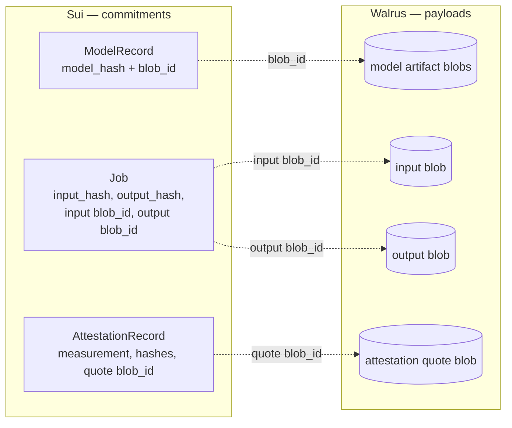
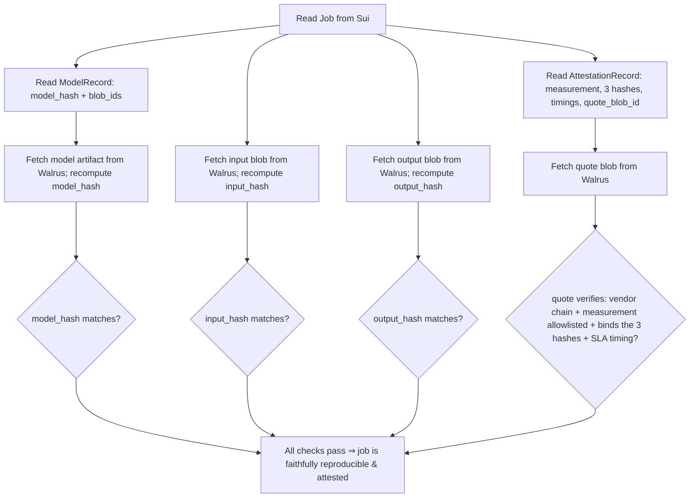

# Walrus Integration

**Purpose:** how GIX uses Walrus as its content-addressed storage and tamper-evident
audit layer — what it stores, how blob ids bind to on-chain hashes, and how anyone can
reconstruct and verify a settled job from Sui plus Walrus alone.

> **Conforms to** [overview](overview.md) and the [glossary](../glossary.md). Those win
> on any naming conflict. This document is the design-level reference for the
> storage/audit substrate; on-chain object and module details are in
> [contracts](sui-move-contracts.md), verification semantics in
> [verification](verification-attestation.md), node-side I/O in
> [node](node-architecture.md), the state machine in [lifecycle](../protocol/task-lifecycle.md),
> and adversarial analysis in the [threat model](../security/threat-model.md).

---

## 1. Role of Walrus in GIX

GIX uses three substrates with strictly separated jobs (see [overview](overview.md) §2):

- **DeepBook** matches supply and demand.
- **Sui (`gix` package)** owns escrow, the `Job` lifecycle, attestation verification,
  and settlement.
- **Walrus** is the **storage and audit layer**: it holds the actual bytes — model
  artifacts, job inputs, job outputs, and attestation quotes — while Sui holds only
  their hashes and lifecycle metadata.

The split is deliberate and load-bearing. On-chain storage is expensive and bounded;
inference artifacts (multi-gigabyte weights, large prompts, image/audio I/O, vendor
quote blobs) do not belong in Sui objects. Instead:

- **Sui stores commitments** — `model_hash`, `input_hash`, `output_hash`, the
  `AttestationRecord`, and the Walrus **blob id** references.
- **Walrus stores payloads** — the bytes those hashes commit to.

Because Walrus is **content-addressed**, the blob id is itself derived from the bytes.
That gives GIX two properties at once:

1. **Tamper-evidence.** A blob id (and the on-chain `*_hash` it is bound to) cannot be
   satisfied by different bytes. If the stored payload is altered, the address no longer
   matches; the mismatch is detectable by any reader.
2. **A canonical "exact model" identity.** The thing a market sells is *a specific
   model at a specific quantization/runtime tier*. Content addressing makes "exact
   model" a cryptographic fact, not a label — see §4.



Sui is the index of truth about *what should exist and what it should hash to*; Walrus
is where the bytes actually live. An auditor cross-checks the two (see §8).

---

## 2. Walrus primer (design level)

> **Assumption boundary.** We treat Walrus at the level needed to design GIX and flag
> where exact behavior is uncertain. We rely only on the high-level guarantees below;
> nothing in GIX's correctness depends on internal encoding parameters.

Walrus is a **Sui-based decentralized blob store**. Its relevant properties:

- **Blobs.** The unit of storage is an opaque byte blob of arbitrary size (from a few
  bytes to many gigabytes). GIX never asks Walrus to interpret contents.
- **Content-addressed blob ids — but *not* a plain hash of the bytes.** Each blob has a
  **blob id** deterministically derived from its content, but it is **not**
  `H(raw_bytes)`. It is a 32-byte (`u256`) commitment over `(encoding_type_tag ‖
  unencoded_length ‖ Merkle_root_over_the_RedStuff_slivers)`. The same bytes under the
  same encoding always yield the same blob id; different bytes yield a different one.
  **Two consequences for GIX** (verified against `red-stuff.mdx`): (1) the blob id gives
  a free *Walrus-internal* integrity check on read, but (2) because it embeds the
  `encoding_type` tag and is a sliver-commitment rather than a content hash GIX controls,
  **GIX must keep its own canonical `*_hash`** (§10) — that separate hash is genuinely
  load-bearing, not redundant (see §2 defense-in-depth note and the SDK doc's blob-id
  question). The blob id is the locator/availability primitive; GIX's `*_hash` is the
  verification primitive.
- **Erasure coding (RedStuff).** Walrus encodes each blob with **RedStuff** (a Twin-Code
  construction over the **RaptorQ** fountain code, ~4.5× storage overhead) into slivers
  spread across independent **storage nodes**. Fault model (verified): tolerates up to
  **f < N/3** Byzantine/faulty shards; writes and availability hold while **> 2/3 of
  shards are honest**, and reads can reconstruct from as few as **~1/3 of nodes
  available**. Reads reconstruct from a subset of slivers.
- **Storage nodes.** A permissionless set of operators hold slivers and serve reads.
  GIX does not run them and does not trust any individual node for correctness — only
  the aggregate availability guarantee and the content-address binding.
- **Storage epochs & availability.** Storage is purchased for a number of **storage
  epochs** (Walrus mainnet epoch ≈ **2 weeks**; up to ~2 years can be prepaid) via an
  on-chain Sui **`Storage`** resource (`start_epoch`/`end_epoch`/`storage_size`)
  associated with the `Blob` object. Within the paid window the blob is guaranteed
  retrievable subject to the RedStuff fault tolerance. Storage is **renewable** (`walrus
  extend`); after `end_epoch` availability is no longer guaranteed and slivers may be
  reclaimed. Retention windows matter for dispute evidence — see §9.
- **On-chain availability certification — the `BlobCertified` event / Point of
  Availability (PoA).** On store, ≥2/3 of storage-node sliver receipts are aggregated into
  an **availability certificate** submitted to Sui; successful verification against the
  current committee emits the **`BlobCertified`** event and sets the `Blob` object's
  **`certified_epoch`** field — this is the **Point of Availability**. GIX gates `Job`
  dispatch (§6) by checking, for the input blob id, that `BlobCertified` fired with
  **`deletable = false`** and an **`end_epoch`** beyond the job/dispute window — a Move
  contract can read the `Blob` object directly (`certified_epoch.is_some()`,
  `end_epoch > now`, `!deletable`), or an off-chain party can rely on a Sui light-client
  proof of the event. Prefer **permanent (non-deletable)** blobs for dispatch inputs; the
  docs warn that deletable blobs "should not be relied on for availability."
  *(Verified: `walrus core-concepts.mdx`, `operations.mdx`.)*
- **Who pays, and the cost shape.** Storage is paid upfront for the chosen epoch span in
  **WAL** (plus **SUI** gas for the on-chain objects), by whoever writes the blob.
  Pricing is **~$0.023 / GB / month (paid in WAL)** charged on the **encoded** size
  (~5× the raw bytes after erasure expansion), **plus a fixed per-blob metadata cost**
  that dominates for small blobs — so "per byte per epoch" only holds asymptotically for
  large blobs; small per-job I/O is dominated by the fixed cost (mitigate with **Quilt**,
  §3 / below). Crucially, Walrus supports **shared blobs**: a `Blob` wrapped in a shared
  Sui object that **anyone can fund and extend** (`walrus share` / `fund-shared-blob` /
  `extend --shared`), so the **GIX treasury can sponsor retention of model artifacts and
  attestation quotes** without holding the writer's keys (shared blobs must be permanent,
  not deletable). This resolves the §9 cost-bearer question's mechanism.
  *(Verified: `walrus storage-costs.mdx`, `managing-blobs.mdx`.)*

What GIX **assumes** from Walrus, and nothing more:

| Guarantee GIX relies on | Used for |
| --- | --- |
| Blob id is a collision-resistant function of content | tamper-evidence, "exact model" identity (§4) |
| Availability certificate is verifiable on Sui | dispatch-time availability gate (§6) |
| Blob is retrievable for its paid storage epochs | hot-path reads (§7) and dispute evidence (§9) |
| Reads reconstruct correctly or fail (no silent wrong bytes) | integrity at read time (§10) |

> **Defense in depth.** GIX does **not** treat the Walrus blob id as the *only*
> integrity check. It also binds an independent **content hash** (the canonical
> `*_hash`, §10) on Sui and re-verifies it on read. If the blob id derivation and our
> hash ever disagreed, GIX's check would still catch a substituted payload.

---

## 3. What GIX stores in Walrus, and why

| # | Artifact | Written by | On-chain reference | Why it lives in Walrus |
| --- | --- | --- | --- | --- |
| 1 | **Model artifacts / weights** | Publisher (governance-approved) | `ModelRecord.blob_id` + `model_hash` | Large, immutable, shared across many jobs; the canonical "exact model" (§4). |
| 2 | **Job inputs** | Consumer | `Job` input `blob_id` + `input_hash` | Variable size, per-job; must be retrievable by the node and auditable. |
| 3 | **Job outputs** | Provider node | `Job` output `blob_id` + `output_hash` | The deliverable; the consumer fetches it and an auditor re-checks its hash. |
| 4 | **Attestation quotes** | Provider node | `AttestationRecord` quote `blob_id` | Full vendor-signed quote can be large; only its summary/hash goes on-chain (§7). |
| 5 | **Audit bundles (optional)** | Provider node / indexer | optional `blob_id` in events | A packaged, self-describing evidence set for offline replay (§8). |

The common rule: **bytes in Walrus, commitments on Sui.** Every artifact above has a
content hash and/or blob id pinned on-chain so that possession of the bytes can be
checked against the chain without trusting whoever served them.

---

## 4. Content addressing as canonical "exact model" identity

A GIX market sells capacity for *one specific model at one specific runtime/quantization
tier* — e.g. `llama-3.1-70b-int8` on vLLM (glossary: *Model/runtime tier*). "Specific"
must be cryptographic, because the entire verification chain ([verification](verification-attestation.md))
proves *that the attested measurement ran against `model_hash`*. If `model_hash` were a
loose label, the proof would be meaningless.

### `ModelRecord` binds blob id ↔ canonical `model_hash`

The `registry` module's **`ModelRecord`** (shared object; see [overview](overview.md) §5
and [contracts](sui-move-contracts.md)) binds, for one model:

- the Walrus **blob id(s)** of the model artifact(s),
- the canonical **`model_hash`** — the integrity hash over the canonical artifact
  bytes/manifest (§10), and
- the set of **approved TEE measurements** that are allowed to serve this model
  (cross-link [verification](verification-attestation.md)).

```move
// illustrative design sketch, not final
public struct ModelRecord has key {
    id: UID,
    model_hash: vector<u8>,        // canonical SHA-256/BLAKE3 over the manifest
    artifact: ArtifactLocator,     // Walrus blob id(s) + sharding manifest
    approved_measurements: vector<vector<u8>>, // allowlisted runtime measurements
    runtime_tier: String,          // e.g. "vllm/llama-3.1-70b-int8"
    status: u8,                    // Proposed | Approved | Deprecated
}

public struct ArtifactLocator has store {
    manifest_blob_id: vector<u8>,  // root manifest blob (lists shards + their hashes)
    shard_blob_ids: vector<vector<u8>>, // for large/sharded models (§4.3)
}
```

### Reproducibility of the canonical hash

`model_hash` must be **reproducible by an independent party** from the published
artifact alone, or the audit story collapses. Requirements:

- **Canonical serialization.** Weights and config are serialized in a fixed, documented
  layout (a manifest listing each file/shard, its byte length, and its hash, in a fixed
  order). The `model_hash` is the hash of that manifest, not of a tarball whose byte
  order could vary.
- **No nondeterministic packaging.** No timestamps, no compression that varies by tool
  version, no host-dependent ordering inside the canonical form.
- **Same bytes → same blob id and same `model_hash`.** A third party who downloads the
  artifact recomputes both and compares against `ModelRecord`. Either mismatch
  disqualifies the artifact.

This is what makes "exact model" objective: two operators serving the same
`ModelRecord` are, by construction, serving byte-identical weights.

### Large-model sharding & distribution

Frontier weights are tens to hundreds of GB. We do not assume a single blob is ideal at
that size, so the canonical form is a **manifest + shards**:

- The model is split into N shards; each shard is a Walrus blob with its own blob id and
  per-shard hash.
- A **root manifest** blob lists every shard's `(blob_id, hash, length, index)`. The
  canonical `model_hash` is the hash of this manifest.
- Nodes fetch shards **in parallel** across many storage nodes (erasure coding already
  spreads each shard), and verify each shard's hash against the manifest before loading.
- Sharding also enables partial cache warming and resumable downloads (§7).

> **Assumption.** Whether GIX uses one big blob or a shard-manifest is a tuning choice;
> the manifest approach is the design default because it parallelizes fetch, bounds
> per-blob size, and makes per-shard integrity local. Exact optimal shard size is left
> open (§11).

---

## 5. Model registry workflow

Publishing a model is a **governance-gated** path because an approved `ModelRecord` is
what every market and every attestation trusts. Steps:

```mermaid
sequenceDiagram
    autonumber
    participant Pub as Publisher
    participant Wal as Walrus
    participant Gov as governance
    participant Reg as registry (ModelRecord)
    participant Ver as verification

    Pub->>Pub: canonicalize weights → manifest; compute model_hash
    Pub->>Wal: upload shards + manifest → shard blob_ids, manifest_blob_id
    Wal-->>Pub: availability certificates (per blob)
    Pub->>Gov: propose ModelRecord(model_hash, blob_ids, runtime_tier)
    Gov->>Wal: independently re-download + recompute model_hash (reproducibility check)
    Gov->>Ver: bind approved TEE measurements for this runtime/model
    Gov->>Reg: approve → ModelRecord.status = Approved
```

1. **Canonicalize & hash.** The publisher produces the canonical manifest and computes
   `model_hash` (§4).
2. **Upload to Walrus.** Shards + manifest are written; the publisher collects the
   on-chain **availability certificates** so governance can confirm the bytes are
   actually retrievable.
3. **Propose `ModelRecord`.** A `registry` proposal carries `model_hash`, the
   `ArtifactLocator` (blob ids), and the intended `runtime_tier`.
4. **Reproducibility verification.** Governance (or a delegated verifier) **independently
   re-downloads** from Walrus and **recomputes** `model_hash`, confirming it matches the
   proposal and that the blob ids resolve. This is the check that makes the registry
   trustworthy rather than self-asserted.
5. **Link approved TEE measurements.** Governance binds the set of **approved
   measurements** (the `MeasurementAllowlist` entries) under which a node may serve this
   model — the link to [verification](verification-attestation.md). A node's attestation
   only verifies if its measurement is in this set **and** the attested `model_hash`
   equals `ModelRecord.model_hash`.
6. **Approve / deprecate.** On approval the record becomes usable by markets; models can
   later be `Deprecated` (no new jobs) while retained for audit of past jobs.

The result: a market's "exact model" is a governance-approved, independently-reproduced,
content-addressed artifact with a pinned set of enclaves allowed to run it.

---

## 6. Input lifecycle

The consumer's input must be (a) content-addressed, (b) referenced on the `Job` at or
before order time, and (c) **provably available** before the node is asked to run.

```mermaid
sequenceDiagram
    autonumber
    participant Cons as Consumer (SDK)
    participant Wal as Walrus
    participant DB as DeepBook
    participant Rel as Relayer
    participant Sui as gix (Job)
    participant Node as Provider Node

    Cons->>Wal: upload input → input blob_id
    Wal-->>Cons: availability certificate
    Cons->>Cons: compute input_hash
    Cons->>DB: post bid / market order (buy Credits)
    DB-->>Rel: fill event
    Rel->>Sui: create Job (input blob_id, input_hash, avail cert ref)
    Sui->>Sui: gate: require certified-available input
    Sui-->>Node: Dispatched (job_id, model blob_ids, input blob_id)
    Node->>Wal: read input blob; recompute & check input_hash
```

- **Upload before order.** The consumer uploads the input and obtains `input_blob_id`
  and `input_hash` **before/at order time** (matches [overview](overview.md) §6
  sequence). The relayer writes both into the `Job` when it turns the DeepBook fill into
  an on-chain Job + escrow.
- **Availability guarantee needed at dispatch.** Before a `Job` moves to `Dispatched`,
  GIX requires evidence that the input is **certified available** on Walrus (the
  on-chain availability certificate, §2). Dispatching against an input that cannot be
  read would strand the provider and cause an unfair SLA failure. The dispatch-ack
  deadline ([lifecycle](../protocol/task-lifecycle.md)) starts only once the input is
  available to fetch.
- **If the input is unavailable.** Two cases:
  - **Pre-dispatch:** the availability gate is not satisfied, so the Job does not
    dispatch; it expires/refunds without provider fault (no slash). This is a
    **consumer-side** failure to provide retrievable input.
  - **Post-dispatch (withholding/loss):** the node cannot read the input within the
    dispatch-ack window. The node signals failure; because the fault is **not** the
    provider's, the Job refunds the consumer and the provider is **not slashed**. The
    `Job` records the input blob id so the dispute is auditable (input availability is a
    risk, not a correctness hole — see [threat model](../security/threat-model.md) and
    §11).

> **Privacy caveat (v1).** The input blob is, in v1, readable by the operator that runs
> the job — integrity-only, not confidential. See §11 and [verification](verification-attestation.md).

---

## 7. Output & quote storage

After running inside the TEE, the node writes two blobs and submits only **hashes /
summaries** on-chain.

- **Output blob.** The node writes the inference output to Walrus → `output_blob_id`,
  and computes `output_hash`. Only `output_hash` (and the blob id reference) is bound to
  the `Job`; the output bytes never go on-chain.
- **Attestation quote blob.** The full vendor-signed quote can be sizeable (certificate
  chains, evidence, GPU CC report). The node writes it to Walrus → `quote_blob_id`. The
  `attestation` module verifies the quote and persists a compact **`AttestationRecord`**
  (measurement, the three hashes, timings, verdict) as a child of the `Job`, with the
  `quote_blob_id` reference for full-evidence audit. This keeps the on-chain footprint
  small while preserving the complete quote off-chain.

```move
// illustrative design sketch, not final
public struct AttestationRecord has key, store {
    id: UID,
    measurement: vector<u8>,
    model_hash: vector<u8>,
    input_hash: vector<u8>,
    output_hash: vector<u8>,
    t_start: u64,
    t_end: u64,
    quote_blob_id: vector<u8>,   // full vendor quote in Walrus
    verdict: u8,                 // Valid | Invalid | SlaBreach
}
```

**Size / latency considerations.**

- Output sizes range from a few KB (text completions) to many MB (images/audio/batched
  results). The hot-path write must overlap with attestation collection to stay inside
  the SLA window.
- The node should **write the output and quote in parallel** and only after both blob
  ids and the `output_hash` are known submit the attestation tx — the on-chain step is
  tiny (hashes + ids), so the dominant latency is the Walrus write, not Sui.
- Output is content-addressed, so a consumer who fetches it can independently confirm it
  is exactly the bytes that were attested (`output_hash` match) — no trust in the
  serving node.

---

## 8. The audit trail — independent third-party verification

A core guarantee of GIX: **any** independent party can reconstruct and verify a settled
job using only **Sui** (hashes, `AttestationRecord`, `ModelRecord`) and **Walrus** (the
actual blobs) — no privileged access, no trust in the provider, relayer, or any storage
node.



Step by step, an auditor:

1. **Reads the `Job`** from Sui: market, parties, `input_hash`, `output_hash`, input and
   output blob ids, deadlines, terminal state.
2. **Reads the `ModelRecord`**: canonical `model_hash`, artifact blob ids, approved
   measurements.
3. **Reads the `AttestationRecord`**: the attested `measurement`, the three hashes,
   `t_start/t_end`, and `quote_blob_id`.
4. **Fetches the model artifact** from Walrus, recomputes `model_hash`, and checks it
   equals `ModelRecord.model_hash` (so the "exact model" is the approved one).
5. **Fetches the input blob**, recomputes `input_hash`, checks it equals `Job.input_hash`.
6. **Fetches the output blob**, recomputes `output_hash`, checks it equals
   `Job.output_hash`.
7. **Fetches the quote blob**, and verifies independently (mirroring
   `gix::attestation`): vendor certificate chain to a governance-pinned root, the
   `measurement` is allowlisted for this `ModelRecord`, the quote **binds**
   `model_hash ‖ input_hash ‖ output_hash ‖ t_start ‖ t_end`, and the latency is within
   the market SLA.

If all hold, the auditor knows: *the approved model, on the consumer's exact input,
produced exactly this output, inside an allowlisted enclave, within SLA* — without
trusting anyone. The **optional audit bundle** (§3, item 5) is a convenience: a single
self-describing blob packaging the references and quote so the replay can be done
offline; it is redundant with, never a substitute for, the on-chain commitments.

> What the audit does **not** prove: that the operator could not *see* the input. That
> is the v1 integrity-only stance (§11).

---

## 9. Availability & retention

Walrus storage is bought per **storage epoch** and expires; GIX must keep evidence
available at least as long as it can be disputed.

| Artifact | Minimum retention | Bearer (design default) | Notes |
| --- | --- | --- | --- |
| Model artifact / manifest | While `ModelRecord` is `Approved` (+ grace for past-job audit) | Publisher / protocol-sponsored | Long-lived, shared; renew while in use, keep after deprecation for audit. |
| Job input | Through settlement + the **dispute window** | Consumer (writer) | Can be released after the dispute window closes. |
| Job output | Through settlement + dispute window (+ consumer's own retention) | Provider initially; consumer may re-pin | Consumer typically fetches and may persist independently. |
| Attestation quote | Through dispute window, ideally longer for audit | Provider / protocol-sponsored | Smallest high-value evidence; cheap to retain. |

Design rules:

- **Retention ≥ dispute window.** Every artifact a dispute could hinge on must be
  certified-available for at least the full dispute/challenge window defined in
  [lifecycle](../protocol/task-lifecycle.md). Settlement should not finalize evidence it
  cannot guarantee remains retrievable through that window.
- **Renewal.** Storage epochs are renewable. Model artifacts are renewed as long as the
  `ModelRecord` is active (or under audit grace). Per-job artifacts are bought for a
  span covering settlement + dispute window at write time, so no renewal is needed in
  the common case.
- **Who pays.** Per the artifact table: the **writer** funds initial storage (consumer
  for inputs, provider for outputs/quotes); **protocol/governance sponsorship** is the
  design default for the shared, long-lived model artifacts and may also backstop quote
  retention so providers cannot cheaply destroy evidence. Exact cost-bearer policy and
  whether output storage cost is folded into the protocol fee are **open** (§11).
- **Deletion / expiry.** After the retention window an artifact may expire and its
  slivers be reclaimed; the on-chain hashes remain forever, but the bytes become
  unrecoverable. Disputes are only possible while evidence is live — hence retention
  must dominate the dispute window, not the other way round.
- **Cost.** Walrus pricing is per byte per epoch (a Walrus parameter). Model artifacts
  dominate stored bytes (GB-scale, shared); per-job I/O is small but high-volume.
  Sizing and the fee treatment of storage are tracked as economics work
  ([tokenomics](../tokenomics.md)).

---

## 10. Integrity verification

GIX's integrity rests on a single idea: **the bytes are bound to a hash that is pinned
on Sui, and re-checked on every read.**

- **Hashing scheme.** A single canonical hash function across the protocol —
  **SHA-256 or BLAKE3** (BLAKE3 is attractive for large weights: fast, tree-structured,
  parallelizable). The choice is fixed protocol-wide so every party computes the same
  `*_hash`; it is recorded in `gix::config`. (Final selection is an open item, §11.)
- **What gets hashed.** `model_hash` over the canonical model manifest (§4);
  `input_hash` over the input blob bytes; `output_hash` over the output blob bytes. The
  attestation quote **binds all three** plus timestamps (glossary: *Attestation quote*).
- **Binding blob id ↔ on-chain hash.** For each artifact GIX stores *both* the Walrus
  **blob id** (content-derived address) **and** the canonical `*_hash` on Sui. They are
  two independent commitments to the same bytes:
  - the blob id lets you **locate and reconstruct** the bytes from Walrus;
  - the `*_hash` lets you **verify** them with GIX's own canonical hash, independent of
    Walrus's encoding.
- **Detecting tampering.** On read, a party recomputes the canonical hash of the fetched
  bytes and compares to the on-chain `*_hash`:
  - **Match** ⇒ the bytes are exactly what was committed.
  - **Mismatch** ⇒ tampering or corruption; the read is rejected. A node that fetches a
    model or input whose hash does not match refuses to run; an auditor whose recomputed
    hash does not match fails the job's audit (§8).
  Because both the blob id and the hash derive from content, an adversary cannot serve
  altered bytes under the same references — the substitution is always detectable.

---

## 11. Risks

Cross-reference: full analysis in [threat model](../security/threat-model.md).

- **Availability faults.** Storage nodes go offline or a blob's epoch expires before its
  retention target. Mitigations: rely on Walrus erasure-coding fault tolerance; require
  on-chain availability certification before depending on a blob (§6); set retention ≥
  dispute window with sponsored renewal for high-value evidence (§9). Residual risk:
  correlated mass node failure beyond the coding threshold — a Walrus-level assumption.
- **Input withholding.** A consumer references an input blob id but the bytes are not
  retrievable. Mitigation: the **dispatch-time availability gate** (§6) — no dispatch
  without certified-available input; provider is not slashed for un-fetchable input.
- **Output withholding.** A provider runs the job but does not (durably) publish the
  output/quote. Mitigation: settlement requires a verified attestation that binds
  `output_hash`, and retention/sponsorship keeps the quote alive through the dispute
  window; failure to produce verifiable, available evidence ⇒ no payout (refund, and
  slash where the fault is provider liveness — [lifecycle](../protocol/task-lifecycle.md)).
- **Data-privacy caveat (v1, integrity-only).** This is the most important honest
  limitation. In v1, **job inputs (and outputs) stored in Walrus are not confidential**:
  the operator running the job can read the input it fetches, and blobs are not
  encrypted by the protocol. The attestation proves *the correct model ran on the
  committed input and produced the committed output* — it proves **integrity**, not
  **confidentiality**. **Client-side encryption is optional** (a consumer may encrypt
  before upload and deliver keys to the enclave out of band), but it **does not change
  the v1 guarantee**: v1 does not provide protocol-level confidentiality, key
  management, or sealed-input handling, and an optional encryption layer is unverified
  by the protocol. Confidential markets — protocol-level sealed inputs to the TEE — are
  a roadmap non-goal for v1 (see [overview](overview.md) §1 and
  [verification](verification-attestation.md)). The intended future substrate is
  **Seal** (Sui threshold IBE): consumers envelope-encrypt the blob (AES payload +
  Seal-wrapped key), store ciphertext on Walrus, and a `seal_approve` policy gated on the
  **attested enclave's PCRs/key** ([verification](verification-attestation.md) §9.3)
  releases the key to that enclave only. Walrus blobs are always public bytes, so
  confidentiality lives entirely in the Seal-controlled key, not in Walrus.

---

## Open questions

> **Resolved against the Walrus docs since first draft:**
> - **Availability-certificate semantics** → the **`BlobCertified` event / Point of
>   Availability**, with the `Blob` object's `certified_epoch`/`end_epoch`/`deletable`
>   fields readable on-chain at the dispatch gate (§2, §6). "Certified available" is as
>   strong as the RedStuff/BFT threshold (recoverable unless >2/3 of shards fail).
> - **Caching / CDN tier** → Walrus has permissionless **aggregators** and **caches**
>   (which can act as **CDNs**), plus an **upload relay** for write-side fan-out (and a
>   browser path). Reads through a cache are still **verified against the blob id**, so the
>   content-address integrity check is preserved end-to-end (§7, §10). Walrus **Sites**
>   is a related CDN-like static-hosting feature (verifies SHA-256 per resource).
> - **Hash function** → settled in [verification](verification-attestation.md) §9.4:
>   **BLAKE3 is not native on Sui**, so use a fast off-chain content hash (BLAKE3 or
>   SHA-256) compared on-chain, and a native hash (`sha2_256`/`blake2b256`) for any
>   on-chain re-hash. Pin both in `gix::config`. (Walrus's own internal sliver/blob-id
>   hash primitive is not named in the docs; do not depend on it being any particular one.)
> - **Storage cost mechanism** → **shared blobs** let the GIX treasury fund/extend
>   retention of model artifacts and quotes without holding the writer's keys (§9). The
>   remaining piece is *policy*, below.
> - **Confidential-markets encryption** → use **Seal** (threshold IBE) with a
>   PCR/enclave-gated `seal_approve` policy + envelope encryption; see §11 and
>   [verification](verification-attestation.md) §9.3.

Still genuinely open — **migrated to the central ledger**
([open-ended-questions.md](../open-ended-questions.md)). From this doc:
- **H1** storage cost-bearer policy · **H3** sharding strategy & Quilt (note: single Walrus
  blob caps ~13.3 GiB; Quilt packs ≤666 small blobs but members aren't content-addressed) ·
  **C3** retention duration (part of the master durations decision) · **G1** audit trail
  under confidentiality.
