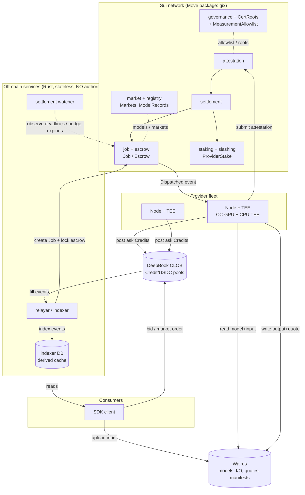
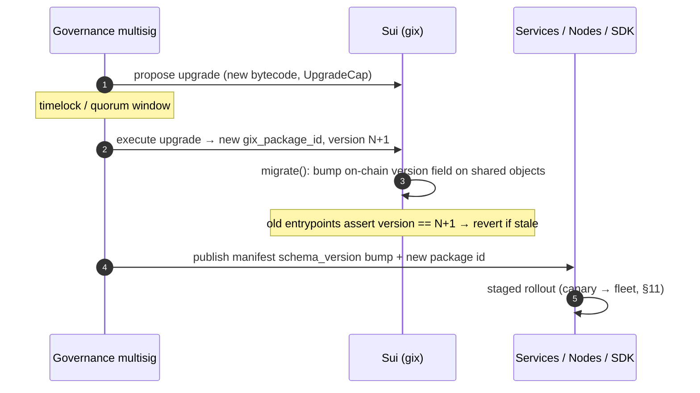

# Deployment & Operations

How to deploy, operate, and incident-respond for the GPU Inference Exchange (GIX): the `gix` Move package on Sui, the off-chain Rust services, and the provider `Node` fleet.

**Status:** Operational guide. Conforms to the canonical names and flows in
[overview](../architecture/overview.md) and the [glossary](../glossary.md). When this
document and the overview disagree on a name or a flow, the overview wins. All
configuration values, object IDs, CLI invocations, and config snippets below are
**illustrative, not final** — they describe the *shape* of the artifact, not the real
deployed values.

Cross-references: [contracts](../architecture/sui-move-contracts.md) ·
[node](../architecture/node-architecture.md) ·
[verification](../architecture/verification-attestation.md) ·
[deepbook](../architecture/deepbook-integration.md) ·
[walrus](../architecture/walrus-integration.md) ·
[threat model](../security/threat-model.md) · [tokenomics](../tokenomics.md) ·
[roadmap](../roadmap.md).

---

## 1. Environments & networks

GIX targets four Sui networks. Each is a complete, isolated deployment with its own
`gix` package, its own shared objects, its own DeepBook pools, and its own Walrus
namespace. **Nothing is shared across networks** — a package ID on testnet is
meaningless on mainnet.

| Network | Purpose | Faucet / funding | Stability promise |
| --- | --- | --- | --- |
| **localnet** | Single-developer loop; CI; full reset every run. Sui `localnet`, a local Walrus dev cluster, and a locally published DeepBook. | Local faucet, unlimited. | None — wiped freely. |
| **devnet** | Integration of the full stack against a live but disposable Sui. Bleeding-edge node/SDK builds. | Sui devnet faucet. | Reset on Sui devnet wipes; expect breakage. |
| **testnet** | Pre-production. Real attestation hardware in the loop with test-USDC. Public providers and consumers welcome. Release-candidate builds only. | Test-USDC mint + Sui testnet faucet. | Stable for a release cycle; migrations announced. |
| **mainnet** | Production. Real USDC, real GIX, real stake at risk, real slashing. | None — bring your own USDC/GIX. | Strong. Upgrades are governance-gated and staged (§11). |

> **Hardware-in-the-loop caveat.** localnet and devnet may run the `Node` in a
> *mock-attestation* mode (a stub quote accepted by a permissive
> `MeasurementAllowlist`) so contributors without confidential-computing GPUs can
> develop. testnet and mainnet require **real** hardware TEE attestation
> (see [verification](../architecture/verification-attestation.md)). Mock mode is
> gated by governance and is **never** enabled on testnet/mainnet allowlists.

### 1.1 The config artifact (the network manifest)

Every binary in the system — `Node`, relayer/indexer, settlement watcher, SDK — reads a
single, network-scoped manifest. We ship one per network; selecting a network means
selecting a manifest. Treat it as the **source of truth for "where everything lives"**;
it is generated by the contract-deployment runbook (§3) and version-controlled.

```toml
# gix.<network>.toml  — illustrative, not final
schema_version       = 3
network              = "testnet"          # localnet|devnet|testnet|mainnet
sui_rpc              = "https://fullnode.testnet.sui.io:443"
sui_ws               = "wss://fullnode.testnet.sui.io:443"

[package]
gix_package_id       = "0xGIX..."         # published gix package
gix_upgrade_cap_id   = "0xUCAP..."         # held by governance multisig, not services
gix_package_version  = 3                    # on-chain versioned-object epoch (§3.5)

[shared_objects]
governance_config_id = "0xGOV..."
cert_roots_id        = "0xCERT..."         # CertRoots (vendor root certs)
measurement_allow_id = "0xMEAS..."         # MeasurementAllowlist
market_registry_id   = "0xREG..."          # market + ModelRecord registry root
fee_schedule_id      = "0xFEE..."

[assets]
usdc_type            = "0x...::usdc::USDC"  # quote asset coin type for THIS network
gix_type             = "0xGIX...::gix::GIX" # native token coin type

[deepbook]
# one entry per Market; key is the Market object id
"0xMKT_H100_L70B" = { pool_id = "0xPOOL...", credit_type = "0xGIX...::credit::CreditH100L70B" }

[walrus]
aggregator_url       = "https://walrus-agg.testnet..."   # read path
publisher_url        = "https://walrus-pub.testnet..."   # write path
epochs_to_store      = 26                                  # default blob persistence

[services]
relayer_indexer_url  = "https://relayer.testnet.gix..."   # convenience, NOT authority
```

- **Resolution order:** explicit CLI flag → `GIX_CONFIG` env var → `~/.gix/gix.<network>.toml`.
- **Provenance:** the canonical manifest for testnet/mainnet is signed by the governance
  multisig and published to Walrus; tooling verifies the signature before trusting IDs.
  This stops a man-in-the-middle from pointing your `Node` at a counterfeit package.
- **`schema_version`** lets binaries reject a manifest they're too old/new to parse
  (see compatibility, §11).

---

## 2. Deployment topology



Three planes:

- **On-chain (authoritative).** The `gix` package is the only component with settlement
  authority. Escrow, attestation verification, slashing, and payout are decided here and
  nowhere else.
- **Off-chain services (liveness/UX only).** The relayer/indexer and settlement watcher
  improve responsiveness and provide read APIs. They are **stateless** and hold **no
  settlement authority** — see §5 and the [threat model](../security/threat-model.md).
- **Edge (providers + consumers).** Provider `Node`s and SDK clients are independent;
  they interact with Sui, DeepBook, and Walrus directly.

---

## 3. Contract deployment runbook (`gix` package)

Audience: **Governance / launch engineering.** Run once per network to stand up GIX, then
only for governance-gated changes. Every mutating step on testnet/mainnet is a
**multisig** transaction (§9). Capture every resulting object ID into the network manifest
(§1.1).

> **Preflight.** Confirm the active `sui client active-env` and `active-address` match the
> target network and the deployer key. Confirm `sui move build` is reproducible (§4.2) and
> that the source commit is tagged. Dry-run every transaction (`--dry-run`) before signing.

### 3.1 Publish the package

```bash
# illustrative, not final
sui client publish --gas-budget 2000000000 ./move/gix \
    --json | tee publish.json
# record: gix_package_id, UpgradeCap id, and the IDs of all
# init-created shared objects (governance config, registries).
```

The package `init` creates the genesis governance objects. Record:

- `gix_package_id` → manifest `[package].gix_package_id`.
- The **`UpgradeCap`** → **transfer immediately to the governance multisig**; never leave
  it on the deployer EOA.
- Genesis shared objects (governance config, fee schedule placeholder, registry root).

### 3.2 Initialize governance capabilities

Mint and distribute the governance capability objects, then hand authority to the
multisig:

```bash
# illustrative, not final
sui client call --package $GIX --module governance --function init_caps \
  --args $GOVERNANCE_CONFIG \
  --gas-budget 50000000
# transfer AdminCap / ParamCap / AllowlistCap to the governance multisig address
sui client transfer --object-id $ADMIN_CAP --to $GOV_MULTISIG ...
```

Capabilities are split so least-privilege holds: an `AllowlistCap` for
CertRoots/MeasurementAllowlist edits, a `ParamCap` for fee/SLA params, an `AdminCap` for
pause/upgrade. All land on the multisig (or on a Sui-native governance object) — never on
a single hot key.

### 3.3 Pin CertRoots and the initial MeasurementAllowlist

Before any real job can settle, attestation needs trust anchors:

```bash
# illustrative, not final
# 1) Pin vendor root certificates (NVIDIA NRAS, Intel TDX, AMD SEV-SNP roots)
sui client call --package $GIX --module governance --function add_cert_root \
  --args $CERT_ROOTS $ALLOWLIST_CAP "<vendor>" 0x<der_root_cert_bytes> ...

# 2) Allow the first reproducible runtime measurement(s)
sui client call --package $GIX --module governance --function allow_measurement \
  --args $MEASUREMENT_ALLOWLIST $ALLOWLIST_CAP 0x<measurement> $MODEL_RECORD ...
```

- **CertRoots** holds the pinned vendor root certs whose chains
  [attestation](../architecture/verification-attestation.md) verifies.
- **MeasurementAllowlist** binds an approved, reproducible runtime measurement to a
  `ModelRecord`. A measurement must be reproducible from a published build (§4.2) before
  it is allowlisted.

### 3.4 Register models, create Markets + DeepBook pools, set fees

```bash
# illustrative, not final
# Register a model: bind Walrus content id → ModelRecord
sui client call --package $GIX --module registry --function register_model \
  --args $REGISTRY "llama-3.1-70b-int8" 0x<model_walrus_blob_id> 0x<model_hash> ...

# Create the Compute Credit type + Market (GPU class, model/runtime tier, SLA class)
sui client call --package $GIX --module market --function create_market \
  --args $REGISTRY $MODEL_RECORD "H100-80GB" "<scu_def>" "<sla_class>" ...

# Create the DeepBook Credit/USDC pool for that market and bind it
sui client call --package $DEEPBOOK --module pool --function create_pool \
  --type-args $CREDIT_TYPE $USDC_TYPE --args <tick> <lot> <min_size> ...
sui client call --package $GIX --module market --function bind_pool \
  --args $MARKET 0x<deepbook_pool_id> ...

# Set the protocol fee schedule (taker/maker/protocol split)
sui client call --package $GIX --module governance --function set_fee_schedule \
  --args $FEE_SCHEDULE $PARAM_CAP <protocol_bps> <maker_rebate_bps> ...
```

Record each `ModelRecord`, `Market`, `Credit` type, and DeepBook pool ID into the manifest
`[deepbook]` and registry sections. Detail on pool params and tick/lot sizing:
[deepbook](../architecture/deepbook-integration.md); on model hashing and blobs:
[walrus](../architecture/walrus-integration.md).

### 3.5 Verify & publish the manifest

1. Re-read every created object (`sui client object <id>`) and assert ownership/shared
   status matches expectations (e.g. the `UpgradeCap` is owned by the multisig).
2. Assemble `gix.<network>.toml`, sign it with the governance multisig, publish to Walrus,
   and record the manifest blob id.
3. Smoke-test: run one end-to-end job on the new deployment (mock attestation on
   dev/localnet; real hardware on testnet) before announcing.

### 3.6 Upgrade procedure (Sui package upgrade)

GIX uses **Sui package upgrades** with **versioned objects** and **governance gating**:



Rules:

- **Versioned shared objects.** Long-lived shared objects (governance config, registries,
  `Market`) carry a `version` field. Entry functions assert the expected version; a
  `migrate` function (callable only with the governance cap) bumps it. This prevents an
  un-migrated object from being used against new logic, and lets us **disable old
  entrypoints atomically** at upgrade.
- **Governance gating.** Only the multisig-held `UpgradeCap`/`AdminCap` can publish a new
  version. Upgrades observe a timelock window so providers can prepare.
- **Compatibility.** Move upgrades are additive-compatible by default; breaking changes go
  through a new module + migration, never an in-place signature change. Node/SDK
  compatibility windows in §11.
- **Mainnet upgrades are staged:** testnet first → soak → mainnet, with a documented
  rollback (re-point manifest at prior package version if `migrate` has not yet run).

---

## 4. Provider / node operator runbook

Audience: **Provider / node operator.** This is the critical operational path. It assumes
the architecture in [node](../architecture/node-architecture.md) and the verification model
in [verification](../architecture/verification-attestation.md).

### 4.1 Hardware & attestation prerequisites

| Requirement | Detail |
| --- | --- |
| **CC-capable GPU** | NVIDIA H100 or H200 with **Confidential Computing** mode enabled. The GPU must be attestable by NVIDIA's remote attestation (NRAS). |
| **CPU TEE** | **Intel TDX** *or* **AMD SEV-SNP** host, with confidential VM support enabled in BIOS/firmware and a current microcode/PSP firmware. |
| **Attestation chain** | Network egress to the vendor attestation services and access to the pinned roots in **CertRoots**. The CPU TEE and GPU CC quote together cover the full runtime. |
| **Secure boot / firmware** | Measured boot; firmware versions that the target `MeasurementAllowlist` recognizes. Outdated firmware → measurement mismatch → no settlement. |
| **Networking** | Stable egress to Sui RPC, DeepBook, the Walrus publisher/aggregator, and the vendor attestation endpoints. Inbound not required. |
| **Capacity** | NVMe for model/blob cache; RAM ≥ model working set; bandwidth sized for input/output blob throughput. |

> If the hardware cannot produce a vendor-signed quote whose **measurement** is on the
> allowlist for the target `ModelRecord`, the `Node` can still run but **every job it
> attests will fail verification and risk slashing.** Validate attestation *before* staking.

### 4.2 Reproducible build & measurement matching

The settlement contract pays you only if your runtime's **measurement** matches the
governance allowlist. So:

1. Build the inference runtime image from the **pinned, published recipe** (locked
   toolchain, pinned deps, deterministic layers). The build must be byte-reproducible.
2. Compute the **measurement** of the built enclave/runtime and confirm it **equals** an
   entry already on the `MeasurementAllowlist` for the models you intend to serve.
3. If you need a new measurement allowlisted, submit the reproducible recipe to governance;
   it is verified independently and added via §3.3. **Do not** run un-allowlisted runtimes
   against real jobs.

```bash
# illustrative, not final
gix-node build-runtime --recipe ./runtime/llama-3.1-70b-int8.lock
gix-node measure ./out/runtime.img
# → measurement 0xMEAS...  ; check it is present on MeasurementAllowlist for the ModelRecord
gix-node verify-attestation --self-test   # produces a quote and checks CertRoots locally
```

### 4.3 Install & configure the Node

```bash
# illustrative, not final
curl -fsSL https://get.gix.network/node | sh        # or: cargo install gix-node
gix-node init --network testnet                     # writes ~/.gix/gix.testnet.toml skeleton
```

```toml
# ~/.gix/node.toml  — illustrative, not final
network        = "testnet"
config         = "~/.gix/gix.testnet.toml"   # the network manifest (§1.1)

[identity]
operator_key   = "keystore://provider-ops"   # signs Sui txns; see §9 key mgmt
endpoint       = "https://node-7.example.net" # advertised endpoint (liveness, optional)

[tee]
gpu_mode       = "cc"                          # confidential computing
cpu_tee        = "tdx"                          # tdx | sev-snp
attest_cache_s = 300

[runtime]
adapter        = "vllm"                         # vllm | tensorrt-llm | triton
model_record   = "0xMODEL..."
markets        = ["0xMKT_H100_L70B"]

[walrus]                                         # inherits manifest unless overridden
[economics]
target_spread_bps = 40
reprice_interval_s = 15
```

### 4.4 Register identity

```bash
# illustrative, not final
gix-node register \
  --endpoint https://node-7.example.net \
  --hardware-class H100-80GB
# → creates the provider's registry entry (operator identity, endpoint, hardware class)
```

Registration records the operator identity and hardware class in `registry` (see
[contracts](../architecture/sui-move-contracts.md)). It does **not** by itself authorize
minting — that requires stake.

### 4.5 Post the bond (ProviderStake)

> **v1: the bond is USDC** (the GIX token is post-MVP — see
> [tokenomics](../tokenomics.md) scope banner). The command takes a USDC amount; the
> CLI re-denominates to GIX when the token ships.

```bash
# illustrative, not final
gix-node stake --amount 25000_USDC
# → creates/updates ProviderStake: collateral + capacity accounting
gix-node stake --status
```

`ProviderStake` is your **slashable bond** and gates how many Compute Credits you may mint
(capacity accounting). Stake more to back more concurrent capacity. Economic parameters
(minimum bond, capacity-per-GIX) are in [tokenomics](../tokenomics.md).

### 4.6 Mint Compute Credits & post asks

```bash
# illustrative, not final
gix-node credits mint --market 0xMKT_H100_L70B --amount 500   # 500 SCU of capacity
gix-node asks post --market 0xMKT_H100_L70B --price 0.012_USDC --size 500
# the Node will from here auto-reprice per [economics] in node.toml
```

Minting requires sufficient un-encumbered `ProviderStake` capacity. Asks are posted to the
market's DeepBook `Credit/USDC` pool; price-time priority and matching are DeepBook's
(see [deepbook](../architecture/deepbook-integration.md)). **Do not mint beyond capacity
you can actually serve** — failing dispatched jobs triggers slashing (§4.9).

### 4.7 Run, monitor, reprice

```bash
# illustrative, not final
gix-node run            # subscribes to Dispatched events; executes; attests
gix-node status         # local: queue depth, GPU util, attestation health
```

The running `Node` subscribes to `Dispatched` events for its markets, pulls model+input
from Walrus, runs inference in the TEE, writes output+quote to Walrus, and submits the
attestation to `gix::attestation` **within the SLA deadline**. The repricer adjusts asks
toward the configured spread as fills and inventory move.

**Health checks** (export to the operator's monitoring, §6):

- `attestation_self_test` — can the box currently produce a valid, allowlisted quote? If
  this fails, **pause asks immediately** (`gix-node asks cancel-all`); otherwise you accept
  jobs you cannot settle.
- `dispatch_to_attest_latency` vs the market SLA budget.
- GPU CC mode still enabled; CPU TEE healthy; firmware unchanged.
- Walrus read/write reachability; Sui RPC liveness; wall-clock skew (timestamps are
  SLA-checked).

### 4.8 Withdraw / unstake (unbonding)

```bash
# illustrative, not final
gix-node asks cancel-all
gix-node credits burn --market 0xMKT_H100_L70B --all   # redeem un-sold capacity
gix-node unstake --amount 25000_GIX                     # begins unbonding
gix-node unstake --status                               # shows unbonding completion epoch
```

Unstaking enters an **unbonding period** during which the stake remains slashable for jobs
already in flight; you cannot withdraw until it elapses and all encumbered capacity is
released. Cancel asks and let in-flight jobs settle **before** unbonding to avoid stranded
slashable exposure. Unbonding duration is a governance parameter
([tokenomics](../tokenomics.md)).

### 4.9 What triggers slashing (avoid these)

Slashing is on-chain and automatic (see `slashing`/`settlement` in
[contracts](../architecture/sui-move-contracts.md)). The conditions, all preventable:

| Trigger | Avoid by |
| --- | --- |
| **Invalid attestation** (bad sig chain, measurement not on allowlist, hash mismatch) | Reproducible build matching the allowlist (§4.2); attestation self-test before accepting jobs. |
| **Missing attestation** (no quote before deadline) | Don't over-mint; monitor `dispatch_to_attest_latency`; keep Walrus/Sui paths healthy. |
| **SLA breach** (latency outside the market's class) | Right-size capacity to the market's p50/p99; cancel asks when degraded. |
| **Liveness fault** (accept dispatch, never deliver) | Pause asks on any health-check failure; never run un-allowlisted runtimes against real jobs. |

---

## 5. Off-chain services deployment

Audience: **Service operators (protocol or third-party).** The relayer/indexer and
settlement watcher. Their cardinal property:

> **They hold NO settlement authority.** A compromised, malicious, or offline service
> cannot steal escrow, fake an attestation, or alter a payout. Settlement is decided
> solely by on-chain attestation verification. If the relayer is down, Jobs can still be
> created via the permissionless on-chain path (see lifecycle). This is the central
> assumption of the [threat model](../security/threat-model.md) — read it before operating
> these services.

### 5.1 Relayer / Indexer

- **Function.** Watches DeepBook fill events and submits `create Job + lock escrow`
  transactions; indexes `gix::events` into a derived read store for the SDK.
- **Statelessness.** All authoritative state is on-chain. The indexer DB is a **rebuildable
  cache** (replay events from Sui to reconstruct it). No durable, non-derivable state lives
  in the service.
- **Horizontal scaling.** Run N relayer replicas behind a work-partitioning scheme
  (e.g. shard by `Market` or by DeepBook pool) so two replicas never race to relay the same
  fill. Job creation is **idempotent**: keyed on the fill's `(pool, fill_id)`, so a
  duplicate submit is a no-op/abort on-chain — at-least-once relaying is safe.
- **HA / failover.** Replicas are interchangeable. Health-check on event-cursor lag; a
  failed replica is replaced and resumes from the last durable cursor. Indexer read
  replicas scale independently of relayer write replicas.

```toml
# relayer.toml  — illustrative, not final
network          = "testnet"
config           = "/etc/gix/gix.testnet.toml"
shard            = { strategy = "by_pool", index = 0, of = 4 }
relayer_key      = "keystore://relayer-submit"   # pays gas only; no settlement power
idempotency_key  = "pool:fill_id"
indexer_dsn      = "postgres://.../gix_idx"        # rebuildable cache
cursor_store     = "postgres://.../gix_cursor"     # last processed event seq
```

### 5.2 Settlement watcher

- **Function.** Observes job deadlines (dispatch-ack, execution/SLA, attestation-submit)
  and **nudges expiries** — i.e. submits the permissionless transaction that drives an
  overdue Job to `Refunded`/`Slashed`. It only *invokes* on-chain logic; it does not
  *decide* outcomes.
- **Statelessness & HA.** Same model as the relayer: stateless, idempotent nudges (the
  on-chain state machine rejects a nudge for a Job not actually past its deadline), N
  interchangeable replicas, partition by Job-id range.

```toml
# settlement-watcher.toml  — illustrative, not final
network        = "testnet"
config         = "/etc/gix/gix.testnet.toml"
watcher_key    = "keystore://watcher-submit"     # gas only; no settlement power
scan_interval  = "2s"
partition      = { by = "job_id_mod", index = 0, of = 4 }
```

### 5.3 Reference deployment

Run services as stateless containers (Kubernetes Deployments) with: liveness/readiness
probes on cursor lag and RPC health, HPA on event backlog, and Postgres (or equivalent)
for the rebuildable indexer cache and cursors. Because services are stateless and
authority-free, **scale and restart freely** — the worst case from a misbehaving service
is delayed liveness, never lost funds.

---

## 6. Monitoring & observability

### 6.1 Key metrics

| Domain | Metric | Why it matters |
| --- | --- | --- |
| Throughput | jobs created / dispatched / settled per min | demand and capacity health |
| Settlement | **time-to-settlement** (dispatch → Settled), p50/p99 | core UX SLO; rising = trouble |
| Verification | **attestation failure rate** (by reason: sig / measurement / hash / SLA) | leading indicator of hardware/build drift or attack |
| Economic | **slash events** (count, GIX slashed, by trigger) | provider health; should be near-zero in steady state |
| Market | DeepBook **pool depth & spread** per market | liquidity / price-discovery health |
| Funds | **escrow TVL** (USDC locked across open Jobs) | financial exposure; sudden moves are alarms |
| Storage | **Walrus availability** (read/write success, blob retrievability) | a stalled Walrus stalls execution and audit |
| Infra | Sui RPC latency/error, event-cursor lag, service replica health | liveness of the off-chain plane |

### 6.2 Logging, tracing, dashboards

- **Structured logs** (JSON) from `Node` and services with a `job_id` correlation field.
- **Distributed tracing** keyed on `job_id` across relayer → Sui → `Node` → Walrus →
  settlement so one job is a single trace.
- **Dashboards:** (1) Job lifecycle funnel (Created→Settled with drop-offs), (2) Market
  liquidity (depth/spread/spot per market), (3) Provider fleet health (attestation success,
  SLA headroom, stake at risk), (4) Financial (escrow TVL, fees, slashing).

### 6.3 SLOs & alerting

| SLO (illustrative) | Target | Alert when |
| --- | --- | --- |
| Time-to-settlement p99 | < SLA budget + margin | p99 > budget for 5 min |
| Attestation failure rate | < 0.5% | > 2% for 10 min (page) |
| Relayer cursor lag | < 5 s | > 30 s sustained (page) |
| Walrus write success | > 99.9% | < 99% for 5 min (page) |
| Slash events | ~0 baseline | any **mass** spike (§7.2) (page) |

Alerts route by severity: page on anything threatening funds, settlement correctness, or a
mass failure; ticket on single-provider degradation.

---

## 7. Incident response runbooks

General principle: **the on-chain contracts are the safety net.** Most incidents are
liveness problems, not loss-of-funds problems, because services have no authority. Escalate
to the governance emergency controls (§7.6) only for on-chain correctness threats.

### 7.1 Stuck / expired jobs

1. Identify Jobs past a deadline still not terminal (indexer query / lifecycle funnel).
2. Confirm the **settlement watcher** is healthy and nudging; if it's down, restart/scale
   it — or submit the permissionless expiry transaction manually via the SDK.
3. Expiry drives `Refunded` (+ `Slashed` where the provider is at fault). Verify the
   consumer was refunded and audit refs are intact.
4. Root-cause: was it one provider (liveness fault, §4.9), a Walrus stall (§7.4), or RPC
   degradation?

### 7.2 Mass attestation failures

1. Read the **attestation failure rate** broken down by reason and by provider/firmware.
2. **Many providers, one reason** → likely systemic: a vendor attestation outage (§7.3),
   an expired/rotated **CertRoots** entry, or a bad allowlist edit. **Few providers** →
   their build/firmware drifted (§4.2).
3. If a recent governance allowlist/CertRoots change caused it, **revert it** (governance
   cap). If a vendor rotated roots, pin the new root via §3.3.
4. Communicate to providers; advise pausing asks until self-tests pass.

### 7.3 Hardware-vendor attestation-service outage

The vendor signing/endorsement service (e.g. NVIDIA NRAS, Intel/AMD) is unreachable.

1. Confirm scope (one vendor? one region?) and that it's external, not our egress.
2. Affected `Node`s **pause asks** (no fresh jobs they cannot attest). In-flight jobs will
   trend to attestation-deadline expiry → refund. Providers are **not** slashed for a
   *vendor* outage if the contract/governance treats it as a non-fault liveness event;
   governance may widen attestation deadlines temporarily during a confirmed outage.
3. Track vendor status; resume asks when signing recovers and self-tests pass.

### 7.4 Walrus unavailability

1. Detect via Walrus read/write success metrics and blob retrievability checks.
2. **Write path down:** providers cannot store output/quote → pause asks; consumers cannot
   upload inputs. **Read path down:** execution stalls (no model/input fetch).
3. In-flight jobs trend to expiry → refund. Switch to a healthy Walrus
   aggregator/publisher endpoint if it's a single-endpoint issue (update manifest
   `[walrus]`). See [walrus](../architecture/walrus-integration.md) for redundancy/epoch
   semantics.

### 7.5 DeepBook pool anomalies

1. Watch for abnormal **spread/depth** collapse, one-sided books, or suspected manipulation
   on a market's `Credit/USDC` pool.
2. Verify the `Market`→pool binding in the manifest is correct (a misbinding looks like an
   empty/wrong book).
3. For suspected manipulation, governance may pause **that market** (§7.6) without touching
   others. Coordinate with liquidity providers. Detail:
   [deepbook](../architecture/deepbook-integration.md).

### 7.6 Governance emergency pause / kill-switch

GIX exposes governance-gated emergency controls (in `governance`/`settlement`):

- **Per-market pause** — halt new Jobs/minting on a single `Market` (contain a market-local
  incident) while the rest of the exchange runs.
- **Global pause** — halt new Job creation protocol-wide for a severe, system-wide threat.
- **Allowlist/CertRoots revert** — instantly remove a bad measurement or root.

Properties: pause **stops new work** but **never strands escrow** — in-flight Jobs still
settle or refund through the normal path. Triggering requires the multisig
(§9). Document each invocation (who, why, scope, expected duration) and publish a status
update.

### 7.7 Contract bug response

1. **Triage severity.** Funds-at-risk → invoke pause (§7.6) immediately to stop new
   exposure; the existing escrow remains under contract control.
2. **Fix** via the governed **upgrade procedure** (§3.6): write the fix + `migrate`, soak on
   testnet, stage to mainnet.
3. If exploitation is active and an upgrade can't land fast enough, prefer **global pause**
   over leaving an exploitable path open.
4. Post-mortem; coordinate disclosure with the [threat model](../security/threat-model.md)
   process.

---

## 8. Consumer onboarding (brief)

Consumers do not deploy infrastructure. To start:

1. Install the **SDK** (TypeScript) — see [node](../architecture/node-architecture.md) and
   the SDK doc referenced from the [overview](../architecture/overview.md).
2. Use a Sui wallet; **fund it with USDC** (the quote/settlement asset) plus a little SUI
   for gas. The `usdc_type` for the chosen network is in the manifest (§1.1).
3. Flow: quote → upload input to Walrus → place a bid/market order on DeepBook → await the
   `Settled` event → fetch and **verify** the output against the on-chain
   `AttestationRecord`.

---

## 9. Key management & secrets

| Key / secret | Holder | Storage | Rotation |
| --- | --- | --- | --- |
| **Governance multisig** (Admin / Param / Allowlist caps, `UpgradeCap`) | Governance | M-of-N hardware wallets / Sui multisig; threshold signing | Rotate members per policy; rotate immediately on suspected compromise. |
| **Provider operator key** | Node operator | HSM / OS keystore; never in plaintext config | Rotate on a schedule and on staff change; update registry endpoint/identity. |
| **ProviderStake authority** | Node operator | Ideally separated from the hot operator key (cold key authorizes stake/unstake) | Rotate rarely; protect heavily — it controls the bond. |
| **Service submit keys** (relayer, watcher) | Service operator | Secret manager (Vault / cloud KMS); injected at runtime | Rotate frequently; **gas-only, no settlement authority** — low blast radius. |
| **Walrus / RPC credentials** | All | Secret manager | Rotate on leak; per-environment scoping. |

Principles: least privilege (split caps; gas-only service keys); **no key with settlement
authority ever lives on an always-online service**; manifest IDs are public but the
manifest is signed so its *authenticity* is protected (§1.1).

---

## 10. Cost & capacity planning

Back-of-envelope; tune against live metrics. All figures **illustrative, not final**.

- **Gas (Sui).** Per job ≈ a handful of transactions (create+escrow, attestation,
  settlement). At Sui's low fees this is fractions of a cent/job; budget separately for
  **relayer** and **settlement-watcher** gas (they pay to submit). Size a gas reserve to
  peak jobs/min × txns/job × per-tx gas, with headroom for fee spikes.
- **Walrus storage.** Per job stores: input blob + output blob + attestation quote.
  Cost ≈ Σ(blob sizes) × `epochs_to_store`. Set `epochs_to_store` from the audit-retention
  requirement; large I/O blobs (e.g. image/video) dominate. Plan a storage budget =
  jobs/day × avg(blob bytes/job) × retention epochs. See
  [walrus](../architecture/walrus-integration.md).
- **Provider infra.** Dominated by CC-GPU amortization + power + bandwidth. Break-even ask
  price must cover (GPU $/hr ÷ SCU/hr) + storage + gas + target margin; feed this into the
  repricer's floor.
- **Services infra.** Modest: a few stateless replicas + a Postgres for the rebuildable
  index. Scale relayer replicas with peak fills/sec; scale indexer reads with SDK query
  volume.

---

## 11. Release & versioning process

Three artifacts version together: **contract (`gix` package)** ↔ **`Node` (Rust)** ↔
**SDK (TypeScript)**, tied by the manifest `schema_version` and `gix_package_version`.

- **Compatibility contract.** Each `Node`/SDK release declares the manifest
  `schema_version` range and `gix_package_version` it supports. On startup a binary
  **refuses** a manifest outside its supported range (fail-closed) rather than acting on a
  package it can't reason about.
- **Versioned objects** (§3.6) make on-chain upgrades safe: post-`migrate`, old binaries
  hit version asserts and fail loudly instead of corrupting state — which is why staged
  rollout matters.
- **Staged rollout.**
  1. Cut and tag the release; publish reproducible `Node` build + measurement (§4.2).
  2. Ship to **testnet**; soak; confirm attestation, settlement, and SLOs.
  3. Governance upgrades the **mainnet** package (timelock, §3.6), publishes the new
     manifest.
  4. **Canary** a small set of `Node`s/services on the new version; watch metrics (§6);
     then roll the fleet.
  5. Keep a rollback: re-point the manifest at the prior package version if `migrate` has
     not yet run; if it has, roll forward with a fix.
- Roadmap of what lands in which release: [roadmap](../roadmap.md).

---

## Open questions

> **Migrated to the central ledger** —
> **[open-ended-questions.md](../open-ended-questions.md)**. From this doc:
> - **K1** vendor-outage fault attribution · **K2** permissionless-relay incentive funding
>   (mechanism = sponsored transactions, settled; incentive policy open) · **K3** manifest
>   distribution & trust · **K4** mock-attestation isolation · **K5** cross-region SLA
>   classes · **K6** indexer rebuild time / snapshots
> - **C3** unbonding vs SLA-tail coupling (part of the master durations decision)
>
> Answer them there; ops runbooks here are updated once decided.
