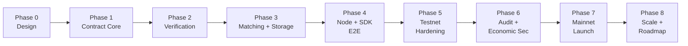

# Roadmap

Purpose: the phased plan from an empty repository to a production mainnet launch of
the GPU Inference Exchange (GIX), with explicit, testable production-readiness gates
between phases. Phase ordering is fixed; durations are illustrative and depend on
team size.

This roadmap operationalizes the architecture in
[architecture/overview.md](architecture/overview.md). Every phase ends at a **gate** —
a checklist that must be green before the next phase begins. Gates are the mechanism
that keeps "production-ready" honest.

---

## Phase 0 — Design *(current)*

**Goal:** a complete, internally consistent engineering plan.

- This documentation set: architecture, contracts, DeepBook/Walrus/attestation
  integration, node, SDK, lifecycle, tokenomics, threat model, operations.
- Resolve the highest-leverage open questions flagged across the docs (on-chain
  attestation-verification cost, deadline parameters, SCU definition per market,
  storage-cost bearer).
- Define interfaces precisely enough to parallelize implementation.

**Gate 0 → 1:**
- [ ] All docs reviewed and cross-consistent with the canon (`overview.md`, glossary).
- [ ] `gix` module boundaries and public entry-function signatures frozen as a draft API.
- [ ] Attestation quote format and the on-chain verification strategy chosen (full
      on-chain vs off-chain pre-verify + succinct check) — see
      [verification](architecture/verification-attestation.md).
- [ ] Object model and which objects are shared/owned/child finalized for the job path.

---

## Phase 1 — Contract core (settlement skeleton)

**Goal:** the on-chain settlement spine works with attestation *mocked*.

- Implement `gix::market`, `credit`, `registry`, `job`, `escrow`, `settlement`,
  `staking`, `slashing`, `governance` with a **stub attestation verifier** that
  accepts a trusted test signature.
- Full happy-path and failure-path lifecycle in Move
  ([task-lifecycle](protocol/task-lifecycle.md)): create job → lock escrow →
  (mock) verify → settle / refund / slash.
- Capability model (Admin/Governance/Provider) and money custody (`Balance<USDC>`).
- Move unit tests + `test_scenario` multi-party flows; invariant tests for
  no-double-spend and no-payout-without-Verified.

**Gate 1 → 2:**
- [ ] Localnet: end-to-end job settles, refunds, and slashes correctly with mocked attestation.
- [ ] Invariant test suite green (escrow conservation, exactly-once settlement).
- [ ] Gas profile per lifecycle step measured and within target.
- [ ] No `public` function can move escrow without passing through `settlement`.

---

## Phase 2 — Verification (real attestation)

**Goal:** replace the mock with real hardware TEE attestation verification.

- `gix::attestation`: vendor certificate-chain verification against governance-pinned
  `CertRoots`, `MeasurementAllowlist` lookup, model/input/output hash binding, SLA
  timing, and replay protection.
- Decide and implement the verification placement (full on-chain vs off-chain
  pre-verify + on-chain succinct check) from Gate 0.
- Reproducible build of the inference runtime so its measurement is deterministic and
  allowlistable; produce a real quote on a CC-capable GPU + CPU TEE.
- Governance flows for pinning/rotating roots and adding/revoking measurements/models.

**Gate 2 → 3:**
- [ ] A genuine attestation quote from real hardware verifies on-chain end-to-end.
- [ ] Negative tests pass: forged signature, wrong measurement, hash mismatch, stale/
      replayed quote, SLA breach → correct slash/refund.
- [ ] Reproducible runtime build yields a stable measurement across two clean builds.
- [ ] Verification cost (gas/latency) within target on the chosen strategy.

---

## Phase 3 — Matching + storage (DeepBook + Walrus)

**Goal:** real price discovery and real audit storage wired into the job path.

- Per-market `Credit/USDC` DeepBook pools; tick/lot/min sizing for micro-transactions
  ([deepbook](architecture/deepbook-integration.md)).
- Relayer/indexer service: detect fills → create Jobs + escrow; **permissionless
  on-chain fallback** for liveness.
- Walrus integration: model registry + content-addressed model hash; input/output and
  attestation-quote blob storage; the reconstructable audit trail
  ([walrus](architecture/walrus-integration.md)).
- Credit minting against staked capacity with capacity accounting (no over-mint).

**Gate 3 → 4:**
- [ ] A DeepBook fill deterministically produces exactly one correct Job + escrow
      (no double-creation, partial fills handled).
- [ ] An independent party reconstructs and verifies a settled job from Sui + Walrus
      alone, with the relayer offline.
- [ ] Capacity accounting prevents minting credits beyond staked capacity.
- [ ] Relayer-down liveness path exercised.

---

## Phase 4 — Node + SDK, full end-to-end

**Goal:** a real provider node serves real consumer jobs through the SDK.

- Rust node: event subscription, runtime adapter (one backend, e.g. vLLM), TEE quote
  collection, Walrus + Sui + DeepBook clients, SLA metering, fault recovery
  ([node](architecture/node-architecture.md)).
- TypeScript SDK: consumer flow (quote → upload → order → await → fetch → verify) and
  provider setup/monitoring; independent client-side verification
  ([sdk](architecture/sdk.md)).
- One real model, one real market, on devnet/testnet, on real CC hardware.

**Gate 4 → 5:**
- [ ] Cold-start to verified result through the public SDK on testnet, real hardware.
- [ ] Node survives crash/restart mid-job without double-submit or lost funds (idempotent).
- [ ] Missed-deadline path produces the correct slash + refund in the live system.
- [ ] SDK client-side verification rejects a tampered output blob.

---

## Phase 5 — Testnet hardening

**Goal:** correctness and resilience under adversarial and load conditions.

- Multi-provider, multi-market testnet with real liquidity and many concurrent jobs.
- Chaos/fault injection: node failures, Walrus unavailability, vendor attestation-
  service outage, relayer outage, deadline storms.
- Load testing for the parallel-settlement claim (thousands of concurrent jobs).
- Full observability/SLOs and incident runbooks
  ([operations](operations/deployment.md)).
- Adversarial economic testing of griefing, over-mint, wash trading, thin-pool
  manipulation ([threat model](security/threat-model.md), [tokenomics](tokenomics.md)).

**Gate 5 → 6:**
- [ ] Sustained target throughput with sub-second settlement finality under load.
- [ ] Every incident runbook executed at least once in a game-day.
- [ ] No critical/high issues open from internal adversarial testing.
- [ ] Monitoring, alerting, and emergency-pause verified live.

---

## Phase 6 — Audit + economic security

**Goal:** independent assurance before real value is at stake.

- External smart-contract audit(s) of the `gix` package; remediate all
  critical/high findings; re-audit deltas.
- Formal-verification targets: escrow conservation, settlement exactly-once, no
  payout without `Verified`, no slash without provider fault.
- Independent review of the attestation verification and trust-anchor governance.
- Economic-security modeling: bond sizing, slashing parameters, cost-of-attack >
  gain; finalize launch parameters.
- Public bug bounty live on testnet.

**Gate 6 → 7:**
- [ ] Audit reports published; all critical/high findings resolved and verified.
- [ ] Formal specs for the core invariants proven or exhaustively tested.
- [ ] Economic parameters ratified by governance with documented justification.
- [ ] Bug bounty has run without unresolved critical findings.

---

## Phase 7 — Mainnet launch

**Goal:** controlled production launch with guardrails.

- Mainnet deployment runbook executed: publish `gix`, pin real `CertRoots` + initial
  `MeasurementAllowlist`, register initial `ModelRecord`s, create initial Markets and
  DeepBook pools, set the fee schedule, configure governance multisig.
- Guarded launch: conservative escrow/exposure caps, limited market set, emergency
  pause armed; staged ramp as confidence grows.
- **USDC-bonded launch (no GIX token in v1):** providers bond USDC, governance is the
  `AdminCap`/multisig, and there are no token emissions — so bootstrapping relies on
  spare-capacity supply and (if needed) treasury-funded USDC incentives rather than
  liquidity mining ([tokenomics](tokenomics.md) scope banner; the GIX token lands in
  Phase 8).

**Gate 7 → 8 (graduation to steady state):**
- [ ] Stable operation under real volume with caps progressively raised.
- [ ] No unresolved security incidents; monitoring/alerting healthy.
- [ ] Governance and treasury operating as designed.

---

## Phase 8 — Scale & roadmap (post-launch)

Sequenced by demand, not committed to dates:

- **GIX token introduction** — add the native token as an **additive upgrade**:
  re-denominate the `ProviderStake` bond from USDC to GIX (with the value-haircut +
  collateral-ratio/oracle policy from **B1**), switch on token-weighted governance
  alongside the `AdminCap`/multisig, and turn on emissions-funded staking rewards and
  bootstrap incentives ([tokenomics](tokenomics.md) §3). v1 deliberately ships
  *without* the token (USDC bonds + `AdminCap` governance); this phase is where
  B1/T-ECON-4/T-ECON-6 re-arm and must be closed before launch.
- **Confidential markets** — TEE-isolated I/O for data confidentiality (lifts the v1
  integrity-only limitation).
- **zkML verifier backend** — add a zero-knowledge `AttestationRecord` type behind the
  pluggable verifier interface as proving matures; start with small/feasible models.
- **More hardware vendors & runtimes**; broader model catalog and market tiers.
- **Throughput & cost** — attestation-cost reductions, batching, fee optimization,
  cheaper storage/retention.
- **Decentralization** — progressive decentralization of governance and the trust
  anchors; multiple independent relayers.
- **Cross-chain / additional quote assets** — beyond v1's single USDC quote.

---

## Cross-cutting workstreams (all phases)

- **Security & threat model** kept current with every change
  ([threat model](security/threat-model.md)).
- **Documentation** — this set stays the source of truth; canon changes land in
  [overview](architecture/overview.md) + [glossary](glossary.md) first.
- **Testing** — unit → scenario → integration → load → adversarial, growing per phase.
- **Observability & ops** — runbooks and dashboards extended as components ship.

## Consolidated open questions to resolve early

Pulled from the per-document "Open questions" sections; these gate or shape multiple
phases and should be closed in Phase 0–2.

**Resolved in a Sui-docs research pass (now design tasks, not unknowns):**

- **On-chain attestation verification approach** — adopt the **Nautilus** register-once +
  native-signature-per-job pattern. **v1 MVP scope (decided 2026-06):** CPU TEE = **Intel
  TDX (P-256) only** (Sui has no native P-384); **AMD SEV-SNP deferred**; and **on-chain
  NVIDIA GPU-CC/NRAS verification is phased to a post-MVP fast-follow** (no Sui prior art —
  needs a feasibility spike). The MVP attests the TDX runtime + binds I/O hashes; closing
  the GPU-CC gap is the **first post-MVP verification milestone**.
  ([verification](architecture/verification-attestation.md) §4, §9)
- **DeepBook fill→Job atomicity** — guaranteed by a single all-or-nothing **PTB** (swap
  interface or in-PTB `BalanceManager` withdraw → `create_job`); relayer is liveness-only.
  ([deepbook](architecture/deepbook-integration.md) §6, §12)
- **One-pool-per-market** — a Pool is **one** shared object (not three); pool count is not
  a Sui throughput limit; the real constraint is **liquidity fragmentation + per-pool 500
  DEEP / cron overhead** → consolidate market dimensions.
  ([deepbook](architecture/deepbook-integration.md) §12 Q5)
- **Walrus storage-cost mechanism** — **shared blobs** let the treasury sponsor retention;
  availability gate = the **`BlobCertified`/PoA** event.
  ([walrus](architecture/walrus-integration.md) §2, §9)
- **Confidential-markets path** — **Seal** (enclave-gated `seal_approve` + envelope
  encryption), shippable as an additive upgrade with no re-attestation.

**Still genuinely open (economics/policy):** the full list — deadlines (C1–C3), SCU
definition (E1), storage cost/retention policy (H1/C3), compensation split (D1),
collateral ratio / emissions / fee-security crossover (A1/A2/B1), and the rest — is
consolidated in **[open-ended-questions.md](open-ended-questions.md)**, the single ledger
of decisions needing your input.
