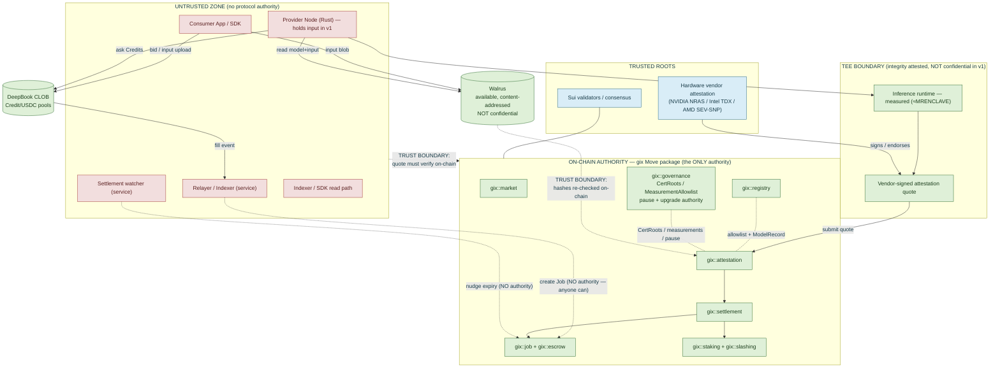

# Security Threat Model

**Purpose:** A rigorous, honest enumeration of the assets, actors, trust
boundaries, threats, and mitigations for GIX — the GPU Inference Exchange — and an
explicit accounting of the residual risk we knowingly accept in v1.

> **Read this first.** GIX is a production-grade, decentralized GPU inference spot
> market on Sui ([Move contracts](../architecture/sui-move-contracts.md)), with matching on DeepBook
> ([deepbook](../architecture/deepbook-integration.md)) and storage/audit on Walrus
> ([walrus](../architecture/walrus-integration.md)). Execution is verified by **hardware TEE remote
> attestation only** — there is **no zkML and no re-execution** in v1
> ([verification](../architecture/verification-attestation.md)). Privacy is **integrity-only** in v1:
> the TEE attests that the correct model ran, *not* that the operator cannot see the
> inputs. This document does not soften those facts. See
> [overview](../architecture/overview.md) for system decomposition and canonical names.

---

## 1. Methodology

We use an asset-centric, STRIDE-derived process. The order is deliberate:

1. **Assets** — what has value and must be protected (§3).
2. **Actors & trust assumptions** — who participates, and exactly how much we trust
   each (§4). This is where we name the *trusted roots* and the *untrusted-for-
   correctness* components.
3. **Trust boundaries** — where authority changes hands (§5, mermaid diagram).
4. **Threat catalog** — STRIDE-style threats grouped by component, each as a table
   with the columns **Threat → Vector → Impact → Likelihood → Mitigation → Residual**
   (§6–§13).
5. **Mitigations** — mapped inline in each table and cross-referenced to the
   mechanisms that implement them (attestation verification, slashing, capacity
   accounting, content addressing, governance pause, formal invariants).
6. **Residual risk** — the honest bottom line: what remains exploitable, accepted, or
   unmitigated in v1 (§14).

**STRIDE legend** (used to tag threats): **S**poofing, **T**ampering,
**R**epudiation, **I**nformation disclosure, **D**enial of service, **E**levation of
privilege.

**Likelihood / Impact scale:** Low / Medium / High, assessed for v1 mainnet with
audited contracts and a thin-to-moderate market. We do not pretend the market is
deep; thin-market assumptions are baked into the manipulation analysis (§8).

**Core security thesis.** On-chain authority is the only authority. Settlement is
decided *solely* by `gix::attestation` + `gix::settlement` on Sui. Every off-chain
service — the **relayer/indexer** and the **settlement watcher** — is **untrusted for
correctness** and trusted only for liveness/UX. They cannot move escrow, fake a
result, or change a `Job` outcome. The deepest trust we place anywhere is in the
**hardware vendor attestation root** — and we state plainly (§14) that this is the
single largest piece of trust in the system.

---

## 2. Scope

**In scope:** the `gix` Move package and its objects (`Job`, `Escrow`,
`ProviderStake`, `ModelRecord`, `AttestationRecord`, `MeasurementAllowlist`,
`CertRoots`, `Market`); the attestation/verification path; DeepBook integration;
Walrus storage/audit; the Rust [node](../architecture/node-architecture.md) and off-chain
[services](../architecture/overview.md#8-off-chain-components-summary); the consumer/provider
[SDK](../architecture/sdk.md) flows; and the economic/governance design
([tokenomics](../tokenomics.md)).

**Out of scope (v1, tracked elsewhere):** zkML proving; data confidentiality /
confidential markets; cross-chain settlement and non-USDC quote assets; the security
of consumer endpoint applications built *on top of* the SDK; and the internal
security of DeepBook, Walrus, and the Sui consensus layer themselves (we treat those
as dependencies with their own threat models and assume their published guarantees).

---

## 3. Assets to protect

| # | Asset | Where it lives | Why it matters |
| --- | --- | --- | --- |
| A1 | **Escrowed USDC** | `Escrow` held by a `Job` | Consumer funds locked against work; theft or wrongful release is direct loss. |
| A2 | **Staked bond** (USDC in v1; GIX post-MVP) | `ProviderStake` | Provider collateral and slashable bond; wrongful slash or stake-key theft is direct loss; under-collateralization breaks the security budget (a v1 non-issue with USDC bonds — see T-ECON-4). |
| A3 | **Market integrity / price** | DeepBook `Credit/USDC` pools, `Market` | The spot price must reflect real supply/demand. Manipulation corrupts settlement value and consumer pricing. |
| A4 | **Model integrity** | `ModelRecord` (Walrus content id + approved measurements) | Consumers must get the *exact* model they paid for; a swapped/poisoned model defeats the entire value proposition. |
| A5 | **Attestation integrity** | `AttestationRecord`, `CertRoots`, `MeasurementAllowlist` | The verification verdict gates all payment. A forged/replayed/spoofed quote turns into stolen escrow + unearned credits. |
| A6 | **Audit-trail availability** | Walrus blobs (model, input, output, quote) | Dispute evidence and reproducibility. If evidence is unavailable, disputes cannot be adjudicated and the protocol loses tamper-evidence. |
| A7 | **Protocol liveness** | Sui, relayer, node fleet, DeepBook, Walrus | Jobs must progress to a terminal state (Settled / Refunded / Slashed / Expired) within bounded time; stalls strand funds and erode trust. |
| A8 | **Governance integrity** | `gix::governance`, upgrade authority | Controls allowlists, fee schedule, pause/kill-switch, and upgrades. Capture is catastrophic — it can subvert every other asset. |

---

## 4. Actors & trust assumptions

The trust column is the heart of this model. "Untrusted for correctness" means: the
protocol's *correctness* (who gets paid, how much, for what) does not depend on this
actor behaving — only its *liveness/UX* does.

| Actor | Role | Trust assumption |
| --- | --- | --- |
| **Consumer** | Uploads input to Walrus, places bids on DeepBook, retrieves verified output. | **Untrusted.** May grief, spam, abandon, or submit malformed input. Protected only by their own escrow and the lifecycle deadlines. |
| **Provider / Node operator** | Posts a bond (USDC in v1; GIX post-MVP), mints Compute Credits, posts asks, runs the [node](../architecture/node-architecture.md), produces attestations. | **Untrusted for correctness.** Assumed rational and possibly Byzantine. Trusted only to the extent the TEE + attestation + slashing constrain them. Holds custody of input data in v1 (see §14). |
| **Governance** | Manages parameters, `MeasurementAllowlist`/`CertRoots`, fee schedule, upgrade authority, pause/kill-switch. | **Partially trusted, bounded.** Trusted to act in protocol interest; constrained by on-chain process, timelocks, and multisig (§15). Capture is an explicit high-impact threat (T-SC-6, T-ECON-2). |
| **Hardware vendors** (NVIDIA NRAS for GPU CC; Intel TDX / AMD SEV-SNP attestation services) | Sign/endorse TEE attestation quotes; publish root certs and reference measurements. | **TRUSTED ROOT.** This is the deepest trust in the system. A compromised vendor signing key or a broken TEE breaks verification for every job under that root. Stated plainly as residual risk (§14). |
| **Walrus storage nodes** | Store and serve content-addressed blobs (model, input, output, quote). | **Trusted for availability, NOT for integrity.** Content addressing makes tampering detectable; withholding/unavailability is the real threat (§9). We assume Walrus's published durability/availability guarantees. |
| **DeepBook** | On-chain CLOB; matches Credit/USDC orders; emits fill events. | **Trusted as a correct CLOB primitive.** We assume DeepBook's matching, price-time priority, and settlement are correct. We do **not** assume the *resulting price* is manipulation-free in a thin pool (§8). |
| **Relayer / Indexer** (service) | Turns DeepBook fills into on-chain `Job`s + escrow; indexes events for the SDK. | **UNTRUSTED for correctness; trusted only for liveness.** Cannot steal funds or fake results (§10.1 explains why). If offline, jobs can be created via the permissionless on-chain path ([lifecycle](../protocol/task-lifecycle.md)). |
| **Settlement watcher** (service) | Observes deadlines, nudges expiries, surfaces audit state. | **UNTRUSTED for correctness; trusted only for liveness.** All settlement authority is in the contracts; the watcher merely *prompts* state transitions that anyone could prompt. |
| **Sui validators / consensus** | Order and execute transactions; finalize object state. | **Trusted as the execution substrate.** We assume Sui's safety and liveness under its honest-stake threshold. Re-org / censorship at the L1 level is out of scope (delegated to Sui's own model). |

---

## 5. Trust boundaries

**How to read it.** Anything in the red **UNTRUSTED ZONE** can be fully malicious
without compromising correctness — its outputs are checked at a boundary before they
gain any authority. The green **ON-CHAIN AUTHORITY** zone is the only place a verdict
becomes binding. The blue **TRUSTED ROOTS** are the assumptions we cannot remove in
v1. The TEE boundary attests integrity but, crucially, is **not a confidentiality
boundary in v1**: input data is visible to the operator path before/around the
runtime.

---

## 6. Threat catalog — Attestation / TEE

The attestation path is the protocol's load-bearing trust mechanism. See
[verification](../architecture/verification-attestation.md) for the verification algorithm and quote
formats.

| ID | Threat (STRIDE) | Vector | Impact | Likelihood | Mitigation | Residual |
| --- | --- | --- | --- | --- | --- | --- |
| T-ATT-1 | **Forged attestation quote** (S, T) | Operator fabricates a quote without a genuine vendor signature. | Unearned escrow release + credit redemption (A1, A5). | Low | `gix::attestation` verifies the full vendor certificate chain against governance-pinned `CertRoots`; a quote with no valid root chain is rejected. | Forgery requires a valid vendor signature → reduces to vendor-key compromise (T-ATT-4). |
| T-ATT-2 | **Measurement spoofing** (T, E) | Operator runs a different/cheaper model or tampered runtime but reports an allowlisted `runtime_measurement`. | Consumer billed for a model they did not get (A4). | Low–Med | Measurement is bound *inside* the signed quote and re-checked against the `MeasurementAllowlist` for the target `ModelRecord`; `model_hash` in the quote must equal the `Job`'s. The TEE will not emit an allowlisted measurement for an unmeasured runtime. | TEE escape / measurement-collision bugs (vendor-level) remain — see §14. |
| T-ATT-3 | **Replay / rollback** (S, T) | Operator resubmits a valid prior quote for a new `Job`, or rolls back enclave state to reuse a quote. | Payment for work not done on the new input (A1, A5). | Med | Quote binds `input_hash ‖ output_hash ‖ job-scoped nonce ‖ t_start ‖ t_end`; `gix::attestation` requires these to match *this* `Job` and rejects a quote whose nonce/hashes were already consumed. `AttestationRecord` is one-per-`Job`. | Within-job rollback that preserves all bound fields is not economically useful; cross-job replay is blocked by the nonce binding. |
| T-ATT-4 | **Vendor attestation key compromise** (S, E) | Hardware vendor signing key leaks or is coerced; attacker mints valid signatures for arbitrary quotes. | Systemic: verification defeated for every job under that root (A5, A1, A2). | Low (high impact) | Governance can revoke a `CertRoots` entry and pause settlement (§15). Multiple independent roots per market are supported so a single vendor compromise need not halt all markets. | **Accepted root risk.** We cannot prevent a vendor compromise, only react to it. See §14. |
| T-ATT-5 | **TEE side-channel leakage** (I) | Cache/timing/power/microarchitectural side channels leak model weights or input data from the enclave. | Confidentiality loss of input/model (A4 for proprietary models). | Med | Out of v1's confidentiality scope; we use vendor-current microcode/firmware and pin patched measurements; proprietary-model markets can require specific mitigated measurements. | **Accepted.** v1 is integrity-only; side channels are a known, unmitigated confidentiality risk (§14). |
| T-ATT-6 | **Trusted-time / SLA gaming** (T, R) | Operator manipulates `t_start`/`t_end` to appear within SLA, or exploits coarse/host-controlled time. | Wrongful payment for an SLA-breaching job; A3/A7 distortion. | Med | Timestamps come from the TEE's trusted-time source and are signed inside the quote; `gix::attestation` cross-checks against on-chain `Job` dispatch/submission times (Sui clock) and the market SLA bounds. Out-of-envelope timing → refund/slash. | Trusted-time precision is vendor-dependent; tight p99 SLAs near the time-source granularity carry residual measurement error. |
| T-ATT-7 | **Stale allowlist / un-revoked measurement** (T, E) | A measurement later found vulnerable stays allowlisted; operator keeps using it. | Continued acceptance of a known-weak runtime (A5). | Med | Governance can remove measurements / rotate `CertRoots`; settlement consults the *current* allowlist at verification time, so revocation is immediate for new jobs. | Window between disclosure and governance action; depends on monitoring (§15). |

---

## 7. Threat catalog — Smart contracts (`gix` Move package)

See [contracts](../architecture/sui-move-contracts.md) for module signatures, abilities, and the Sui
object-safety design rules. Move's resource model removes whole classes of Solidity
bugs (no ambient reentrancy, linear asset types, no integer-overflow-by-default in
checked ops), but it is not a free pass.

| ID | Threat (STRIDE) | Vector | Impact | Likelihood | Mitigation | Residual |
| --- | --- | --- | --- | --- | --- | --- |
| T-SC-1 | **Escrow draining** (T, E) | Logic flaw lets `Escrow` USDC be released to the wrong party or twice. | Direct loss of A1. | Low–Med | `Escrow` is a `Balance` held *by* the `Job`; only `gix::settlement` can release it, gated on a verified `AttestationRecord`. Single-release invariant; double-settle guarded by job state machine. Targeted for **formal verification** (§15). | Bug risk pre-audit is real (§14); FV closes the highest-value invariants. |
| T-SC-2 | **Reentrancy-equivalent / object-safety** (T) | Cross-object call re-enters a half-updated `Job`/`Escrow`; shared-object race. | Inconsistent state, possible double-spend (A1). | Low | Move has no dynamic dispatch reentrancy; state transitions are linear on the owned `Balance` and the `Job` state field is advanced before fund movement. Sui sequences writes to a shared `Job`. | Logic-level "check-then-act" races across two shared objects are still possible to mis-design; covered by review + FV. |
| T-SC-3 | **Arithmetic errors** (T) | Fee/payout/credit math overflows, truncates, or rounds in attacker's favor. | Value leakage from A1/A2/credit supply. | Med | `gix::math` uses checked, fixed-point arithmetic with explicit rounding direction (always against the actor who benefits); property tests on conservation. | Rounding-dust accumulation; mitigated by direction discipline, monitored. |
| T-SC-4 | **Capability / access-control misuse** (E) | A privileged capability (mint, slash, pause, upgrade) is held too broadly or leaks. | Unauthorized mint/slash/pause (A2, A8). | Low–Med | Capabilities are distinct typed objects with least privilege; mint authority is bound to capacity accounting in `ProviderStake`, not a free `mint`. Admin caps held by governance multisig. | Key management of governance caps is the residual (T-SC-6, §15). |
| T-SC-5 | **Malicious or buggy upgrade** (T, E) | A package upgrade introduces a backdoor or a fund-losing bug. | Catastrophic, all assets (A1–A8). | Low (high impact) | Upgrade authority is governance-controlled with a **timelock** and published diff; emergency-only fast path is pause, not silent upgrade. Upgrade compatibility constraints enforced by Sui. | Trust in governance + audit of each upgrade; timelock gives reaction window. |
| T-SC-6 | **Governance capture** (E) | Attacker acquires enough governance power (token concentration, key theft, social) to control allowlists/upgrades. | Subvert verification, drain via upgrade, mint credits (A8 → all). | Low–Med | Multisig + timelock + on-chain proposal transparency; quorum and concentration limits; the pause path is separable from the upgrade path so a defender can freeze before an attacker executes. | **Accepted high-impact risk** of progressive decentralization; see §14 and [tokenomics](../tokenomics.md). |
| T-SC-7 | **State-machine bypass** (E) | A transaction advances a `Job` past a required state (e.g. to `Settled` without `Verified`). | Unearned payout (A1). | Low | Each transition function asserts the predecessor state; `Verified` requires a stored `AttestationRecord`; `Settled` requires `Verified`. Enforced by [lifecycle](../protocol/task-lifecycle.md) invariants. | Mis-specified transition = bug; covered by FV of the state machine. |

---

## 8. Threat catalog — Market / DeepBook

We assume DeepBook is a correct CLOB ([deepbook](../architecture/deepbook-integration.md)). The
threats here are *economic*, and in a **thin market** several are only partially
mitigable. We say so.

| ID | Threat (STRIDE) | Vector | Impact | Likelihood | Mitigation | Residual |
| --- | --- | --- | --- | --- | --- | --- |
| T-MKT-1 | **Thin-pool price manipulation** (T) | Small capital moves the `Credit/USDC` spot in a low-liquidity market to set a favorable settlement reference. | Distorted pricing / settlement value (A3). | **High in thin markets** | Settlement value is fixed at *fill time*, not re-marked, so post-fill moves don't change a locked `Job`; per-market position/size limits; market-maker incentives to deepen books ([tokenomics](../tokenomics.md)). | **Accepted.** Thin markets are manipulable; see §14. Liquidity is a bootstrapping problem, not a contract bug. |
| T-MKT-2 | **Wash trading** (S, T) | An actor trades with itself to fake volume/price and farm any volume-based incentives. | Misleading price discovery; incentive drain (A3). | Med | No naive volume rewards in v1 fee design; sybil-resistant maker incentives keyed to staked capacity, not raw volume; on-chain trade graph is auditable for detection. | Self-trading is not fully preventable on a permissionless CLOB; detection-and-penalize is the posture. |
| T-MKT-3 | **Front-running / MEV** (T, I) | Validator/searcher reorders or inserts orders around a known fill or `Job` creation. | Worse execution for consumer/provider (A3). | Med | Settlement does not depend on transaction ordering for *correctness* (the `Job` price is the matched fill); DeepBook's price-time priority limits naive front-running; no on-chain oracle to sandwich at settlement. | L1-level MEV is inherent to public chains; mitigated, not eliminated. |
| T-MKT-4 | **Compute-credit over-mint** (E, T) | Provider mints more Credits than their staked capacity backs, then sells claims they cannot honor. | Unbacked claims → failed jobs, slashing cascades, A3/A2. | Low | `gix::credit` minting is gated by `gix::staking` capacity accounting in `ProviderStake`; mint is impossible beyond accounted free capacity; redemption/burn on job completion reconciles supply. | Capacity is self-declared at the hardware level; over-commit (T-NODE-5) is the related residual. |
| T-MKT-5 | **Spoofing / layering** (T) | Large fake orders placed and pulled to mislead other traders. | Distorted perceived depth (A3). | Med | Post-only/maker economics and (optionally) maker bonds raise the cost of fleeting orders; on-chain order lifecycle is auditable. | Inherent to open CLOBs; thin markets amplify it (links to T-MKT-1). |

---

## 9. Threat catalog — Walrus / data

Content addressing ([walrus](../architecture/walrus-integration.md)) makes *tampering* self-defeating
(a tampered blob has a different hash and fails the on-chain hash binding). The real
threats are **availability** and **v1 confidentiality**.

| ID | Threat (STRIDE) | Vector | Impact | Likelihood | Mitigation | Residual |
| --- | --- | --- | --- | --- | --- | --- |
| T-WAL-1 | **Input unavailable at dispatch** (D) | Consumer's input blob is not retrievable when the node tries to read it. | Node cannot run → job stalls (A7) or wrongly looks like provider fault. | Med | Consumer uploads and confirms a Walrus `blob_id` *before* posting the order; dispatch carries the `blob_id`; an unretrievable input within the dispatch-ack deadline routes to **consumer-fault refund**, not provider slash. | Depends on Walrus availability SLA and correct fault attribution in [lifecycle](../protocol/task-lifecycle.md). |
| T-WAL-2 | **Output withholding** (D, R) | Provider runs the job but does not publish the output blob (or publishes then deletes). | Consumer pays / job can't settle cleanly; dispute (A6, A7). | Med | The attestation quote binds `output_hash`; settlement requires the bound output to be retrievable by `blob_id`; non-retrievable output → no clean settle → refund + (provider-fault) slash. | Eventual-availability races; retention window must outlast dispute window (T-WAL-5). |
| T-WAL-3 | **Blob tampering** (T) | Storage node serves altered model/input/output bytes. | Wrong bytes used or served (A4, A6). | Low | **Mitigated by content addressing**: any altered byte changes the hash; `gix::attestation` and clients re-check hashes against the `Job`/`ModelRecord`. Tampered data simply fails verification. | Effectively closed for integrity; reduces to availability (serve-nothing) which is T-WAL-1/2. |
| T-WAL-4 | **Data-privacy leakage** (I) | Operator or storage node reads plaintext consumer input/output. | Confidentiality loss (A4 for sensitive inputs). | **High (by design)** | **None in v1.** Inputs may be visible to operators; this is the integrity-only posture. Sensitive workloads should not use v1. Confidential markets are roadmap. | **Accepted.** No data confidentiality in v1 — stated plainly in §14 and [overview](../architecture/overview.md). |
| T-WAL-5 | **Loss of dispute evidence / retention** (D, R) | Audit blobs (quote, I/O) expire or are garbage-collected before a dispute resolves. | Disputes unadjudicable; tamper-evidence lost (A6). | Med | Retention/`epochs` for audit blobs are sized to exceed the maximum dispute + slashing-appeal window; `AttestationRecord` retains the verified *summary* on-chain even if blobs lapse. | If retention is mis-sized or Walrus epoch economics shift, late disputes lose raw evidence; monitored. |

---

## 10. Threat catalog — Off-chain services (relayer / settlement watcher / indexer)

These are the components the system is **explicitly designed not to trust for
correctness** ([overview §8](../architecture/overview.md#8-off-chain-components-summary)). This section
exists to prove that property, not just assert it.

### 10.1 Why the relayer cannot steal

The relayer's *only* on-chain action is to call the permissionless `Job`-creation
entry that locks the consumer's already-authorized USDC into `Escrow` against a
DeepBook fill. It never holds custody, never signs for the consumer's or provider's
funds, and cannot release `Escrow` — only `gix::settlement` can, and only against a
verified `AttestationRecord`. The worst a malicious relayer can do is **refuse to
act** (censorship) or **create a malformed `Job`** that simply fails to settle and
refunds. Because `Job` creation is permissionless, a censored consumer or provider
can submit the creation transaction themselves (or via any alternate relayer). Theft
is structurally impossible; the residual is **liveness**, not **safety**.

| ID | Threat (STRIDE) | Vector | Impact | Likelihood | Mitigation | Residual |
| --- | --- | --- | --- | --- | --- | --- |
| T-OFF-1 | **Malicious / offline relayer — censorship** (D) | Relayer drops or selectively ignores fills; refuses to create `Job`s. | Jobs delayed; UX degraded (A7). **Not theft.** | Med | Permissionless on-chain `Job`-creation path; multiple/independent relayers; SDK can self-relay. See §10.1. | Liveness only; depends on at least one honest relayer or self-service. |
| T-OFF-2 | **Relayer creates malformed Job** (T) | Relayer mis-encodes a `Job` (wrong hashes/parties). | Job fails verification → refund (A7 delay). | Low | On-chain validation rejects a `Job` whose fields don't match the fill / consumer authorization; bad `Job`s refund, never mis-pay. | Wasted gas / latency; no fund loss. |
| T-OFF-3 | **Settlement-watcher fault** (D) | Watcher stops nudging expiries, or nudges wrong jobs. | Expiries not *prompted* promptly (A7). | Med | All expiry transitions are permissionless and contract-enforced; anyone (consumer, provider, SDK) can trigger them. The watcher is a convenience, not an authority. | Liveness only; longer time-to-refund if no one nudges. |
| T-OFF-4 | **Indexer / SDK read-path poisoning** (T, I) | Compromised indexer serves false event/state data to clients. | Client shown wrong price/status (A3 perception, UX). | Med | Clients can verify critical facts directly against Sui (object reads) and Walrus (hash checks); the indexer is a cache, not a source of truth. | Naive clients that trust the indexer blindly are misled; SDK defaults to on-chain verification of settlement-critical facts. |

---

## 11. Threat catalog — Node / provider

See [node](../architecture/node-architecture.md). The node is untrusted-for-correctness, but a
*compromised* node still has assets (its stake, its keys) and obligations (jobs it
accepted).

| ID | Threat (STRIDE) | Vector | Impact | Likelihood | Mitigation | Residual |
| --- | --- | --- | --- | --- | --- | --- |
| T-NODE-1 | **Operator / stake-key theft** (S, E) | Attacker steals the operator key controlling `ProviderStake`. | Stake withdrawal/redirect; impersonation (A2). | Med | Key hygiene guidance, hardware-key / KMS support; stake-withdrawal timelock so theft is detectable before exit; slashing still applies to misbehavior under the stolen key. | Endpoint key theft is a perennial operational risk; mitigated, not eliminated. |
| T-NODE-2 | **Runtime supply-chain compromise** (T, E) | Malicious dependency/container in the inference runtime. | Could attempt wrong output or data exfil (A4). | Med | The runtime is *measured*; only allowlisted measurements verify. A tampered runtime yields a non-allowlisted measurement → rejection. Reproducible builds for allowlisted runtimes. | Confidentiality exfil within an allowlisted-but-malicious build is bounded by the integrity-only posture (§14); supply-chain of the *blessed* build must be guarded. |
| T-NODE-3 | **Dishonest operator** (T) | Operator returns a wrong/cheaper result deliberately. | Consumer harmed if it settled (A4). | Low | The TEE+attestation binds the exact `model_hash`/`output_hash`; a wrong result either fails to attest (no pay) or is provably bound to the wrong model (rejected). Economic deterrent via slashing. | Reduces to TEE soundness (T-ATT-2/5) — i.e. the residual is the hardware root. |
| T-NODE-4 | **DoS on the node** (D) | Network/resource flood against a specific node. | Node misses SLA/attestation deadline (A7), risks slash. | Med | Per-job capacity accounting; rate limits; the node only accepts work it has reserved capacity for; SLA-breach slashing is bounded and appealable for force-majeure classes. | A targeted, well-resourced DoS can still cause SLA misses; provider bears bounded slash risk. |
| T-NODE-5 | **Capacity overcommit** (T) | Provider mints/sells more Credits than hardware can serve in time. | SLA breaches, cascading refunds/slashes (A3, A2). | Med | `ProviderStake` capacity accounting caps mintable Credits to declared, staked capacity; over-commit surfaces as SLA-breach slashing, making it economically self-correcting. | Self-declared capacity vs. real throughput gap; deterred economically, not prevented. |

---

## 12. Threat catalog — Consumer-side

The consumer is untrusted and can grief the system or specific providers.

| ID | Threat (STRIDE) | Vector | Impact | Likelihood | Mitigation | Residual |
| --- | --- | --- | --- | --- | --- | --- |
| T-CON-1 | **Lock-and-abandon griefing** (D) | Consumer matches, then never uploads usable input / disappears. | Provider's reserved capacity idled (A7, provider opportunity cost). | Med | Input must be uploaded (Walrus `blob_id` confirmed) before/at order time; dispatch-ack and execution deadlines cap idle time; consumer-fault expiry can forfeit a portion of escrow as compensation to the provider ([lifecycle](../protocol/task-lifecycle.md)). | Small-value griefing within fee thresholds remains a nuisance; bounded by fees. |
| T-CON-2 | **Malformed input** (D) | Consumer submits input the runtime can't process. | Wasted provider work; ambiguous fault (A7). | Med | The TEE attests *over whatever input was bound*; a malformed input that produces a (bound) error output still settles deterministically as work-performed — fault is the consumer's, not the provider's. Market may define input schema bounds. | Edge cases in fault attribution; spec'd in [lifecycle](../protocol/task-lifecycle.md). |
| T-CON-3 | **Refusal to retrieve output** (R) | Consumer never fetches the output, then claims non-delivery. | Disputes / reputational noise (A6). | Low | Delivery is proven by the on-chain `output_hash` binding + retrievable Walrus blob; non-retrieval by the consumer does not block settlement. | None material; settlement is delivery-by-availability, not by retrieval. |
| T-CON-4 | **Order spam** (D) | Flood of tiny/cancelling orders to congest a market. | DeepBook/relayer load (A7). | Med | DeepBook minimum sizes / fees; per-actor rate limiting in the relayer path; gas costs price the attack. | Public-chain spam is bounded by gas, not eliminated. |

---

## 13. Threat catalog — Economic / systemic

These cut across components and are where the protocol's *incentive* security lives.
See [tokenomics](../tokenomics.md).

| ID | Threat (STRIDE) | Vector | Impact | Likelihood | Mitigation | Residual |
| --- | --- | --- | --- | --- | --- | --- |
| T-ECON-1 | **Sybil** (S) | One entity spins up many provider identities. | Fake liquidity/decentralization; gaming incentives (A3, A8). | Med | Influence and mint capacity are bound to the **staked bond** (USDC in v1; GIX post-MVP), not identity count; sybils gain nothing without proportional stake at risk. | Stake-weighting means a *capitalized* sybil is just a large staker — acceptable, since their stake is slashable. |
| T-ECON-2 | **Collusion / bribery** (E) | Providers (and/or governance) collude to grief, fix prices, or pass a malicious proposal. | Price manipulation, capture (A3, A8). | Low–Med | Slashing aligns providers against detectable misbehavior; governance timelock/transparency raises collusion cost; markets are independent so cartels must dominate each separately. | Sufficiently capitalized collusion in a thin market is not preventable — see T-MKT-1 and §14. |
| T-ECON-3 | **Slashing avoidance** (E) | Provider exits stake before a slash lands. | Misbehavior without penalty (A2 erosion). | Med | Stake-withdrawal **timelock/unbonding** keeps stake slashable across the dispute window; pending slashable events freeze withdrawal. | Mis-sized unbonding window vs. dispute window is the residual; governance-tuned and monitored. |
| T-ECON-4 | **Under-collateralization** (T) | Stake value falls (GIX price drop) below the value of outstanding obligations. | Security budget < value at risk (A2, A1). | Med | Capacity/mint caps are sized with conservative collateral ratios; GIX-denominated stake vs. USDC-denominated escrow is risk-managed via over-collateralization buffers. **v1 neutralizes this entirely:** bonds are **USDC** (same asset as escrow), so stake value cannot drift against the obligation — there is no buffer to erode. The threat **re-arms only when GIX-denominated bonds are introduced post-MVP**. | **v1: N/A** (same-asset bond). Post-MVP: GIX/USDC volatility can erode the buffer between rebalances — an explicit economic residual (§14). |
| T-ECON-5 | **USDC depeg / issuer risk** (T) | Circle USDC loses peg, is frozen, or the issuer blacklists addresses. | Settlement asset impaired (A1). | Low–Med | USDC is the v1 quote/settlement asset by design; governance can pause new markets on a depeg event; multi-stablecoin support is roadmap. | **Accepted.** USDC/issuer risk is inherited and unhedged in v1 (§14). |
| T-ECON-6 | **Oracle / external-price reliance** (T) | A manipulated external price feed is relied on for settlement or collateral valuation. | Wrongful settlement/liquidation (A1, A2). | Low | **Settlement uses no external price oracle** — value is the DeepBook *fill* price locked at match. **v1 uses no price oracle anywhere:** with USDC bonds, the collateral-ratio check is USDC-vs-USDC and needs no reference price. A price reference is only introduced **post-MVP** for GIX-bond valuation, and even then uses conservative, time-averaged sources with governance bounds, confined to the mint/collateral path (never settlement). | **v1: no oracle in the system.** Post-MVP: any GIX collateral-valuation reference inherits oracle risk; minimized by keeping it off the settlement path entirely (B1). |

---

## 14. Residual risks (read this honestly)

These are the risks we **knowingly accept** in v1. They are not bugs to be fixed
before launch; they are the stated boundaries of what GIX v1 guarantees. Anyone
building on or providing to GIX should weigh them directly.

1. **Hardware-vendor trust root (the deepest trust).** Verification reduces to
   trusting NVIDIA / Intel / AMD attestation roots ([verification](../architecture/verification-attestation.md)).
   A compromised vendor signing key (T-ATT-4) or a fundamental TEE break defeats
   verification for every job under that root. We can *react* (revoke `CertRoots`,
   pause) but cannot *prevent* it. Multiple roots per market limit blast radius; they
   do not remove the assumption. **This is the single largest trust in the system.**

2. **TEE side channels (no confidentiality guarantee).** Microarchitectural side
   channels (T-ATT-5) can leak model weights or input data from an enclave. We pin
   patched measurements but do not claim side-channel resistance.

3. **No data confidentiality in v1 (integrity-only).** By design, the operator path
   can see consumer inputs and outputs (T-WAL-4). The TEE attests *that the right
   model ran*, **not** that the operator can't read the data. **Do not put secrets,
   regulated data, or proprietary inputs through GIX v1.** Confidential markets are
   roadmap, not present.

4. **Thin-market manipulation.** In low-liquidity markets, modest capital can move
   the `Credit/USDC` spot (T-MKT-1, T-MKT-5) and collusion (T-ECON-2) is cheaper. We
   fix settlement value at fill time and incentivize liquidity, but a thin market is
   manipulable and we say so.

5. **USDC / issuer risk.** The settlement asset can depeg, freeze, or blacklist
   (T-ECON-5). v1 inherits this risk unhedged.

6. **Under-collateralization under GIX volatility.** The GIX-denominated security
   budget vs. USDC-denominated escrow (T-ECON-4) can compress between rebalances if
   GIX falls sharply. **Not a v1 risk:** v1 bonds in **USDC** (same asset as escrow),
   so this residual is **inert until GIX-denominated bonds are introduced post-MVP** —
   it must be re-accepted (with a `k`/oracle policy, B1) as part of the token launch.

7. **Smart-contract bug risk, pre-audit.** Until external audits and the targeted
   formal-verification work (§15) complete, undiscovered logic bugs in `gix::escrow`
   / `gix::settlement` / the state machine (T-SC-1, T-SC-2, T-SC-7) are the highest-
   severity unknown. Mainnet value should be gated behind audit completion and
   caps/limits.

8. **Governance capture during decentralization.** Early governance is necessarily
   more centralized (T-SC-6, T-ECON-2); the pause/upgrade authority is powerful. The
   timelock and multisig bound the risk but do not erase it.

---

## 15. Security process

Defense is a process, not a one-time review.

- **External audits.** At least two independent audits of the `gix` Move package
  before mainnet value-at-risk, with public reports; re-audit of every upgrade that
  touches `escrow`/`settlement`/`attestation`/`staking`. Gated by
  [ops/deployment](../operations/deployment.md).
- **Formal verification targets.** Machine-checked invariants for the highest-value
  properties: **escrow conservation** (no USDC created or destroyed; single-release
  per `Job`), **settlement correctness** (`Settled ⇒ Verified ⇒ valid
  AttestationRecord`), **credit supply conservation** (mint ≤ staked capacity; burn on
  completion), and **state-machine soundness** (no skipped predecessor state). Tools:
  Move Prover / specification on the [contracts](../architecture/sui-move-contracts.md).
- **Bug bounty.** A tiered, public bounty (critical = escrow drain / mint bypass /
  verification defeat) live before/at mainnet, scoped to contracts, node, and
  services.
- **Monitoring & alerting.** On-chain watchers for: anomalous settlement/refund
  ratios, slashing spikes, credit-supply vs. staked-capacity drift, allowlist/cert
  changes, governance proposal lifecycle, and DeepBook depth/spread per market
  (thin-market early warning). Alerts route to an on-call rotation.
- **Incident response.** A documented runbook with severity tiers, on-call,
  communication templates, and the decision tree for invoking pause vs. revoke vs.
  upgrade. See [ops/deployment](../operations/deployment.md).
- **Emergency pause / kill-switch.** `gix::governance` holds a **pause** authority,
  separable from the upgrade authority, that can halt new settlement (and optionally
  new `Job` creation / minting) per-market or globally. Pause is the fast path;
  upgrade is the slow, timelocked path. Revoking a `CertRoots` entry or removing a
  `MeasurementAllowlist` measurement is the targeted response to a TEE/vendor
  compromise (T-ATT-4, T-ATT-7).
- **Responsible disclosure.** A published security contact and disclosure policy with
  a coordinated-disclosure window; safe-harbor for good-faith research; no legal
  action for in-scope, non-destructive testing.

---

## 16. Open questions

These materially affect the threat posture and must be closed before / during mainnet
hardening.

> **Migrated to the central ledger** —
> **[open-ended-questions.md](../open-ended-questions.md)**. From this doc:
> - **F1** multi-root quorum (T-ATT-4) · **C4** trusted-time tightness / min SLA p99
>   (T-ATT-6) · **C3** dispute-appeal vs retention vs unbonding durations
>   (T-WAL-5/T-ECON-3)
> - **D2** consumer-fault compensation (T-CON-1) · **B1** collateral-ratio governance +
>   price reference (T-ECON-4/T-ECON-6) · **E3** maker bonds for spoofing (T-MKT-5)
> - **J1** governance decentralization schedule (T-SC-6) · **G1** confidential-markets
>   audit posture (T-WAL-4)
>
> The confidential-markets **technical path** is settled (Seal + enclave-gated
> `seal_approve` + envelope encryption, additive upgrade, no re-attestation; see
> [verification](../architecture/verification-attestation.md) §9.3 and
> [walrus](../architecture/walrus-integration.md) §11) — only the **audit posture** (G1)
> needs your call.

---

### Cross-references

[overview](../architecture/overview.md) ·
[verification](../architecture/verification-attestation.md) ·
[contracts](../architecture/sui-move-contracts.md) ·
[deepbook](../architecture/deepbook-integration.md) ·
[walrus](../architecture/walrus-integration.md) ·
[node](../architecture/node-architecture.md) ·
[tokenomics](../tokenomics.md) ·
[lifecycle](../protocol/task-lifecycle.md) ·
[ops](../operations/deployment.md) ·
[glossary](../glossary.md)
